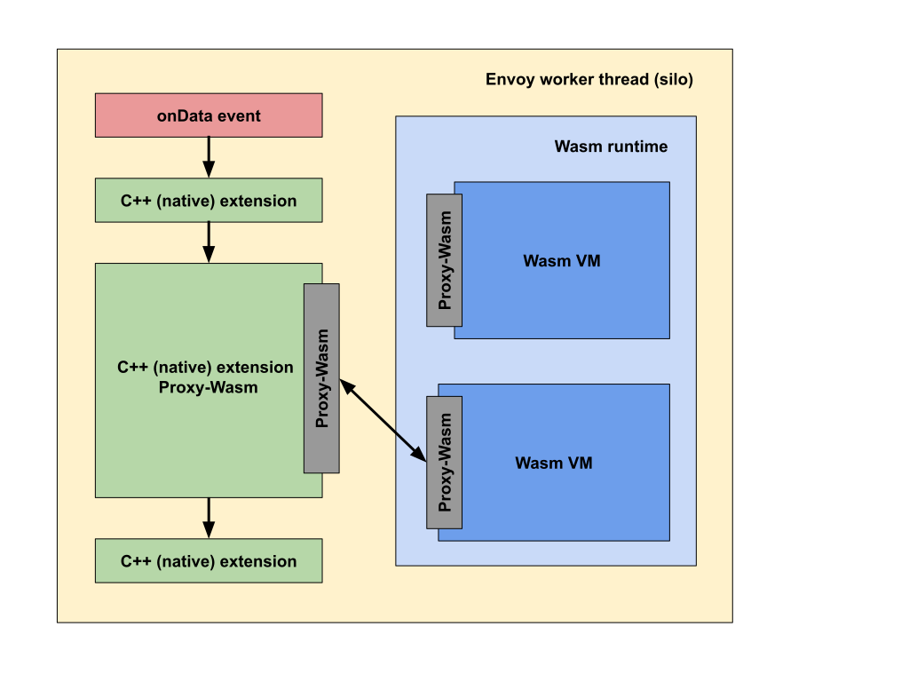

this page is used to summary all extension architecture that envoy supported
------------------------------

- [Envoy extensions](#envoy-extensions)
- [WASM](#wasm)
  - [References](#references)
- [Extenstion](#extenstion)

# Envoy extensions
* Using C++ to extend which is based on envoy source code
* Using LUA to extend
* Using WASM extension

# WASM

## References
https://github.com/proxy-wasm/spec/blob/master/docs/WebAssembly-in-Envoy.md
https://medium.com/trendyol-tech/extending-envoy-proxy-wasm-filter-with-golang-9080017f28ea
https://www.envoyproxy.io/docs/envoy/latest/api-v3/extensions/wasm/v3/wasm.proto

# Extenstion

