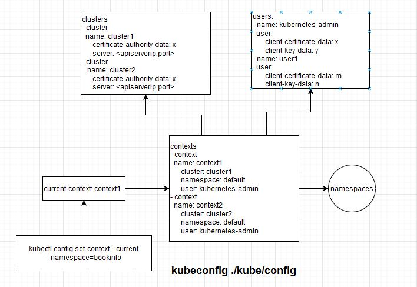

Kubernetes Configuration
---
- [.kube/config](#kubeconfig)
- [/etc/kubernetes](#etckubernetes)
- [/etc/systemd/system](#etcsystemdsystem)
  - [/etc/systemd/system/kubelet.service.d/10-kubeadm.conf](#etcsystemdsystemkubeletserviced10-kubeadmconf)
- [/var/lib/kubelet](#varlibkubelet)
  - [EnvironmentFile=-/var/lib/kubelet/kubeadm-flags.env](#environmentfile-varlibkubeletkubeadm-flagsenv)
  - [--config=/var/lib/kubelet/config.yaml](#--configvarlibkubeletconfigyaml)
  - [--bootstrap-kubeconfig=/etc/kubernetes/bootstrap-kubelet.conf](#--bootstrap-kubeconfigetckubernetesbootstrap-kubeletconf)
  - [--kubeconfig=/etc/kubernetes/kubelet.conf](#--kubeconfigetckuberneteskubeletconf)
- [EnvironmentFile: /etc/default/kubelet/](#environmentfile-etcdefaultkubelet)
- [kubeadm](#kubeadm)
  - [main](#main)
  - [newCmdInit](#newcmdinit)
  - [cmd.Execute()](#cmdexecute)
    - [cmd.execute()](#cmdexecute-1)
      - [c.RunE](#crune)
        - [initRunner.InitData(args)](#initrunnerinitdataargs)
        - [initRunner.Run(args)](#initrunnerrunargs)
        - [showJoinCommand(data, out)](#showjoincommanddata-out)

# .kube/config
== /etc/kubernetes/admin.conf
```yaml
root@k8s-controler-1:~/.kube# cat config
apiVersion: v1
clusters:
- cluster:
    certificate-authority-data: LS0tLS1CRUdJTiBDRVJUSUZJQ0FURS0tLS0tCk1JSUM1ekNDQWMrZ0F3SUJBZ0lCQURBTkJna3Foa2lHOXcwQkFRc0ZBREFWTVJNd0VRWURWUVFERXdwcmRXSmwKY201bGRHVnpNQjRYRFRJeE1EWXdPVEEzTVRJd01sb1hEVE14TURZd056QTNNVEl3TWxvd0ZURVRNQkVHQTFVRQpBeE1LYTNWaVpYSnVaWFJsY3pDQ0FTSXdEUVlKS29aSWh2Y05BUUVCQlFBRGdnRVBBRENDQVFvQ2dnRUJBSlJWClk1YzVtMi90bHIyQU9kYXEwL2FyUzlvaEpTNkMxck1aenhRQ3dlV2k1bGRHajdPaVBaNXV1UDVuaCtSN09oQmoKQTV0dDFPRjErdWF6K2d4dlpkV29kRHpJc01TNkhBTjAydzlla2N5S3lmNWZuYVRmZmhpeWpPQktWcEVsSlhsNgozbFdMWmJYSWlpZURQSUFpTUpXM0xsNk85R29ROVJqQ1ErWnRzNis4RXhTWkJxV3FpK3RIT1VYMnRmRjNaV20rClIxRW40eDZ6VW5LYTl4VVpQMld6RllNdlJ1QzJTWXhjKytWNGdyRi9EczRHeForcHgzbU1uOEVWRTRkcFRWckgKT2NBNElWZ3ZjTHhaMWxiOC9EV2tjbGRTKzhRaTNOVFRVbmhEMTg1NVRvK05NblhmeWhwS0twZTJweUtCbzN0dAphcjlvUFByVkZhZXhhTVlrajVjQ0F3RUFBYU5DTUVBd0RnWURWUjBQQVFIL0JBUURBZ0trTUE4R0ExVWRFd0VCCi93UUZNQU1CQWY4d0hRWURWUjBPQkJZRUZLY3ViVFRKZnJDTlRTWkszaEtXVmpKaTdrcjRNQTBHQ1NxR1NJYjMKRFFFQkN3VUFBNElCQVFBbUNMRjZMdHpwSU9Wd001MDFoNEhQTFh0dXZmZ1FNd2plUWE2MFhOTDZMd3JZRHd6YQovdEtJWlhRMCtrZjdkRUZ3V1h3aTdjN2F4Wk1oYTNDVkswVVUzSVJkSFhZZHlEOGtOb1RqY3llL1huekZPdk1rClR6TjNjSlRwcUx5ZCtwM3ZoaVl3V1czUlRQWVc0YUJEbTUvT0JEZnhqVUc2TmYvZW5TakpoQ2VqdjBuSDByUXAKRm5UZlN3SlIreVNyZ3AwcUU0bld5cXBBTUhmbkZMVlZYelFHODhqNWZ2LytHYTRoUTNiZWhOb0NEc1AvOFpQZwpGeU91WWlnN1ZXNFpNSTB6NGJNanYxMFpOa2YyZUFGcXpidHRIMXVCOSt2UitSSy9OTHRCSEVqVkVqcWxQVGNhCnpZanhmZ0MreDRvdy9MNFdNMC9ob3JWWlFkaEw0WUZ3STZ3OQotLS0tLUVORCBDRVJUSUZJQ0FURS0tLS0tCg==
    server: https://192.168.122.250:9443
  name: kubernetes
contexts:
- context:
    cluster: kubernetes
    namespace: bookinfo
    user: kubernetes-admin
  name: kubernetes-admin@kubernetes
current-context: kubernetes-admin@kubernetes
kind: Config
preferences: {}
users:
- name: kubernetes-admin
  user:
    client-certificate-data: LS0tLS1CRUdJTiBDRVJUSUZJQ0FURS0tLS0tCk1JSURJVENDQWdtZ0F3SUJBZ0lJTFRkcnhVTTM4Qzh3RFFZSktvWklodmNOQVFFTEJRQXdGVEVUTUJFR0ExVUUKQXhNS2EzVmlaWEp1WlhSbGN6QWVGdzB5TVRBMk1Ea3dOekV5TURKYUZ3MHlNakEyTURrd056RXlNRGRhTURReApGekFWQmdOVkJBb1REbk41YzNSbGJUcHRZWE4wWlhKek1Sa3dGd1lEVlFRREV4QnJkV0psY201bGRHVnpMV0ZrCmJXbHVNSUlCSWpBTkJna3Foa2lHOXcwQkFRRUZBQU9DQVE4QU1JSUJDZ0tDQVFFQTlBR2J2SkI5c2JYRytYZVQKZkhkTWh1T0lway9GbGR3dVJOZmtDWWFoV05YcThEUTJFTm1WZnd1aHdrTk16bEFOazRyWkIrVlBud3FwN2VLaQovcGc1T2FLRGNNeXFTbThxb2svcERvV21aVnJoRXFMUy9jN3RLMkNZMEZ6QStLUFdQMlY5V1pOaU1VN0ZOdjNqCnQzT2hhdEpwb20wZ25FTXQxMWFESlNJVkRKYVZObFdDNFc0SnVmbllYYnQ1bTVNTWtuQ3FXVUlsYjVDeHR5eU0KZGxrc3d6N1J5VHlKQ2dwNVl1Zk5qRTNPV25BYzhTMFJWUjJCTHlxWDBiNGI1NXlDQlpKczNrSTYzWERoSStuVwpBNVMxVEJZbFl5Mm5mUERkQXZRK0FvVkQwaVp5OWdCaUhZY0l1Vi95VW4wVHpaSEVzYVVBOVdTR1hvY1hnTTNGClNBOEVQUUlEQVFBQm8xWXdWREFPQmdOVkhROEJBZjhFQkFNQ0JhQXdFd1lEVlIwbEJBd3dDZ1lJS3dZQkJRVUgKQXdJd0RBWURWUjBUQVFIL0JBSXdBREFmQmdOVkhTTUVHREFXZ0JTbkxtMDB5WDZ3alUwbVN0NFNsbFl5WXU1SworREFOQmdrcWhraUc5dzBCQVFzRkFBT0NBUUVBTTVNc0JUeEJQZlF0R0lLTGIzaWdQR0RCWTh0aVJ1WTBEa1RECjRiQk85RmVFMFJrcGtXSFVndEN6bjdjMlRwbDdVQVE0U1hGYUl4V1lHZ0c1SW04UTBLUDRUOWlYbEdCdnA0TVUKV2NGWXNEUDBMUFdxL1NoUzh6cVpKdExJekRjOXMyREpONlRjbnl0TGJ2MDExbEVlTDVxT3NtWWJqa2YrdnVzbApSRWY2bUFSRFFKY1JzVEJNR0dNRlpFOGhrd0lZeHoxTlNueng4OXBaQVdjZTVyUXEyVTgrQkRhOFJWK2tUT3c0CjFJcU5aK2FxTlNSUjMyQXI5ODJ5V05PN0hROE93ekZkRjA1L2NJaGdJeHZ4TkhnUEtTd081ZUppN09YZWlrd0UKelJiZ1dPVlArbWdxMis1N29sRERpM0JKN2lKUmtPU2lhWkJpVjl5eHR4YzNVNEszMFE9PQotLS0tLUVORCBDRVJUSUZJQ0FURS0tLS0tCg==
    client-key-data: LS0tLS1CRUdJTiBSU0EgUFJJVkFURSBLRVktLS0tLQpNSUlFcEFJQkFBS0NBUUVBOUFHYnZKQjlzYlhHK1hlVGZIZE1odU9JcGsvRmxkd3VSTmZrQ1lhaFdOWHE4RFEyCkVObVZmd3Vod2tOTXpsQU5rNHJaQitWUG53cXA3ZUtpL3BnNU9hS0RjTXlxU204cW9rL3BEb1dtWlZyaEVxTFMKL2M3dEsyQ1kwRnpBK0tQV1AyVjlXWk5pTVU3Rk52M2p0M09oYXRKcG9tMGduRU10MTFhREpTSVZESmFWTmxXQwo0VzRKdWZuWVhidDVtNU1Na25DcVdVSWxiNUN4dHl5TWRsa3N3ejdSeVR5SkNncDVZdWZOakUzT1duQWM4UzBSClZSMkJMeXFYMGI0YjU1eUNCWkpzM2tJNjNYRGhJK25XQTVTMVRCWWxZeTJuZlBEZEF2UStBb1ZEMGlaeTlnQmkKSFljSXVWL3lVbjBUelpIRXNhVUE5V1NHWG9jWGdNM0ZTQThFUFFJREFRQUJBb0lCQUN2WEtpTWNGdWxhRHJEOQowZ3IzNkZFSUNxSlBET0liR0ZrWUxRbWxIZEkzUlNuNVI0bUpmbm5BSGtVb0VHRzFNbXRDOURHZCtzdEpnRFNVCmx0S0ZpU3FZejJMeDh0ckMxSGNyUW1Wd2orLy8veFo1R00ydll4OTdFSm5IUUlpcjd5K2V6WUhOb0VQWnNrZHEKSUlMeWpKc0R5U1Q4MUhJZkE5cC8yYnBQUUZidFVYWm4rY2pCY3VVTk5lVENmb1NOcVMyQ0pRRXpIcHZtamFFRwptTzlIa2h4WldkZG1kNy9OWk9pTEJSUHpXaXdadjcrZG85TGR2bHRBaU9EK2QrREdEUldyMkdHRWcvNFJOUmpOClFvclFnWjZUNGNwWmZXcThKTVhldVpERVVxZUIwaHgxb2ZXYUQ0V2lWQzJNSnpBUWd1dXBvV0RoR1BXSjFsYWoKWFBydUtzVUNnWUVBOUdqaDlMSjFRTW9nTkdkQ0tIQUxHVllzZXpGUnU5TmY1aVJEYlJUVUFUcEJ1c1hIVkxlZQpBYm5ERENpaG0yaGFkMWdKUk9vTTlQVWZKeUJIemJkOUxkQVlvN1JhOEEvR0oxdkdGOHc0WVNIV3E1OUZING5aCnA2UFBDN1FGM213Njd0UFltMDhabHJySDZRRlNuandnMjh5UVpqcVpZcXVVWWswMWNMU1ZML01DZ1lFQS81UFUKQ2FnRlFBWHFPdU9vMWpsS0NhV05CdTEvSlc0VEVGUDNNSm83UGdSRmpHWUF3YWQ0cGc2czdXcGNDWkFPWTM5cApiT0NiRTVCOU9za3Npb09RMTNjWGJiRUdvYkI4ZFJTQ0JyTDFBWmRLTDVvTkJIb2NsdFlPd0JjdzV1bXVoTzZHCnNFY1JXUXJoZTBPaXdnRXlPeGY4WWxLT2twWCtWNGYwM2tic053OENnWUVBejdod0NicStJb0ZtMjRMQzNJRlYKUFlSYXE1emYvVVVKWlJ4KzNhOXMrMW9hMFBVVWt6QzNMbnBGaGdqbVNLRm8rYk10dFk5QjBkS2VWbTk5OXgyeQpXd1JZWEpHRkZEQWoxZ0dPbTEwcXNZckQydnF6RWJuajdURXdYNTd4dWZhOEk0eVN0SFNHcCs4NHhoUWt0bTBkCjlCQ296T21Td1NSWUtTKzdjbjFYcWZjQ2dZQUJCSkN5blNXd05KWFRPRGJpNjRWODlsalNiejJ6WTNYVitjK2gKTk93SmVqRGd0ME5IZ2lnNzJSRWRQUEF5NVl6NUhuZklCRGo1NGZodHRJRmw1OUk2MlhHUmNVUUtmczV3Rk8zVApvd0RReWM1MDFCTTdNbFZNMEh0c2ptc1djRlhPbDdpWG1TRGJqdXlJOWlMK3pNeHJhZFFLZkRPdko4UEVpM2tSCkxZMGhSd0tCZ1FDdlRxL3AvUEFid2ZPRTQ0V3p3Q2l4QjJ4SGdGZnd1UzdzSEh3VnBXOVJGeWZQZkoxT1U1b3QKOXMxZzZnb0QwdSs1RnNjbWg5QWM4NlhZd2FDMzYvN0pOUy9xUEUyRElTMVRQZGoyaldhbk5hVE11UnJscmJEOAoyZlpBeWZISi90dUtUbTBFQ2IzS1FRQUljMnBKeGplMEFBQ1FkMDB4TEFMRmtMRUpwUzhQN1E9PQotLS0tLUVORCBSU0EgUFJJVkFURSBLRVktLS0tLQo=
root@k8s-controler-1:~/.kube# 

```

```yaml
oot@k8s-controler-1:~/.kube# kubectl config view
apiVersion: v1
clusters:
- cluster:
    certificate-authority-data: DATA+OMITTED
    server: https://192.168.122.250:9443
  name: kubernetes
contexts:
- context:
    cluster: kubernetes
    namespace: bookinfo
    user: kubernetes-admin
  name: kubernetes-admin@kubernetes
current-context: kubernetes-admin@kubernetes
kind: Config
preferences: {}
users:
- name: kubernetes-admin
  user:
    client-certificate-data: REDACTED
    client-key-data: REDACTED
root@k8s-controler-1:~/.kube# 
```

kubeconfig(.kube/config) overview


# /etc/kubernetes
```bash
oot@k8s-controler-1:/etc/kubernetes# tree 
.
?????? admin.conf
?????? controller-manager.conf
?????? kubelet.conf
?????? manifests
???? ?????? etcd.yaml
???? ?????? kube-apiserver.yaml
???? ?????? kube-controller-manager.yaml
???? ?????? kube-scheduler.yaml
?????? pki
???? ?????? apiserver.crt
???? ?????? apiserver-etcd-client.crt
???? ?????? apiserver-etcd-client.key
???? ?????? apiserver.key
???? ?????? apiserver-kubelet-client.crt
???? ?????? apiserver-kubelet-client.key
???? ?????? ca.crt
???? ?????? ca.keycat ca
???? ?????? etcd
???? ???? ?????? ca.crt
???? ???? ?????? ca.key
???? ???? ?????? healthcheck-client.crt
???? ???? ?????? healthcheck-client.key
???? ???? ?????? peer.crt
???? ???? ?????? peer.key
???? ???? ?????? server.crt
???? ???? ?????? server.key
???? ?????? front-proxy-ca.crt
???? ?????? front-proxy-ca.key
???? ?????? front-proxy-client.crt
???? ?????? front-proxy-client.key
???? ?????? sa.key
???? ?????? sa.pub
?????? scheduler.conf

```

# /etc/systemd/system
## /etc/systemd/system/kubelet.service.d/10-kubeadm.conf

```bash
./systemd/system/multi-user.target.wants/kubelet.service
./systemd/system/kubelet.service.d
./systemd/system/kubelet.service.d/10-kubeadm.conf
```

# /var/lib/kubelet

## EnvironmentFile=-/var/lib/kubelet/kubeadm-flags.env
## --config=/var/lib/kubelet/config.yaml
## --bootstrap-kubeconfig=/etc/kubernetes/bootstrap-kubelet.conf 
## --kubeconfig=/etc/kubernetes/kubelet.conf

```
root@k8s-controler-1:/var/lib/kubelet# tree
.
?????? config.yaml
?????? cpu_manager_state
?????? device-plugins
???? ?????? DEPRECATION
???? ?????? kubelet.sock
?????? kubeadm-flags.env
?????? pki
???? ?????? kubelet-client-2021-06-09-15-12-10.pem
???? ?????? kubelet-client-2021-06-09-15-12-47.pem
???? ?????? kubelet-client-current.pem -> /var/lib/kubelet/pki/kubelet-client-2021-06-09-15-12-47.pem
???? ?????? kubelet.crt
???? ?????? kubelet.key
?????? plugins
?????? plugins_registry
?????? pod-resources
???? ?????? kubelet.sock
?????? pods
    ?????? 1ea6402b-4959-4561-911e-81fa27db5977
    ???? ?????? containers
    ???? ???? ?????? coredns
    ???? ????     ?????? a75636eb
    ???? ?????? etc-hosts
    ???? ?????? plugins
    ???? ???? ?????? kubernetes.io~empty-dir
    ???? ????     ?????? wrapped_config-volume
    ???? ????     ???? ?????? ready
    ???? ????     ?????? wrapped_kube-api-access-q6jfz
    ???? ????         ?????? ready
    ???? ?????? volumes
    ????     ?????? kubernetes.io~configmap
    ????     ???? ?????? config-volume
    ????     ????     ?????? Corefile -> ..data/Corefile
    ????     ?????? kubernetes.io~projected
    ????         ?????? kube-api-access-q6jfz
    ????             ?????? ca.crt -> ..data/ca.crt
    ????             ?????? namespace -> ..data/namespace
    ????             ?????? token -> ..data/token
    ?????? 28fb2347-01ab-403f-a8e7-03aa7e0882f1
    ???? ?????? containers
    ???? ???? ?????? coredns
    ???? ????     ?????? 5f705eb5
    ???? ?????? etc-hosts
    ???? ?????? plugins
    ???? ???? ?????? kubernetes.io~empty-dir
    ???? ????     ?????? wrapped_config-volume
    ???? ????     ???? ?????? ready
    ???? ????     ?????? wrapped_kube-api-access-vtpw5
    ???? ????         ?????? ready
    ???? ?????? volumes
    ????     ?????? kubernetes.io~configmap
    ????     ???? ?????? config-volume
    ????     ????     ?????? Corefile -> ..data/Corefile
    ????     ?????? kubernetes.io~projected
    ????         ?????? kube-api-access-vtpw5
    ????             ?????? ca.crt -> ..data/ca.crt
    ????             ?????? namespace -> ..data/namespace
    ????             ?????? token -> ..data/token
    ?????? 8337dc48-5ae7-470b-a4df-bed60c01108a
    ???? ?????? containers
    ???? ???? ?????? sleep
    ???? ????     ?????? a8eb4a2e
    ???? ?????? etc-hosts
    ???? ?????? plugins
    ???? ???? ?????? kubernetes.io~empty-dir
    ???? ????     ?????? wrapped_kube-api-access-td7j4
    ???? ????     ???? ?????? ready
    ???? ????     ?????? wrapped_secret-volume
    ???? ????         ?????? ready
    ???? ?????? volumes
    ????     ?????? kubernetes.io~projected
    ????     ???? ?????? kube-api-access-td7j4
    ????     ????     ?????? ca.crt -> ..data/ca.crt
    ????     ????     ?????? namespace -> ..data/namespace
    ????     ????     ?????? token -> ..data/token
    ????     ?????? kubernetes.io~secret
    ????         ?????? secret-volume
    ?????? 873822ffca62472cf0c126256b280211
    ???? ?????? containers
    ???? ???? ?????? kube-scheduler
    ???? ????     ?????? 0463ee72
    ???? ????     ?????? 10718bd9
    ???? ?????? etc-hosts
    ???? ?????? plugins
    ???? ?????? volumes
    ?????? d16f5c83-9506-40f3-8bfb-5195a95dda59
    ???? ?????? containers
    ???? ???? ?????? weave
    ???? ???? ???? ?????? 1ddd3982
    ???? ???? ???? ?????? 53cbcd52
    ???? ???? ?????? weave-init
    ???? ???? ???? ?????? eaca4d39
    ???? ???? ?????? weave-npc
    ???? ????     ?????? 0d905c9a
    ???? ?????? etc-hosts
    ???? ?????? plugins
    ???? ???? ?????? kubernetes.io~empty-dir
    ???? ????     ?????? wrapped_kube-api-access-nxwbw
    ???? ????         ?????? ready
    ???? ?????? volumes
    ????     ?????? kubernetes.io~projected
    ????         ?????? kube-api-access-nxwbw
    ????             ?????? ca.crt -> ..data/ca.crt
    ????             ?????? namespace -> ..data/namespace
    ????             ?????? token -> ..data/token
    ?????? d3411ebf4544b800e7d0d9e3f6f2f98b
    ???? ?????? containers
    ???? ???? ?????? etcd
    ???? ????     ?????? 4e012039
    ???? ????     ?????? bdd8513a
    ???? ????     ?????? bf3ca37b
    ???? ?????? etc-hosts
    ???? ?????? plugins
    ???? ?????? volumes
    ?????? d73c8827-2ec4-4f30-bce2-e134dd248d48
    ???? ?????? containers
    ???? ???? ?????? kube-proxy
    ???? ????     ?????? 8acf7f4f
    ???? ?????? etc-hosts
    ???? ?????? plugins
    ???? ???? ?????? kubernetes.io~empty-dir
    ???? ????     ?????? wrapped_kube-api-access-65x4w
    ???? ????     ???? ?????? ready
    ???? ????     ?????? wrapped_kube-proxy
    ???? ????         ?????? ready
    ???? ?????? volumes
    ????     ?????? kubernetes.io~configmap
    ????     ???? ?????? kube-proxy
    ????     ????     ?????? config.conf -> ..data/config.conf
    ????     ????     ?????? kubeconfig.conf -> ..data/kubeconfig.conf
    ????     ?????? kubernetes.io~projected
    ????         ?????? kube-api-access-65x4w
    ????             ?????? ca.crt -> ..data/ca.crt
    ????             ?????? namespace -> ..data/namespace
    ????             ?????? token -> ..data/token
    ?????? e3e1e2a62c312969b3969b1e6d0ce43a
    ???? ?????? containers
    ???? ???? ?????? kube-apiserver
    ???? ????     ?????? 500acca2
    ???? ?????? etc-hosts
    ???? ?????? plugins
    ???? ?????? volumes
    ?????? ea048080a0460f1975b09dcc54312ae1
        ?????? containers
        ???? ?????? kube-controller-manager
        ????     ?????? 12bbeaaa
        ????     ?????? 3ec8f70b
        ????     ?????? e5fc5cc3
        ?????? etc-hosts
        ?????? plugins
        ?????? volumes
```

# EnvironmentFile: /etc/default/kubelet/


# kubeadm
## main
```
- kubeadm.go:main
-- app.Run
--- cmd.NewKubeadmCommand
---- cmds.AddCommand(newCmdInit(out, nil))
--- cmd.Execute
```

## newCmdInit
```go
        if initOptions == nil {
                initOptions = newInitOptions()
        }
        initRunner := workflow.NewRunner()

        cmd := &cobra.Command{
                Use:   "init",
                Short: "Run this command in order to set up the Kubernetes control plane",

                RunE: func(cmd *cobra.Command, args []string) error {
                        c, err := initRunner.InitData(args)
                        if err != nil {
                                return err
                        }

                        data := c.(*initData)
                        fmt.Printf("[init] Using Kubernetes version: %s\n", data.cfg.KubernetesVersion)

                        if err := initRunner.Run(args); err != nil {
                                return err
                        }

                        return showJoinCommand(data, out)
                },


        AddInitConfigFlags(cmd.Flags(), initOptions.externalInitCfg)
        AddClusterConfigFlags(cmd.Flags(), initOptions.externalClusterCfg, &initOptions.featureGatesString)
        AddInitOtherFlags(cmd.Flags(), initOptions)
        initOptions.bto.AddTokenFlag(cmd.Flags())
        initOptions.bto.AddTTLFlag(cmd.Flags())
        options.AddImageMetaFlags(cmd.Flags(), &initOptions.externalClusterCfg.ImageRepository)

        // defines additional flag that are not used by the init command but that could be eventually used
        // by the sub-commands automatically generated for phases
        initRunner.SetAdditionalFlags(func(flags *flag.FlagSet) {
                options.AddKubeConfigFlag(flags, &initOptions.kubeconfigPath)
                options.AddKubeConfigDirFlag(flags, &initOptions.kubeconfigDir)
                options.AddControlPlanExtraArgsFlags(flags, &initOptions.externalClusterCfg.APIServer.ExtraArgs, &initOptions.externalClusterCfg.ControllerManager.ExtraArgs, &initOptions.externalClusterCfg.Scheduler.ExtraArgs)
        })

        // initialize the workflow runner with the list of phases
        initRunner.AppendPhase(phases.NewPreflightPhase())
        initRunner.AppendPhase(phases.NewCertsPhase())
        initRunner.AppendPhase(phases.NewKubeConfigPhase())
        initRunner.AppendPhase(phases.NewKubeletStartPhase())
        initRunner.AppendPhase(phases.NewControlPlanePhase())
        initRunner.AppendPhase(phases.NewEtcdPhase())
        initRunner.AppendPhase(phases.NewWaitControlPlanePhase())
        initRunner.AppendPhase(phases.NewUploadConfigPhase())
        initRunner.AppendPhase(phases.NewUploadCertsPhase())
        initRunner.AppendPhase(phases.NewMarkControlPlanePhase())
        initRunner.AppendPhase(phases.NewBootstrapTokenPhase())
        initRunner.AppendPhase(phases.NewKubeletFinalizePhase())
        initRunner.AppendPhase(phases.NewAddonPhase())

        // sets the data builder function, that will be used by the runner
        // both when running the entire workflow or single phases
        initRunner.SetDataInitializer(func(cmd *cobra.Command, args []string) (workflow.RunData, error) {
                return newInitData(cmd, args, initOptions, out)
        })

        // binds the Runner to kubeadm init command by altering
        // command help, adding --skip-phases flag and by adding phases subcommands
        initRunner.BindToCommand(cmd)

        return cmd

```

## cmd.Execute()
```go
// ExecuteC executes the command.
func (c *Command) ExecuteC() (cmd *Command, err error) {
        if c.ctx == nil {
                c.ctx = context.Background()
        }

        // Regardless of what command execute is called on, run on Root only
        if c.HasParent() {
                return c.Root().ExecuteC()
        }

        // windows hook
        if preExecHookFn != nil {
                preExecHookFn(c)
        }

        // initialize help as the last point possible to allow for user
        // overriding
        c.InitDefaultHelpCmd()

        args := c.args

        // Workaround FAIL with "go test -v" or "cobra.test -test.v", see #155
        if c.args == nil && filepath.Base(os.Args[0]) != "cobra.test" {
                args = os.Args[1:]
        }

        // initialize the hidden command to be used for bash completion
        c.initCompleteCmd(args)

        var flags []string
        if c.TraverseChildren {
                cmd, flags, err = c.Traverse(args)
        } else {
                cmd, flags, err = c.Find(args)
        }
        if err != nil {
                // If found parse to a subcommand and then failed, talk about the subcommand
                if cmd != nil {
                        c = cmd
                }
                if !c.SilenceErrors {
                        c.PrintErrln("Error:", err.Error())
                        c.PrintErrf("Run '%v --help' for usage.\n", c.CommandPath())
                }
                return c, err
        }
        cmd.commandCalledAs.called = true
        if cmd.commandCalledAs.name == "" {
                cmd.commandCalledAs.name = cmd.Name()
        }

        // We have to pass global context to children command
        // if context is present on the parent command.
        if cmd.ctx == nil {
                cmd.ctx = c.ctx
        }

        err = cmd.execute(flags)
        if err != nil {
                // Always show help if requested, even if SilenceErrors is in
                // effect
                if err == flag.ErrHelp {
                        cmd.HelpFunc()(cmd, args)
                        return cmd, nil
                }

                // If root command has SilentErrors flagged,
                // all subcommands should respect it
                if !cmd.SilenceErrors && !c.SilenceErrors {
                        c.PrintErrln("Error:", err.Error())
                }

                // If root command has SilentUsage flagged,
                // all subcommands should respect it
                if !cmd.SilenceUsage && !c.SilenceUsage {
                        c.Println(cmd.UsageString())
                }
        }
        return cmd, err
}
```

### cmd.execute()
```go
func (c *Command) execute(a []string) (err error) {
        if c == nil {
                return fmt.Errorf("Called Execute() on a nil Command")
        }

        if len(c.Deprecated) > 0 {
                c.Printf("Command %q is deprecated, %s\n", c.Name(), c.Deprecated)
        }

        // initialize help and version flag at the last point possible to allow for user
        // overriding
        c.InitDefaultHelpFlag()
        c.InitDefaultVersionFlag()

        err = c.ParseFlags(a)
        if err != nil {
                return c.FlagErrorFunc()(c, err)
        }

        // If help is called, regardless of other flags, return we want help.
        // Also say we need help if the command isn't runnable.
        helpVal, err := c.Flags().GetBool("help")
        if err != nil {
                // should be impossible to get here as we always declare a help
                // flag in InitDefaultHelpFlag()
                c.Println("\"help\" flag declared as non-bool. Please correct your code")
                return err
        }

        if helpVal {
                return flag.ErrHelp
        }

        // for back-compat, only add version flag behavior if version is defined
        if c.Version != "" {
                versionVal, err := c.Flags().GetBool("version")
                if err != nil {
                        c.Println("\"version\" flag declared as non-bool. Please correct your code")
                        return err
                }
                if versionVal {
                        err := tmpl(c.OutOrStdout(), c.VersionTemplate(), c)
                        if err != nil {
                                c.Println(err)
                        }
                        return err
                }
        }

        if !c.Runnable() {
                return flag.ErrHelp
        }

        c.preRun()
        argWoFlags := c.Flags().Args()
        if c.DisableFlagParsing {
                argWoFlags = a
        }

        if err := c.ValidateArgs(argWoFlags); err != nil {
                return err
        }

        for p := c; p != nil; p = p.Parent() {
                if p.PersistentPreRunE != nil {
                        if err := p.PersistentPreRunE(c, argWoFlags); err != nil {
                                return err
                        }
                        break
                } else if p.PersistentPreRun != nil {
                        p.PersistentPreRun(c, argWoFlags)
                        break
                }
        }
        if c.PreRunE != nil {
                if err := c.PreRunE(c, argWoFlags); err != nil {
                        return err
                }
        } else if c.PreRun != nil {
                c.PreRun(c, argWoFlags)
        }
        if err := c.ValidateArgs(argWoFlags); err != nil {
                return err
        }

        for p := c; p != nil; p = p.Parent() {
                if p.PersistentPreRunE != nil {
                        if err := p.PersistentPreRunE(c, argWoFlags); err != nil {
                                return err
                        }
                        break
                } else if p.PersistentPreRun != nil {
                        p.PersistentPreRun(c, argWoFlags)
                        break
                }
        }
        if c.PreRunE != nil {
                if err := c.PreRunE(c, argWoFlags); err != nil {
                        return err
                }
        } else if c.PreRun != nil {
                c.PreRun(c, argWoFlags)
        }

        if err := c.validateRequiredFlags(); err != nil {
                return err
        }
        if c.RunE != nil {
                if err := c.RunE(c, argWoFlags); err != nil {
                        return err
                }
        } else {
                c.Run(c, argWoFlags)
        }
        if c.PostRunE != nil {
                if err := c.PostRunE(c, argWoFlags); err != nil {
                        return err
                }
        } else if c.PostRun != nil {
                c.PostRun(c, argWoFlags)
        }
        for p := c; p != nil; p = p.Parent() {
                if p.PersistentPostRunE != nil {
                        if err := p.PersistentPostRunE(c, argWoFlags); err != nil {
                                return err
                        }
                        break
                } else if p.PersistentPostRun != nil {
                        p.PersistentPostRun(c, argWoFlags)
                        break
                }
        }

        return nil
}

```

#### c.RunE
```go
                Use:   "init",
                Short: "Run this command in order to set up the Kubernetes control plane",
                RunE: func(cmd *cobra.Command, args []string) error {
                        c, err := initRunner.InitData(args)
                        if err != nil {
                                return err
                        }

                        data := c.(*initData)
                        fmt.Printf("[init] Using Kubernetes version: %s\n", data.cfg.KubernetesVersion)

                        if err := initRunner.Run(args); err != nil {
                                return err
                        }

                        return showJoinCommand(data, out)
                },

```
##### initRunner.InitData(args)
```go
        // sets the data builder function, that will be used by the runner
        // both when running the entire workflow or single phases
        initRunner.SetDataInitializer(func(cmd *cobra.Command, args []string) (workflow.RunData, error) {
                return newInitData(cmd, args, initOptions, out)
        })

```
```go
// newInitData returns a new initData struct to be used for the execution of the kubeadm init workflow.
// This func takes care of validating initOptions passed to the command, and then it converts
// options into the internal InitConfiguration type that is used as input all the phases in the kubeadm init workflow
func newInitData(cmd *cobra.Command, args []string, options *initOptions, out io.Writer) (*initData, error) {
        // Re-apply defaults to the public kubeadm API (this will set only values not exposed/not set as a flags)
        kubeadmscheme.Scheme.Default(options.externalInitCfg)
        kubeadmscheme.Scheme.Default(options.externalClusterCfg)

        // Validate standalone flags values and/or combination of flags and then assigns
        // validated values to the public kubeadm config API when applicable
        var err error
        if options.externalClusterCfg.FeatureGates, err = features.NewFeatureGate(&features.InitFeatureGates, options.featureGatesString); err != nil {
                return nil, err
        }

        if err = validation.ValidateMixedArguments(cmd.Flags()); err != nil {
                return nil, err
        }

        if err = options.bto.ApplyTo(options.externalInitCfg); err != nil {
                return nil, err
        }

        // Either use the config file if specified, or convert public kubeadm API to the internal InitConfiguration
        // and validates InitConfiguration
        cfg, err := configutil.LoadOrDefaultInitConfiguration(options.cfgPath, options.externalInitCfg, options.externalClusterCfg)
        if err != nil {
                return nil, err
        }
        // For new clusters we want to set the kubelet cgroup driver to "systemd" unless the user is explicit about it.
        // Currently this cannot be as part of the kubelet defaulting (Default()) because the function is called for
        // upgrades too, which can break existing nodes after a kubelet restart.
        // TODO: https://github.com/kubernetes/kubeadm/issues/2376
        componentconfigs.MutateCgroupDriver(&cfg.ClusterConfiguration)

        ignorePreflightErrorsSet, err := validation.ValidateIgnorePreflightErrors(options.ignorePreflightErrors, cfg.NodeRegistration.IgnorePreflightErrors)
        if err != nil {
                return nil, err
        }
        // Also set the union of pre-flight errors to InitConfiguration, to provide a consistent view of the runtime configuration:
        cfg.NodeRegistration.IgnorePreflightErrors = ignorePreflightErrorsSet.List()

        // override node name and CRI socket from the command line options
        if options.externalInitCfg.NodeRegistration.Name != "" {
                cfg.NodeRegistration.Name = options.externalInitCfg.NodeRegistration.Name
        }
        if options.externalInitCfg.NodeRegistration.CRISocket != "" {
                cfg.NodeRegistration.CRISocket = options.externalInitCfg.NodeRegistration.CRISocket
        }

        if err := configutil.VerifyAPIServerBindAddress(cfg.LocalAPIEndpoint.AdvertiseAddress); err != nil {
                return nil, err
        }
        if err := features.ValidateVersion(features.InitFeatureGates, cfg.FeatureGates, cfg.KubernetesVersion); err != nil {
                return nil, err
        }
        // if dry running creates a temporary folder for saving kubeadm generated files
        dryRunDir := ""
        if options.dryRun {
                // the KUBEADM_INIT_DRYRUN_DIR environment variable allows overriding the dry-run temporary
                // directory from the command line. This makes it possible to run "kubeadm init" integration
                // tests without root.
                if dryRunDir, err = kubeadmconstants.CreateTempDirForKubeadm(os.Getenv("KUBEADM_INIT_DRYRUN_DIR"), "kubeadm-init-dryrun"); err != nil {
                        return nil, errors.Wrap(err, "couldn't create a temporary directory")
                }
        }

        // Checks if an external CA is provided by the user (when the CA Cert is present but the CA Key is not)
        externalCA, err := certsphase.UsingExternalCA(&cfg.ClusterConfiguration)
        if externalCA {
                // In case the certificates signed by CA (that should be provided by the user) are missing or invalid,
                // returns, because kubeadm can't regenerate them without the CA Key
                if err != nil {
                        return nil, errors.Wrapf(err, "invalid or incomplete external CA")
                }

                // Validate that also the required kubeconfig files exists and are invalid, because
                // kubeadm can't regenerate them without the CA Key
                kubeconfigDir := options.kubeconfigDir
                if options.dryRun {
                        kubeconfigDir = dryRunDir
                }
                if err := kubeconfigphase.ValidateKubeconfigsForExternalCA(kubeconfigDir, cfg); err != nil {
                        return nil, err
                }
        }
        // Checks if an external CA is provided by the user (when the CA Cert is present but the CA Key is not)
        externalCA, err := certsphase.UsingExternalCA(&cfg.ClusterConfiguration)
        if externalCA {
                // In case the certificates signed by CA (that should be provided by the user) are missing or invalid,
                // returns, because kubeadm can't regenerate them without the CA Key
                if err != nil {
                        return nil, errors.Wrapf(err, "invalid or incomplete external CA")
                }

                // Validate that also the required kubeconfig files exists and are invalid, because
                // kubeadm can't regenerate them without the CA Key
                kubeconfigDir := options.kubeconfigDir
                if options.dryRun {
                        kubeconfigDir = dryRunDir
                }
                if err := kubeconfigphase.ValidateKubeconfigsForExternalCA(kubeconfigDir, cfg); err != nil {
                        return nil, err
                }
        }

        // Checks if an external Front-Proxy CA is provided by the user (when the Front-Proxy CA Cert is present but the Front-Proxy CA Key is not)
        externalFrontProxyCA, err := certsphase.UsingExternalFrontProxyCA(&cfg.ClusterConfiguration)
        if externalFrontProxyCA {
                // In case the certificates signed by Front-Proxy CA (that should be provided by the user) are missing or invalid,
                // returns, because kubeadm can't regenerate them without the Front-Proxy CA Key
                if err != nil {
                        return nil, errors.Wrapf(err, "invalid or incomplete external front-proxy CA")
                }
        }

        if options.uploadCerts && (externalCA || externalFrontProxyCA) {
                return nil, errors.New("can't use upload-certs with an external CA or an external front-proxy CA")
        }

        return &initData{
                cfg:                     cfg,
                certificatesDir:         cfg.CertificatesDir,
                skipTokenPrint:          options.skipTokenPrint,
                dryRun:                  options.dryRun,
                dryRunDir:               dryRunDir,
                kubeconfigDir:           options.kubeconfigDir,
                kubeconfigPath:          options.kubeconfigPath,
                ignorePreflightErrors:   ignorePreflightErrorsSet,
                externalCA:              externalCA,
                outputWriter:            out,
                uploadCerts:             options.uploadCerts,
                skipCertificateKeyPrint: options.skipCertificateKeyPrint,
                patchesDir:              options.patchesDir,
        }, nil
}
```
* Default Init Configuration
  ```go
    // DefaultedInitConfiguration takes a versioned init config (often populated by flags), defaults it and converts it into internal InitConfiguration
    func DefaultedInitConfiguration(versionedInitCfg *kubeadmapiv1beta2.InitConfiguration, versionedClusterCfg *kubeadmapiv1beta2.ClusterConfiguration) (*kubeadmapi.InitConfiguration, error) {
        internalcfg := &kubeadmapi.InitConfiguration{}

        // Takes passed flags into account; the defaulting is executed once again enforcing assignment of
        // static default values to cfg only for values not provided with flags
        kubeadmscheme.Scheme.Default(versionedInitCfg)
        if err := kubeadmscheme.Scheme.Convert(versionedInitCfg, internalcfg, nil); err != nil {
                return nil, err
        }

        kubeadmscheme.Scheme.Default(versionedClusterCfg)
        if err := kubeadmscheme.Scheme.Convert(versionedClusterCfg, &internalcfg.ClusterConfiguration, nil); err != nil {
                return nil, err
        }

        // Applies dynamic defaults to settings not provided with flags
        if err := SetInitDynamicDefaults(internalcfg); err != nil {
                return nil, err
        }
        // Validates cfg (flags/configs + defaults + dynamic defaults)
        if err := validation.ValidateInitConfiguration(internalcfg).ToAggregate(); err != nil {
                return nil, err
        }
        return internalcfg, nil
    }

    // SetInitDynamicDefaults checks and sets configuration values for the InitConfiguration object
    func SetInitDynamicDefaults(cfg *kubeadmapi.InitConfiguration) error {
            //6+16: BootstrapTokenString is a token of the format abcdef.abcdef0123456789
            //type BootstrapTokenString struct {
            //        ID     string (6)
            //        Secret string (16)
            //}
            if err := SetBootstrapTokensDynamicDefaults(&cfg.BootstrapTokens); err != nil {
                    return err
            }
            // 1. Get Hostname
            // 2. Detect CRI socket
            if err := SetNodeRegistrationDynamicDefaults(&cfg.NodeRegistration, true); err != nil {
                    return err
            }

            //API Server Advertise IP Address
            if err := SetAPIEndpointDynamicDefaults(&cfg.LocalAPIEndpoint); err != nil {
                    return err
            }

            //control plan endpoint
            return SetClusterDynamicDefaults(&cfg.ClusterConfiguration, &cfg.LocalAPIEndpoint, &cfg.NodeRegistration)
    }

  ```
* cgroup driver as systemd
* Verify API Server Bind Address
* Return initData
  
##### initRunner.Run(args)
##### showJoinCommand(data, out)