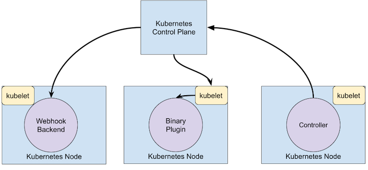

This page will include CRD related knowledges
---

- [Extending Kubernetes](#extending-kubernetes)
  - [Configuration](#configuration)
  - [Built-in Policy APIS](#built-in-policy-apis)
  - [Extenstions](#extenstions)
    - [Extension Patterns](#extension-patterns)
    - [Kubernetes Extenstion Models](#kubernetes-extenstion-models)
    - [Extension Points](#extension-points)
- [API Extenstions](#api-extenstions)
  - [User Defined Types](#user-defined-types)
  - [Combining New APIs with Automation](#combining-new-apis-with-automation)
  - [Changing Build-in Resources](#changing-build-in-resources)
- [Infrastructure Extenstions](#infrastructure-extenstions)
- [Custom Resources](#custom-resources)
  - [Custom Controller](#custom-controller)
  - [Adding Custom Resources](#adding-custom-resources)
- [Extend the Kubernetes API with CustomResourceDefinitions](#extend-the-kubernetes-api-with-customresourcedefinitions)
  - [CRD Examples](#crd-examples)
  - [CRD Versions](#crd-versions)
- [References](#references)

# Extending Kubernetes
* Configuration
  * changing flags
  * local configuration
  * API resources
* extenstions
  * addtional progrems or services

## Configuration
changeable by the cluster administrator. Also, they are subject to change in future Kubernetes versions, and setting them may require restarting processes

Aplied to:
* kubelet
* kube-apiserver
* kube-controller-manager
* kube-schedule

## Built-in Policy APIS
* Resource Quota
* PodSecurityPolicy
* NetworkPolicy
* RBAC

## Extenstions
Extensions are software components that extend and deeply integrate with Kubernetes. They adapt it to support new types and new kinds of hardware.

### Extension Patterns
Kubernetes is designed to be **automated** by writing client programs

There is a specific pattern for writing client programs that work well with Kubernetes called the **Controller** pattern. Controllers typically read an object's **.spec**, possibly do things, and then update the object's **.status**.

* A controller is a client of kubernetes
* kubernetes as Webhook is the client and calls out to a remote service
* The remote service is called a Webhook Backend 

### Kubernetes Extenstion Models
* webhook model: make network request
* Binary Plugin model: execute a binary
  * CNI
  * CSI

### Extension Points

# API Extenstions
## User Defined Types
* to define new controllers, application configuration objects
* manage them using Kubernetes tools, such as kubectl
* goto https://kubernetes.io/docs/concepts/extend-kubernetes/api-extension/custom-resources/

## Combining New APIs with Automation
* Customer resource API and a control loop is called **operator** Patten
* goto https://kubernetes.io/docs/concepts/extend-kubernetes/operator/

## Changing Build-in Resources
* API Access Extenstion
  * Authentication
  * Authorization
  * Dynamic Admission Control

# Infrastructure Extenstions
* Storage Plugin
* Device Plugin
* Network Plugin
* Scheduler Extensions
  * Multiple scheduler
  * goto https://kubernetes.io/docs/concepts/extend-kubernetes/operator/
  
# Custom Resources
Custom resources are extensions of the Kubernetes API.

* Customer Resource
* Built-in Resource (for example: pod kind)

Both above can be access by kubectl

## Custom Controller
custom resources let you store and retrieve structured data. When you combine a custom resource with a custom controller, custom resources provide a true declarative API.

**Consider API aggregation if:**
* readable and writable by kubectl
* view by Kube UI
* New API
* Follow Kubernetes REST Resource path (API groups and Namespaces)
* Scoped in cluster or namespace
* Reuse kube API support feature

## Adding Custom Resources
* CRD only w/o any programming
* API aggregation requiring programming but allow more control over API like data store and conversion between API versions

CRDs allow users to create new types of resources without adding another API server. You do not need to understand API Aggregation to use CRDs.

# Extend the Kubernetes API with CustomResourceDefinitions
## CRD Examples
[crontab CRD](../src/crontabs-crd.yaml)

## CRD Versions
Webhook Conversion

# References
[Extending Kubernetes](https://kubernetes.io/docs/concepts/extend-kubernetes/)
[Custom Resources](https://kubernetes.io/docs/concepts/extend-kubernetes/api-extension/custom-resources/)
[Extend the Kubernetes API with CustomResourceDefinitions](https://kubernetes.io/docs/tasks/extend-kubernetes/custom-resources/custom-resource-definitions/)
[Versions in CustomResourceDefinitions](https://kubernetes.io/docs/tasks/extend-kubernetes/custom-resources/custom-resource-definition-versioning/)
[Kubernetes API Aggregation Layer](https://kubernetes.io/docs/concepts/extend-kubernetes/api-extension/apiserver-aggregation/)
[Webhook Conversion](https://kubernetes.io/docs/tasks/extend-kubernetes/custom-resources/custom-resource-definition-versioning/#webhook-conversion)