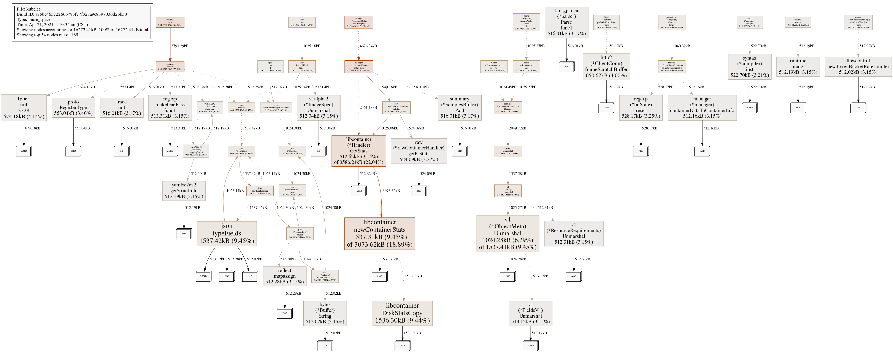
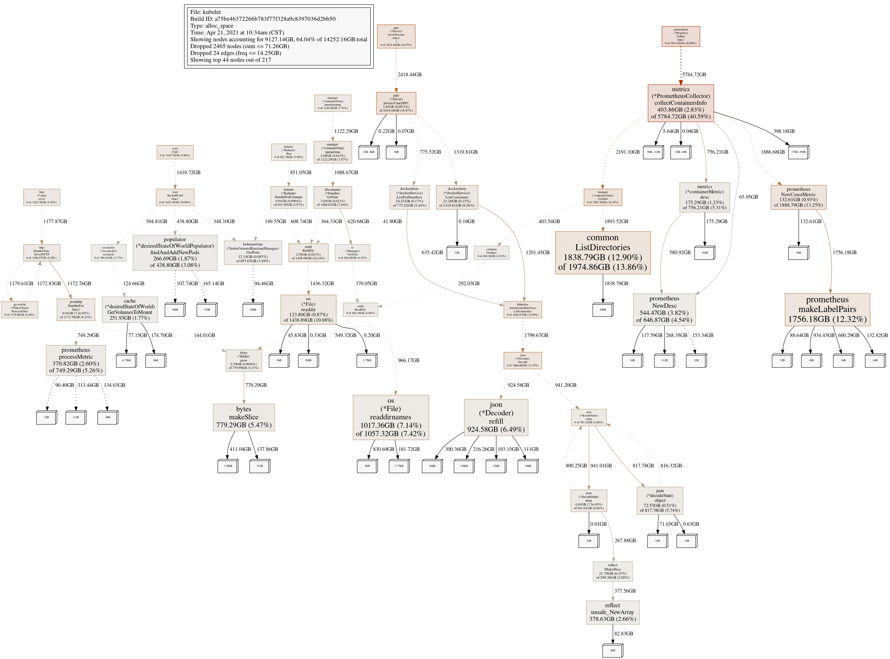
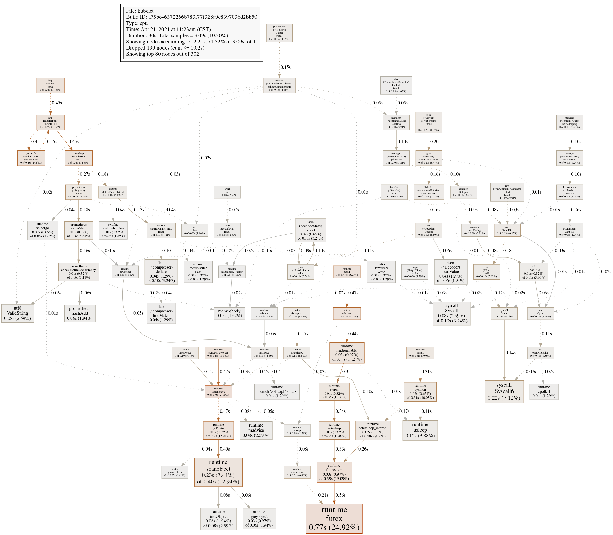
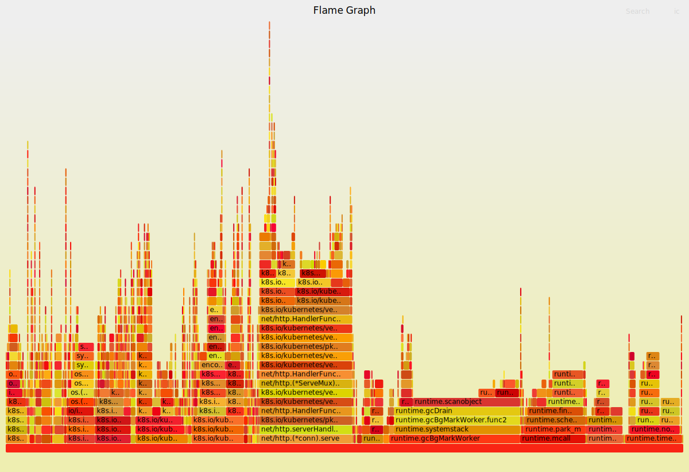

Kubernetes Debugging
-------------
- [golang env](#golang-env)
- [Golang profiling](#golang-profiling)
  - [go tool pprof basic](#go-tool-pprof-basic)
  - [pprof heap](#pprof-heap)
  - [pprof Profile](#pprof-profile)
  - [pprof Trace](#pprof-trace)
- [Monitoring, Logging and Debugging](#monitoring-logging-and-debugging)
  - [kubernetes Feature Gate](#kubernetes-feature-gate)
  - [kubernetes admission controller](#kubernetes-admission-controller)
  - [Debuggin gwith an ephemeral containers](#debuggin-gwith-an-ephemeral-containers)
    - [Shortage:](#shortage)
    - [References](#references)
  - [Service Debugging](#service-debugging)
  - [Delete Terminating Stuck Pod](#delete-terminating-stuck-pod)
  - [Events Debugging](#events-debugging)
  - [dd](#dd)
- [Determine the reason for Pod Failure](#determine-the-reason-for-pod-failure)
  - [terminationMessagePath](#terminationmessagepath)
  - [terminationMessagePolicy](#terminationmessagepolicy)
- [References](#references-1)

# golang env
This debugging env can be setup into local/private machine instead of customer live site. When debugging target customer issue, run some cmds like curl from customer site and ship those files into this local debugging env and generate some report.

```
docker pull golang
docker run -e HTTP_PROXY=http://10.158.100.2:8080 -e HTTPS_PROXY=http://10.158.100.2:8080 -e http_proxy=http://10.158.100.2:8080 -e https_proxy=http://10.158.100.2:8080 -v /home/ryliu:/ryliu --name golang-evn --net host -dt library/golang bash
```

Download FlameGraph tool
```
git clone https://github.com/brendangregg/FlameGraph.git
```

# Golang profiling 
## go tool pprof basic
* Enable pprof
  
  The package is typically only imported for the side effect of registering its HTTP handlers. The handled paths all begin with /debug/pprof/.

  To use pprof, link this package into your program:
  ```
  import _ "net/http/pprof"
  ```

  If your application is not already running an http server, you need to start one. Add "net/http" and "log" to your imports and the following code to your main function:
  ```
  go func() {
	  log.Println(http.ListenAndServe("localhost:6060", nil))
  }()
  ```

* Profiles Types
  ```
  goroutine    - stack traces of all current goroutines
  heap         - a sampling of all heap allocations
  threadcreate - stack traces that led to the creation of new OS threads
  block        - stack traces that led to blocking on synchronization primitives
  mutex        - stack traces of holders of contended mutexes
  ```
* Profile API
  go tool pprof
  ```
  http://localhost:port/debug/pprof/goroutine
  http://localhost:port/debug/pprof/heap
  http://localhost:port/debug/pprof/threadcreate
  http://localhost:port/debug/pprof/block
  http://localhost:port/debug/pprof/mutex

  and also 2 more: the CPU profile and the CPU trace.

  http://localhost:port/debug/pprof/profile
  http://localhost:port/debug/pprof/trace?seconds=5  (go tool trace)
  ```

* pprof kubelet dump env
  ```
  kubectl proxy &
  ```

## pprof heap
* Dump heap profile
  ```
  go tool pprof --raw --output kubelet.heap http://127.0.0.1:8001/api/v1/nodes/foss-ssc-1/proxy/debug/pprof/heap?seconds=60

  curl -o kubelet.gz http://127.0.0.1:8001/api/v1/nodes/foss-ssc-1/proxy/debug/pprof/heap
  ```
* Analyzing heap profile interactively
  ```
  go tool pprof /root/pprof/pprof.kubelet.alloc_objects.alloc_space.inuse_objects.inuse_space.003.pb.gz
  ```
* Analyzing heap profile bash mode
  ```
  go tool pprof -top /root/pprof/pprof.kubelet.alloc_objects.alloc_space.inuse_objects.inuse_space.003.pb.gz
  ```

* Analyzing heap profile in png
  ```
  go tool pprof -png /root/pprof/pprof.kubelet.alloc_objects.alloc_space.inuse_objects.inuse_space.001.pb.gz > kubelet.png
  ```
  


  * alloc_space vs inuse_space
    ```
      -inuse_space      Display in-use memory size
      -inuse_objects    Display in-use object counts
      -alloc_space      Display allocated memory size
      -alloc_objects    Display allocated object counts
    ```
    For example:
    ```
    go tool pprof -png -alloc_space /root/pprof/pprof.kubelet.alloc_objects.alloc_space.inuse_objects.inuse_space.001.pb.gz > kubelet.alloc_space.png
    ```
    


## pprof Profile

* Dump Profile
  ```
  curl -o kubelet.gz http://127.0.0.1:8001/api/v1/nodes/foss-ssc-1/proxy/debug/pprof/profile
  ```
* Anaylzing Profile
    ```
    [root@foss-ssc-1 profile]# go tool pprof -top kubelet.gz
    File: kubelet
    Build ID: a75be46372266b783f77f328a9c8397036d2bb50
    Type: cpu
    Time: Apr 21, 2021 at 11:23am (CST)
    Duration: 30s, Total samples = 3.09s (10.30%)
    Showing nodes accounting for 2.69s, 87.06% of 3.09s total
    Dropped 199 nodes (cum <= 0.02s)
        flat  flat%   sum%        cum   cum%
        0.77s 24.92% 24.92%      0.77s 24.92%  runtime.futex
        0.23s  7.44% 32.36%      0.40s 12.94%  runtime.scanobject
        0.22s  7.12% 39.48%      0.22s  7.12%  syscall.Syscall6
        0.12s  3.88% 43.37%      0.12s  3.88%  runtime.usleep
        0.08s  2.59% 45.95%      0.08s  2.59%  runtime.madvise
        0.08s  2.59% 48.54%      0.10s  3.24%  syscall.Syscall
        0.08s  2.59% 51.13%      0.08s  2.59%  unicode/utf8.ValidString
        0.06s  1.94% 53.07%      0.06s  1.94%  k8s.io/kubernetes/vendor/github.com/prometheus/client_golang/prometheus.hashAdd
        0.06s  1.94% 55.02%      0.08s  2.59%  runtime.findObject
        0.05s  1.62% 56.63%      0.05s  1.62%  memeqbody
        0.04s  1.29% 57.93%      0.10s  3.24%  compress/flate.(*compressor).deflate
        0.04s  1.29% 59.22%      0.04s  1.29%  compress/flate.(*compressor).findMatch
        0.04s  1.29% 60.52%      0.06s  1.94%  encoding/json.(*Decoder).readValue
        0.04s  1.29% 61.81%      0.04s  1.29%  runtime.epollctl
        0.04s  1.29% 63.11%      0.04s  1.29%  runtime.memclrNoHeapPointers
        0.03s  0.97% 64.08%      0.03s  0.97%  runtime.epollwait
        0.03s  0.97% 65.05%      0.44s 14.24%  runtime.findrunnable
        0.03s  0.97% 66.02%      0.59s 19.09%  runtime.futexsleep
        0.03s  0.97% 66.99%      0.06s  1.94%  runtime.greyobject
        0.03s  0.97% 67.96%      0.04s  1.29%  runtime.heapBitsSetType
    ```
   
* Anaylzing using flame graph (火焰图)
  ```
    curl -o kubelet.gz http://127.0.0.1:8001/api/v1/nodes/foss-ssc-1/proxy/debug/pprof/profile?seconds=60
    go tool pprof -output kubelet.raw -raw kubelet.gz
    ../FlameGraph/stackcollapse-go.pl kubelet.raw > kubelet.out
    ../FlameGraph/flamegraph.pl  kubelet.out > kubelet_flamegraph.svg
  ```
  

## pprof Trace
* Dump trace
  ```
  curl -o kubelet.trace http://127.0.0.1:8001/api/v1/nodes/foss-ssc-1/proxy/debug/pprof/trace?seconds=60
  ```
* Analyzing trace
  ```
  [root@foss-ssc-1 pprof]# go tool trace -http='ipaddr:port' kubelet.trace
  2021/04/21 13:04:04 Parsing trace...
  2021/04/21 13:04:05 Splitting trace...
  2021/04/21 13:04:07 Opening browser. Trace viewer is listening on http://135.252.135.241:7060
  ```

# Monitoring, Logging and Debugging
## kubernetes Feature Gate

https://kubernetes.io/docs/reference/command-line-tools-reference/feature-gates/

```
kube-apiserver --help

--feature-gates mapStringBool
  A set of key=value pairs that describe feature gates for alpha/experimental features. Options are:
  APIListChunking=true|false (BETA - default=true)
  APIPriorityAndFairness=true|false (ALPHA - default=false)
  APIResponseCompression=true|false (BETA - default=true)
  AllAlpha=true|false (ALPHA - default=false)
  AllBeta=true|false (BETA - default=false)
  AllowInsecureBackendProxy=true|false (BETA - default=true)
  AnyVolumeDataSource=true|false (ALPHA - default=false)
  AppArmor=true|false (BETA - default=true)
  BalanceAttachedNodeVolumes=true|false (ALPHA - default=false)
  BoundServiceAccountTokenVolume=true|false (ALPHA - default=false)
  CPUManager=true|false (BETA - default=true)
  CRIContainerLogRotation=true|false (BETA - default=true)
  CSIInlineVolume=true|false (BETA - default=true)
  CSIMigration=true|false (BETA - default=true)
  CSIMigrationAWS=true|false (BETA - default=false)
  CSIMigrationAWSComplete=true|false (ALPHA - default=false)
  CSIMigrationAzureDisk=true|false (ALPHA - default=false)
  CSIMigrationAzureDiskComplete=true|false (ALPHA - default=false)
  CSIMigrationAzureFile=true|false (ALPHA - default=false)
  CSIMigrationAzureFileComplete=true|false (ALPHA - default=false)
  CSIMigrationGCE=true|false (BETA - default=false)
  CSIMigrationGCEComplete=true|false (ALPHA - default=false)
  CSIMigrationOpenStack=true|false (BETA - default=false)
  CSIMigrationOpenStackComplete=true|false (ALPHA - default=false)
  ConfigurableFSGroupPolicy=true|false (ALPHA - default=false)
  CustomCPUCFSQuotaPeriod=true|false (ALPHA - default=false)
  DefaultIngressClass=true|false (BETA - default=true)
  DevicePlugins=true|false (BETA - default=true)
  DryRun=true|false (BETA - default=true)
  DynamicAuditing=true|false (ALPHA - default=false)
  DynamicKubeletConfig=true|false (BETA - default=true)
  EndpointSlice=true|false (BETA - default=true)
  EndpointSliceProxying=true|false (ALPHA - default=false)
  EphemeralContainers=true|false (ALPHA - default=false)
  EvenPodsSpread=true|false (BETA - default=true)
  ExpandCSIVolumes=true|false (BETA - default=true)
  ExpandInUsePersistentVolumes=true|false (BETA - default=true)
  ExpandPersistentVolumes=true|false (BETA - default=true)
  ExperimentalHostUserNamespaceDefaulting=true|false (BETA - default=false)
  HPAScaleToZero=true|false (ALPHA - default=false)
  HugePageStorageMediumSize=true|false (ALPHA - default=false)
  HyperVContainer=true|false (ALPHA - default=false)
  IPv6DualStack=true|false (ALPHA - default=false)
  ImmutableEphemeralVolumes=true|false (ALPHA - default=false)
  KubeletPodResources=true|false (BETA - default=true)
  LegacyNodeRoleBehavior=true|false (ALPHA - default=true)
  LocalStorageCapacityIsolation=true|false (BETA - default=true)
  LocalStorageCapacityIsolationFSQuotaMonitoring=true|false (ALPHA - default=false)
  NodeDisruptionExclusion=true|false (ALPHA - default=false)
  NonPreemptingPriority=true|false (ALPHA - default=false)
  PodDisruptionBudget=true|false (BETA - default=true)
  PodOverhead=true|false (BETA - default=true)
  ProcMountType=true|false (ALPHA - default=false)
  QOSReserved=true|false (ALPHA - default=false)
  RemainingItemCount=true|false (BETA - default=true)
  RemoveSelfLink=true|false (ALPHA - default=false)
  ResourceLimitsPriorityFunction=true|false (ALPHA - default=false)
  RotateKubeletClientCertificate=true|false (BETA - default=true)
  RotateKubeletServerCertificate=true|false (BETA - default=true)
  RunAsGroup=true|false (BETA - default=true)
  RuntimeClass=true|false (BETA - default=true)
  SCTPSupport=true|false (ALPHA - default=false)
  SelectorIndex=true|false (ALPHA - default=false)
  ServerSideApply=true|false (BETA - default=true)
  ServiceAccountIssuerDiscovery=true|false (ALPHA - default=false)
  ServiceAppProtocol=true|false (ALPHA - default=false)
  ServiceNodeExclusion=true|false (ALPHA - default=false)
  ServiceTopology=true|false (ALPHA - default=false)
  StartupProbe=true|false (BETA - default=true)
  StorageVersionHash=true|false (BETA - default=true)
  SupportNodePidsLimit=true|false (BETA - default=true)
  SupportPodPidsLimit=true|false (BETA - default=true)
  Sysctls=true|false (BETA - default=true)
  TTLAfterFinished=true|false (ALPHA - default=false)
  TokenRequest=true|false (BETA - default=true)
  TokenRequestProjection=true|false (BETA - default=true)
  TopologyManager=true|false (BETA - default=true)
  ValidateProxyRedirects=true|false (BETA - default=true)
  VolumeSnapshotDataSource=true|false (BETA - default=true)
  WinDSR=true|false (ALPHA - default=false)
  WinOverlay=true|false (ALPHA - default=false)
```

## kubernetes admission controller
```bash
      --admission-control strings              Admission is divided into two phases. In the first phase, only mutating admission plugins run. In the second phase, only validating admission plugins run. The names in the below list may represent a validating plugin, a mutating plugin, or both. The order of plugins in which they are passed to this flag does not matter. Comma-delimited list of: AlwaysAdmit, AlwaysDeny, AlwaysPullImages, CertificateApproval, CertificateSigning, CertificateSubjectRestriction, DefaultIngressClass, DefaultStorageClass, DefaultTolerationSeconds, DenyServiceExternalIPs, EventRateLimit, ExtendedResourceToleration, ImagePolicyWebhook, LimitPodHardAntiAffinityTopology, LimitRanger, MutatingAdmissionWebhook, NamespaceAutoProvision, NamespaceExists, NamespaceLifecycle, NodeRestriction, OwnerReferencesPermissionEnforcement, PersistentVolumeClaimResize, PersistentVolumeLabel, PodNodeSelector, PodSecurity, PodSecurityPolicy, PodTolerationRestriction, Priority, ResourceQuota, RuntimeClass, SecurityContextDeny, ServiceAccount, StorageObjectInUseProtection, TaintNodesByCondition, ValidatingAdmissionWebhook. (DEPRECATED: Use --enable-admission-plugins or --disable-admission-plugins instead. Will be removed in a future version.)
      --admission-control-config-file string   File with admission control configuration.
      --disable-admission-plugins strings      admission plugins that should be disabled although they are in the default enabled plugins list (NamespaceLifecycle, LimitRanger, ServiceAccount, TaintNodesByCondition, PodSecurity, Priority, DefaultTolerationSeconds, DefaultStorageClass, StorageObjectInUseProtection, PersistentVolumeClaimResize, RuntimeClass, CertificateApproval, CertificateSigning, CertificateSubjectRestriction, DefaultIngressClass, MutatingAdmissionWebhook, ValidatingAdmissionWebhook, ResourceQuota). Comma-delimited list of admission plugins: AlwaysAdmit, AlwaysDeny, AlwaysPullImages, CertificateApproval, CertificateSigning, CertificateSubjectRestriction, DefaultIngressClass, DefaultStorageClass, DefaultTolerationSeconds, DenyServiceExternalIPs, EventRateLimit, ExtendedResourceToleration, ImagePolicyWebhook, LimitPodHardAntiAffinityTopology, LimitRanger, MutatingAdmissionWebhook, NamespaceAutoProvision, NamespaceExists, NamespaceLifecycle, NodeRestriction, OwnerReferencesPermissionEnforcement, PersistentVolumeClaimResize, PersistentVolumeLabel, PodNodeSelector, PodSecurity, PodSecurityPolicy, PodTolerationRestriction, Priority, ResourceQuota, RuntimeClass, SecurityContextDeny, ServiceAccount, StorageObjectInUseProtection, TaintNodesByCondition, ValidatingAdmissionWebhook. The order of plugins in this flag does not matter.
      --enable-admission-plugins strings       admission plugins that should be enabled in addition to default enabled ones (NamespaceLifecycle, LimitRanger, ServiceAccount, TaintNodesByCondition, PodSecurity, Priority, DefaultTolerationSeconds, DefaultStorageClass, StorageObjectInUseProtection, PersistentVolumeClaimResize, RuntimeClass, CertificateApproval, CertificateSigning, CertificateSubjectRestriction, DefaultIngressClass, MutatingAdmissionWebhook, ValidatingAdmissionWebhook, ResourceQuota). Comma-delimited list of admission plugins: AlwaysAdmit, AlwaysDeny, AlwaysPullImages, CertificateApproval, CertificateSigning, CertificateSubjectRestriction, DefaultIngressClass, DefaultStorageClass, DefaultTolerationSeconds, DenyServiceExternalIPs, EventRateLimit, ExtendedResourceToleration, ImagePolicyWebhook, LimitPodHardAntiAffinityTopology, LimitRanger, MutatingAdmissionWebhook, NamespaceAutoProvision, NamespaceExists, NamespaceLifecycle, NodeRestriction, OwnerReferencesPermissionEnforcement, PersistentVolumeClaimResize, PersistentVolumeLabel, PodNodeSelector, PodSecurity, PodSecurityPolicy, PodTolerationRestriction, Priority, ResourceQuota, RuntimeClass, SecurityContextDeny, ServiceAccount, StorageObjectInUseProtection, TaintNodesByCondition, ValidatingAdmissionWebhook. The order of plugins in this flag does not matter.
```

## Debuggin gwith an ephemeral containers
Ephemeral containers are useful for interactive troubleshooting when kubectl exec is insufficient because a container has crashed or a container image doesn't include debugging utilities. 

require the EphemeralContainers feature gate enabled in your cluster and kubectl version v1.18 or later

https://github.com/kubernetes/enhancements/blob/master/keps/sig-node/277-ephemeral-containers/README.md

ephemeralContainers

Ephemeral containers may be run in an existing pod to perform user-initiated actions such as debugging. 

**This list cannot be specified when creating a pod, and it cannot be modified by updating the pod spec.**

In order to add an ephemeral container to an existing pod, use the pod's ephemeralcontainers subresource. This field is beta-level and available on clusters that haven't disabled the EphemeralContainers feature gate.

* Pod yaml
  ```yaml
  apiVersion: v1
  kind: Pod
  metadata:
    labels:
      app: ephemeral-demo
    name: ephemeral-demo
  spec:
    containers:
    - image: ryanlyy/centos-tc:20210526
      imagePullPolicy: IfNotPresent
      name: ephemeral-demo
      command:
      - bash
      - -c 
      - sleep 6000000000
      securityContext: 
        capabilities:
          drop: ["ALL"]
        #privileged: true
        runAsNonRoot: true
        runAsUser: 2000
        allowPrivilegeEscalation: false
  ```
* Debug patch.yaml
  ```json
  {
      "apiVersion": "v1",
      "kind": "Pod",
      "metadata": {
        "name": "ephemeral-demo"
      },
      "spec": {
      "ephemeralContainers": [{
          "command": [
              "sh"
          ],
          "image": "busybox:20220311",
          "imagePullPolicy": "IfNotPresent",
          "name": "debugger",
          "stdin": true,
          "tty": true,
          "terminationMessagePolicy": "File",
          "securityContext": {
            "capabilities": {
                "add": ["NET_ADMIN", "NET_RAW"]
      }
    }
      }]
      }
  }
  ```

* Update
  
  ```bash
  kubectl replace --raw /api/v1/namespaces/default/pods/ephemeral-demo/ephemeralcontainers -f debug.json
  ```

* Pod running manifest
  ```yaml
  spec:
  containers:
  - command:
    - bash
    - -c
    - sleep 6000000000
    image: ryanlyy/centos-tc:20210526
    imagePullPolicy: IfNotPresent
    name: ephemeral-demo
    resources: {}
    securityContext:
      allowPrivilegeEscalation: false
      capabilities:
        drop:
        - ALL
      runAsNonRoot: true
      runAsUser: 2000
    terminationMessagePath: /dev/termination-log
    terminationMessagePolicy: File
    volumeMounts:
    - mountPath: /var/run/secrets/kubernetes.io/serviceaccount
      name: kube-api-access-dx94z
      readOnly: true
  dnsPolicy: ClusterFirst
  enableServiceLinks: true
  ephemeralContainers:
  - command:
    - sh
    image: busybox:20220311
    imagePullPolicy: IfNotPresent
    name: debugger
    resources: {}
    securityContext:
      capabilities:
        add:
        - NET_ADMIN
        - NET_RAW
    stdin: true
    terminationMessagePath: /dev/termination-log
    terminationMessagePolicy: File
    tty: true

  ```

After added into ephemeral container, it is running status. At this time, you can attach into this container (but exec does not work). when you exit from this container, it will be finished. if you want to attach into it again, start it using docker start (you need to access node)

Like regular containers, you may not change or remove an ephemeral container after you have added it to a Pod

```bash
* spec.ephemeralContainers: Forbidden: existing ephemeral containers "debugger" may not be removed
```

### Shortage:
* can't restart using kubectl
* cant remove/change from pod
* May lead pod evict
* add security risk

### References
* https://kubernetes.io/docs/reference/kubernetes-api/workload-resources/pod-v1/
* https://medium.com/01001101/ephemeral-containers-the-future-of-kubernetes-workload-debugging-c5b7ded3019f


## Service Debugging
* Check if endpoints exist for that service
  ```
  [root@foss-ssc-1 pprof]# kubectl get endpoints docker-registry-service
  NAME                      ENDPOINTS              AGE
  docker-registry-service   192.168.150.127:5000   192d
  ```
* iptable-save to check service for non headless
  ```
  [root@foss-ssc-1 pprof]# iptables-save | grep docker-registry-service
  -A KUBE-SERVICES ! -s 192.168.0.0/16 -d 10.110.136.53/32 -p tcp -m comment --comment "default/docker-registry-service: cluster IP" -m tcp --dport 3000 -j KUBE-MARK-MASQ
  -A KUBE-SERVICES -d 10.110.136.53/32 -p tcp -m comment --comment "default/docker-registry-service: cluster IP" -m tcp --dport 3000 -j KUBE-SVC-IOQWXJDBNWAU5JMW
  -A KUBE-NODEPORTS -p tcp -m comment --comment "default/docker-registry-service:" -m tcp --dport 32100 -j KUBE-MARK-MASQ
  -A KUBE-NODEPORTS -p tcp -m comment --comment "default/docker-registry-service:" -m tcp --dport 32100 -j KUBE-SVC-IOQWXJDBNWAU5JMW
  -A KUBE-SVC-IOQWXJDBNWAU5JMW -m comment --comment "default/docker-registry-service:" -j KUBE-SEP-EMPLNE5PZQ7LTPXI
  -A KUBE-SEP-EMPLNE5PZQ7LTPXI -s 192.168.150.127/32 -m comment --comment "default/docker-registry-service:" -j KUBE-MARK-MASQ
  -A KUBE-SEP-EMPLNE5PZQ7LTPXI -p tcp -m comment --comment "default/docker-registry-service:" -m tcp -j DNAT --to-destination 192.168.150.127:5000
  ```
* dig

## Delete Terminating Stuck Pod
```
kubectl delete pod <PODNAME> --grace-period=0 --force --namespace <NAMESPACE>
```
if still stuck try:
```
kubectl patch pod <pod> -p '{"metadata":{"finalizers":null}}'
```
or  restart container


## Events Debugging
  ```
  kubectl get events --all-namespaces
  kubectl describe node/deployment/pod...
  ```
## dd
# Determine the reason for Pod Failure
Termination messages provide a way for containers to write information about fatal events to a location where it can be easily retrieved and surfaced by tools like dashboards and monitoring software. In most cases, information that you put in a termination message should also be written to the general Kubernetes logs.

## terminationMessagePath
string	Optional: Path at which the file to which the container's termination message will be written is mounted into the container's filesystem. Message written is intended to be brief final status, such as an assertion failure message. Will be truncated by the node if greater than 4096 bytes. The total message length across all containers will be limited to 12kb. Defaults to /dev/termination-log. Cannot be updated.

## terminationMessagePolicy
string	Indicate how the termination message should be populated. File will use the contents of terminationMessagePath to populate the container status message on both success and failure. FallbackToLogsOnError will use the last chunk of container log output if the termination message file is empty and the container exited with an error. The log output is limited to 2048 bytes or 80 lines, whichever is smaller. Defaults to File. Cannot be updated.

```yaml
apiVersion: v1
kind: Pod
metadata:
  name: msg-path-demo
spec:
  containers:
  - name: msg-path-demo-container
    image: debian
    terminationMessagePath: "/tmp/my-log"
    terminationMessagePolicy: FallbackToLogsOnError
```
NOTE: signal shall be support to print termination message to termi
# References
* https://www.cnblogs.com/zerchin/p/kubernetes.html
* https://github.com/brendangregg/FlameGraph
* https://juejin.cn/post/6844903647290081293
* https://jvns.ca/blog/2017/09/24/profiling-go-with-pprof/
* https://golang.org/pkg/net/http/pprof/
* 