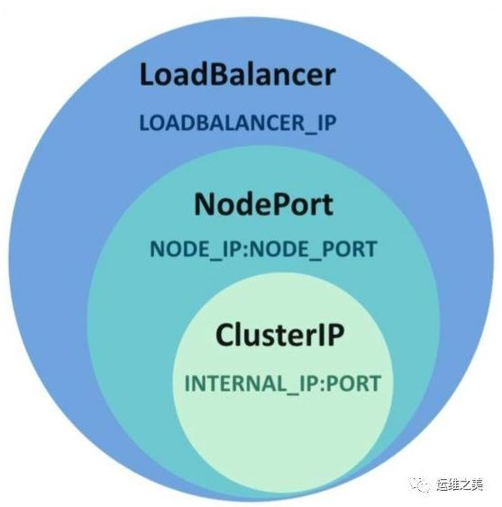

Kubernetes Debugging
-------------
- [golang env](#golang-env)
- [Golang profiling](#golang-profiling)
  - [go tool pprof basic](#go-tool-pprof-basic)
  - [pprof heap](#pprof-heap)
  - [pprof Profile](#pprof-profile)
  - [pprof Trace](#pprof-trace)
- [References](#references)

# golang env
This debugging env can be setup into local/private machine instead of customer live site. When debugging target customer issue, run some cmds like curl from customer site and ship those files into this local debugging env and generate some report.

```
docker pull golang
docker run -e HTTP_PROXY=http://10.158.100.2:8080 -e HTTPS_PROXY=http://10.158.100.2:8080 -e http_proxy=http://10.158.100.2:8080 -e https_proxy=http://10.158.100.2:8080 -v /home/ryliu:/ryliu --name golang-evn --net host -dt library/golang bash
```

Download FlameGraph tool
```
git clone https://github.com/brendangregg/FlameGraph.git
```

# Golang profiling 
## go tool pprof basic
* Enable pprof
  
  The package is typically only imported for the side effect of registering its HTTP handlers. The handled paths all begin with /debug/pprof/.

  To use pprof, link this package into your program:
  ```
  import _ "net/http/pprof"
  ```

  If your application is not already running an http server, you need to start one. Add "net/http" and "log" to your imports and the following code to your main function:
  ```
  go func() {
	  log.Println(http.ListenAndServe("localhost:6060", nil))
  }()
  ```

* Profiles Types
  ```
  goroutine    - stack traces of all current goroutines
  heap         - a sampling of all heap allocations
  threadcreate - stack traces that led to the creation of new OS threads
  block        - stack traces that led to blocking on synchronization primitives
  mutex        - stack traces of holders of contended mutexes
  ```
* Profile API
  go tool pprof
  ```
  http://localhost:port/debug/pprof/goroutine
  http://localhost:port/debug/pprof/heap
  http://localhost:port/debug/pprof/threadcreate
  http://localhost:port/debug/pprof/block
  http://localhost:port/debug/pprof/mutex

  and also 2 more: the CPU profile and the CPU trace.

  http://localhost:port/debug/pprof/profile
  http://localhost:port/debug/pprof/trace?seconds=5  (go tool trace)
  ```

* pprof kubelet dump env
  ```
  kubectl proxy &
  ```

## pprof heap
* Dump heap profile
  ```
  go tool pprof --raw --output kubelet.heap http://127.0.0.1:8001/api/v1/nodes/foss-ssc-1/proxy/debug/pprof/heap?seconds=60

  curl -o kubelet.gz http://127.0.0.1:8001/api/v1/nodes/foss-ssc-1/proxy/debug/pprof/heap
  ```
* Analyzing heap profile interactively
  ```
  go tool pprof /root/pprof/pprof.kubelet.alloc_objects.alloc_space.inuse_objects.inuse_space.003.pb.gz
  ```
* Analyzing heap profile bash mode
  ```
  go tool pprof -top /root/pprof/pprof.kubelet.alloc_objects.alloc_space.inuse_objects.inuse_space.003.pb.gz
  ```

* Analyzing heap profile in png
  ```
  go tool pprof -png /root/pprof/pprof.kubelet.alloc_objects.alloc_space.inuse_objects.inuse_space.001.pb.gz > kubelet.png
  ```
  


  * alloc_space vs inuse_space
    ```
      -inuse_space      Display in-use memory size
      -inuse_objects    Display in-use object counts
      -alloc_space      Display allocated memory size
      -alloc_objects    Display allocated object counts
    ```
    For example:
    ```
    go tool pprof -png -alloc_space /root/pprof/pprof.kubelet.alloc_objects.alloc_space.inuse_objects.inuse_space.001.pb.gz > kubelet.alloc_space.png
    ```
    


## pprof Profile

* Dump Profile
  ```
  curl -o kubelet.gz http://127.0.0.1:8001/api/v1/nodes/foss-ssc-1/proxy/debug/pprof/profile
  ```
* Anaylzing Profile
    ```
    [root@foss-ssc-1 profile]# go tool pprof -top kubelet.gz
    File: kubelet
    Build ID: a75be46372266b783f77f328a9c8397036d2bb50
    Type: cpu
    Time: Apr 21, 2021 at 11:23am (CST)
    Duration: 30s, Total samples = 3.09s (10.30%)
    Showing nodes accounting for 2.69s, 87.06% of 3.09s total
    Dropped 199 nodes (cum <= 0.02s)
        flat  flat%   sum%        cum   cum%
        0.77s 24.92% 24.92%      0.77s 24.92%  runtime.futex
        0.23s  7.44% 32.36%      0.40s 12.94%  runtime.scanobject
        0.22s  7.12% 39.48%      0.22s  7.12%  syscall.Syscall6
        0.12s  3.88% 43.37%      0.12s  3.88%  runtime.usleep
        0.08s  2.59% 45.95%      0.08s  2.59%  runtime.madvise
        0.08s  2.59% 48.54%      0.10s  3.24%  syscall.Syscall
        0.08s  2.59% 51.13%      0.08s  2.59%  unicode/utf8.ValidString
        0.06s  1.94% 53.07%      0.06s  1.94%  k8s.io/kubernetes/vendor/github.com/prometheus/client_golang/prometheus.hashAdd
        0.06s  1.94% 55.02%      0.08s  2.59%  runtime.findObject
        0.05s  1.62% 56.63%      0.05s  1.62%  memeqbody
        0.04s  1.29% 57.93%      0.10s  3.24%  compress/flate.(*compressor).deflate
        0.04s  1.29% 59.22%      0.04s  1.29%  compress/flate.(*compressor).findMatch
        0.04s  1.29% 60.52%      0.06s  1.94%  encoding/json.(*Decoder).readValue
        0.04s  1.29% 61.81%      0.04s  1.29%  runtime.epollctl
        0.04s  1.29% 63.11%      0.04s  1.29%  runtime.memclrNoHeapPointers
        0.03s  0.97% 64.08%      0.03s  0.97%  runtime.epollwait
        0.03s  0.97% 65.05%      0.44s 14.24%  runtime.findrunnable
        0.03s  0.97% 66.02%      0.59s 19.09%  runtime.futexsleep
        0.03s  0.97% 66.99%      0.06s  1.94%  runtime.greyobject
        0.03s  0.97% 67.96%      0.04s  1.29%  runtime.heapBitsSetType
    ```
   
* Anaylzing using flame graph (火焰图)
  ```
    curl -o kubelet.gz http://127.0.0.1:8001/api/v1/nodes/foss-ssc-1/proxy/debug/pprof/profile?seconds=60
    go tool pprof -output kubelet.raw -raw kubelet.gz
    ../FlameGraph/stackcollapse-go.pl kubelet.raw > kubelet.out
    ../FlameGraph/flamegraph.pl  kubelet.out > kubelet_flamegraph.svg
  ```
  

## pprof Trace
* Dump trace
  ```
  curl -o kubelet.trace http://127.0.0.1:8001/api/v1/nodes/foss-ssc-1/proxy/debug/pprof/trace?seconds=60
  ```
* Analyzing trace
  ```
  [root@foss-ssc-1 pprof]# go tool trace -http='ipaddr:port' kubelet.trace
  2021/04/21 13:04:04 Parsing trace...
  2021/04/21 13:04:05 Splitting trace...
  2021/04/21 13:04:07 Opening browser. Trace viewer is listening on http://135.252.135.241:7060
  ```



# References
* https://www.cnblogs.com/zerchin/p/kubernetes.html
* https://github.com/brendangregg/FlameGraph
* https://juejin.cn/post/6844903647290081293
* https://jvns.ca/blog/2017/09/24/profiling-go-with-pprof/
* https://golang.org/pkg/net/http/pprof/
* 