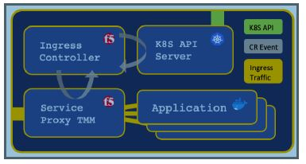

Kubernetes Loadbalancer F5 BIG-IP now named SPK (Service Proxy for Kubernetes)
---

# Overview
Service Proxy for Kubernetes (SPK) is a cloud-native application traffic management solution, designed for communication service provider (CoSP) 5G networks. SPK integrates F5’s containerized Traffic Management Microkernel (TMM) and Custom Resource Definitions (CRDs) into the OpenShift container platform, to proxy and load balance low-latency 5G workloads.

## Features
* TCP, UDP, SCTP, NGAP and Diameter traffic management
* OVN-Kubernetes CNI and SR-IOV interface networking
* Multiple dual-stack IPv4/IPv6 capabilities
* **Egress request routing for internal Pods**
* Redundant data storage with persistence
* Diagnostics, statistics and debugging
* Centralized logging collection
* Pod health monitoring

## Components
* Ingress Controller
  * watches the Kube-API for Custom Resource (CR) update events
  * configures the Service Proxy Pod based on the update 
  * monitors Kubernetes Service object Endpoints, to dynamically update Service Proxy TMM’s load balancing pools
  * 
* Customer Resource Definitions
  * extend the Kubernetes API, enabling Service Proxy TMM to be configured using SPK’s Custom Resource (CR) objects
  * CRs configure TMM to process application traffic using UDP, TCP, SCTP, NGAP and Diameter. 
  * CRs also configure TMM’s networking components such as self IP addresses and static routes

* Service Proxy
  * proxy and load balance low-latency application traffic between networks
  * assist with dynamic routing, logging collection and debugging.

