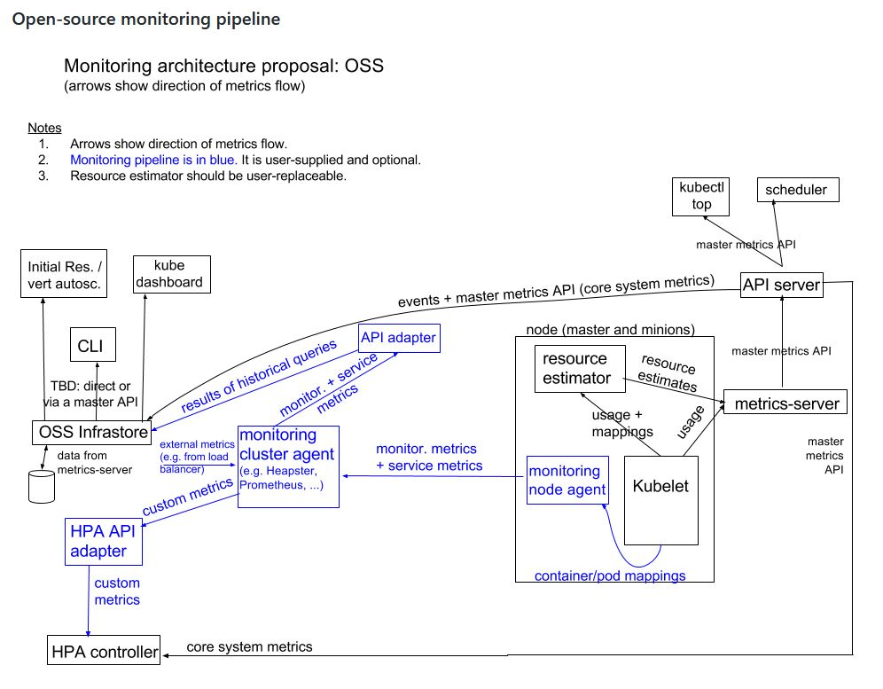
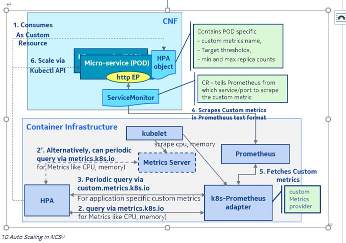
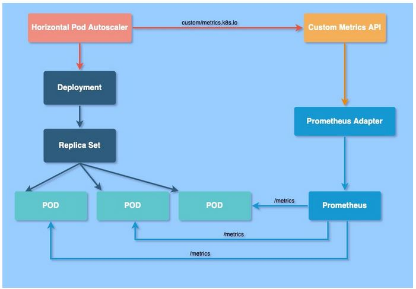
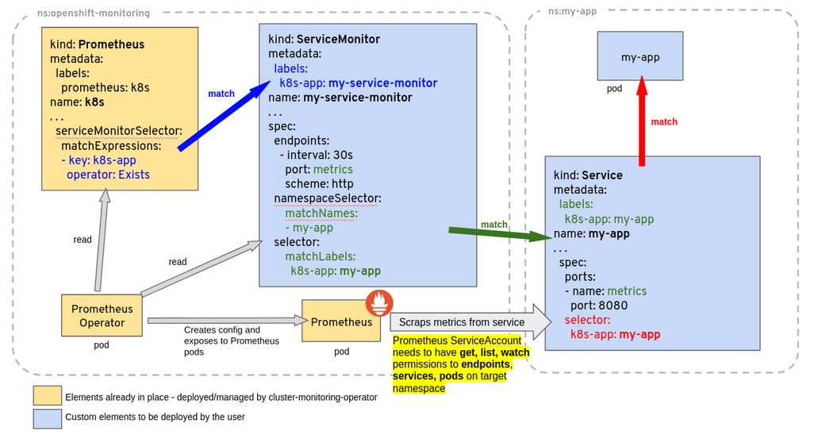

Kubernetes Scaling HPA
---

- [Overview](#overview)
- [How HPA works](#how-hpa-works)
- [HPA API](#hpa-api)
- [Scaling on  metrics](#scaling-on--metrics)
  - [Resource metrics (metrics.k8s.io) provided by metrics-server](#resource-metrics-metricsk8sio-provided-by-metrics-server)
  - [Customer Metrics (custom.metrics.k8s.io) provided by metrics solution vendor](#customer-metrics-custommetricsk8sio-provided-by-metrics-solution-vendor)
  - [External metreics (external.metrics.k8s.io) provided by custom metrics adpator](#external-metreics-externalmetricsk8sio-provided-by-custom-metrics-adpator)
- [Kubernetes Monitor Architecture](#kubernetes-monitor-architecture)
  - [Core Metrics Pipeline](#core-metrics-pipeline)
  - [Metrics-server](#metrics-server)
    - [Extenstion APIserver - Register APIService objects](#extenstion-apiserver---register-apiservice-objects)
  - [Monitoring Pipeline](#monitoring-pipeline)
    - [cAdvisor + Prometheus](#cadvisor--prometheus)
- [HPA Walkthrough](#hpa-walkthrough)
  - [Autoscaling on resource metrics (CPU)](#autoscaling-on-resource-metrics-cpu)
  - [Autoscaling on custom-metrics](#autoscaling-on-custom-metrics)
    - [Nokia Blueprint](#nokia-blueprint)
    - [Prometheus Adaptor](#prometheus-adaptor)
    - [Prometheus Adapter Integration into Kubernetes](#prometheus-adapter-integration-into-kubernetes)
    - [CaaS](#caas)
    - [Workt Items](#workt-items)
    - [How to configure Prometheus to scrape metrics from CNF](#how-to-configure-prometheus-to-scrape-metrics-from-cnf)
- [Code through](#code-through)
- [References](#references)

https://kubernetes.io/docs/tasks/run-application/horizontal-pod-autoscale/

# Overview
In Kubernetes, a HorizontalPodAutoscaler automatically updates a workload resource (such as a Deployment or StatefulSet), with the aim of automatically scaling the workload to match demand except DaemonSet

Autoscaling controller: Parts of kube-controler-manager
running within the Kubernetes **control plane** as "control loop", periodically adjusts the desired scale of its target (for example, a Deployment) to match observed metrics such as average **CPU utilization**, average **memory utilization**, or any other **custom metric** you specify

* Horizontal Scaling
  * Deploying more pod
* Vertical Scaling
  * assigning more resource(cpu,memory)
  
--horizontal-pod-autoscaler-sync-period parameter to the kube-controller-manager (and the default interval is 15 seconds).

# How HPA works
Once during each period, the controller manager:
* Queries the resource utilization against the metrics specified in each HorizontalPodAutoscaler definition
* Find the **target resource** defined by the **scaleTargetRef**
* Selects the pods based on the target resource's .spec.selector labels
* Obtains the metrics from either the resource metrics API (for per-pod resource metrics), or the custom metrics API (for all other metrics).
  * For per-pod resource metrics (like CPU), the controller fetches the metrics from the resource metrics API for each Pod targeted by the HorizontalPodAutoscaler. 
    * if a target utilization value is set, the controller calculates the utilization value as a percentage of the equivalent resource request on the containers in each Pod. 
    * If a target raw value is set, the raw metric values are used directly. 
  The controller then takes the mean of the utilization or the raw value (depending on the type of target specified) across all targeted Pods, and produces a ratio used to scale the number of desired replicas.
  * For per-pod custom metrics, the controller functions similarly to per-pod resource metrics, except that it works with raw values, not utilization values.
  * For object metrics and external metrics, a single metric is fetched, which describes the object in question. This metric is compared to the target value, to produce a ratio as above. In the autoscaling/v2 API version, this value can optionally be divided by the number of Pods before the comparison is made.

HPA is namespaced

# HPA API

* V1: Only support CPU Utilization
  ```
  targetCPUUtilizationPercentage (int32)
    target average CPU utilization (represented as a percentage of requested CPU) over all the pods; if not specified the default autoscaling policy will be used
  ```
  https://kubernetes.io/docs/reference/kubernetes-api/workload-resources/horizontal-pod-autoscaler-v1/

* V2
  * scaleTargetRef (CrossVersionObjectReference)
    * kind (Deployment|Statefulset)
    * name (workload name in this namespace on that kind)
    * apiVersion(kind API Version)
  * behavior (HorizontalPodAutoscalerBehavior)
    * scaleUp
    * scaleDown
  * metrics: metrics contains the specifications for which to use to calculate the desired replica count (the maximum replica count across all metrics will be used). The desired replica count is calculated multiplying the ratio between the target value and the current value by the current number of pods
    * scaleTargetRef: target deployment or statefulset be scaled
    * minReplicas, maxReplicas: the minimum and maximum Replicas Count to be scaled in and out
    * metrics type (metrics source): ContainerResource|External|Object|Pods|Resource
      * resource (ResourceMetricSource) -- per pod
        * name(string): name of resource in questions
          * cpu
          * memory
        * target(MetricTarget)
          * type (string): Utilization|Value|AverageValue
          * averageUtilization (only valid for Resource metric source type(i.e: cpu/memory))
          * averageValue
          * value

      * containerResource(**ContainerResourceMetricSource**) 
        * container(string): container name of scaling target
        * name(string): the name of the resource in question
          * cpu
          * memory
        * target(MetricTarget): target Values of the given metrics
          * type: Utilization|Value|Average
          * averageUtilization (only valid for Resource metric source type(i.e: cpu/memory))
          * averageValue
          * value
        NOTE: per container feature-gate **HPAContainerMetrics** must be enabled and **v1.20 is alpha**

      * pods (PodsMetricSource)
        * metric
          * name(string): namve of given metric
          * selector(LabelSelecotor)
        * target(MetricTarget): target Values of the given metrics
          * type: Utilization|Value|Average
          * averageUtilization (only valid for Resource metric source type(i.e: cpu/memory))
          * averageValue
          * value

        **These metrics describe Pods, and are averaged together across Pods and compared with a target value to determine the replica count**

      * object (ObjectMetricSource)
        * describedOject (CrossVersionObjectReference)
          * kind
          * name
          * apiVersion
        * metric
          * name(string): namve of given metric
          * selector(LabelSelecotor)
        * target(MetricTarget): target Values of the given metrics
          * type: Utilization|Value|Average
          * averageUtilization (only valid for Resource metric source type(i.e: cpu/memory))
          * averageValue
          * value

        **These metrics describe a different object in the same namespace, instead of describing Pods**

      * external (**ExternalMetricSource**)
        * metric
          * name(string): namve of given metric
          * selector(LabelSelecotor)
        * target(MetricTarget): target Values of the given metrics
          * type: Utilization|Value|Average
          * averageUtilization (only valid for Resource metric source type(i.e: cpu/memory))
          * averageValue
          * value

NOTE: 
* selector is the string-encoded form of a standard kubernetes label selector for the given metric When set, it is passed as an additional parameter to the **metrics server** for more specific metrics scoping. When unset, just the metricName will be used to gather metrics.
* If you provide multiple such metric blocks, the HorizontalPodAutoscaler will consider each metric in turn. The HorizontalPodAutoscaler will calculate proposed replica counts for each metric, and then **choose the one with the highest replica count**.
*  **pod or object selection is decided by where the metrics is coming from**


# Scaling on  metrics
FEATURE STATE: Kubernetes v1.23 [stable] 

Provided that you use the **autoscaling/v2** API version, you can configure a HorizontalPodAutoscaler to scale based on a custom metric (that is not built in to Kubernetes or any Kubernetes component). The HorizontalPodAutoscaler controller then queries for these **custom metrics** from the Kubernetes API.

API:
* For **resource metrics**, this is the **metrics.k8s.io** API, generally provided by **metrics-server**. It can be launched as a cluster add-on
* For **custom metrics**, this is the **custom.metrics.k8s.io** API. It's provided by **"adapter" API servers** provided by metrics solution vendors. Check with your metrics pipeline to see if there is a **Kubernetes metrics adapter** available
* For **external metrics**, this is the **external.metrics.k8s.io** API. It may be provided by the **custom metrics adapters** provided above

## Resource metrics (metrics.k8s.io) provided by metrics-server
* cpu
* memory
  
## Customer Metrics (custom.metrics.k8s.io) provided by metrics solution vendor
proposes an API that the Horizontal Pod Autoscaler can use to access **arbitrary metrics**;  the new API should be structured around accessing metrics by referring to **Kubernetes objects** (or groups thereof) and a metric name

* Root API: **/apis/custom-metrics/v1alpha1**
* **/{object-type}/{object-name}/{metric-name...}**: retrieve the given metric for the given non-namespaced object (e.g. Node, PersistentVolume)
* **/{object-type}/*/{metric-name...}**: retrieve the given metric for all non-namespaced objects of the given type
* **/{object-type}/*/{metric-name...}?labelSelector=foo**: retrieve the given metric for all non-namespaced objects of the given type matching the given label selector
  
* **/namespaces/{namespace-name}/{object-type}/{object-name}/{metric-name...}**: retrieve the given metric for the given namespaced object
  * /namespaces/mynamespace/pods/*/METRIC_NAME?labelSelector=foo
  * /namespaces/mynamespace/$RESOURCE.$GROUP/$OBJECT_NAME/$METRIC_NAME
* **/namespaces/{namespace-name}/{object-type}/*/{metric-name...}**: retrieve the given metric for all namespaced objects of the given type
* **/namespaces/{namespace-name}/{object-type}/*/{metric-name...}?labelSelector=foo**: retrieve the given metric for all namespaced objects of the given type matching the given label selector
* **/namespaces/{namespace-name}/metrics/{metric-name}**: retrieve the given metric which describes the given namespace.


## External metreics (external.metrics.k8s.io) provided by custom metrics adpator
HPA v2 API extension proposal introduces new External metric type for autoscaling based on metrics coming from outside of Kubernetes cluster

* /apis/external.metrics.k8s.io/v1beta1/namespaces/<namespace_name>/<metric_name>?labelSelector=<selector>

external refers to a global metric that is not associated with any Kubernetes object. It allows autoscaling based on information coming from components running outside of cluster (for example length of queue in cloud messaging service, or QPS from loadbalancer running outside of cluster).

ExternalMetricSource indicates how to scale on a metric not associated with any Kubernetes object (for example length of queue in cloud messaging service, or QPS from loadbalancer running outside of cluster).

# Kubernetes Monitor Architecture
## Core Metrics Pipeline
consisting of **Kubelet/cAdvisor**, a **resource estimator**, a slimmed-down Heapster called **metrics-server**, and the **API server** serving the master metrics API.

These metrics are used by **core system components**, such as **scheduling logic** (e.g. **scheduler** and **horizontal pod autoscaling** based on system metrics) and simple out-of-the-box UI components (e.g. **kubectl top**). 

## Metrics-server

* CPU/Memory(only cpu/memory) based horizontal autoscaling (learn more about [Horizontal Autoscaling](https://kubernetes.io/docs/tasks/run-application/horizontal-pod-autoscale/))
* Automatically adjusting/suggesting resources needed by containers (learn more about [Vertical Autoscaling](https://github.com/kubernetes/autoscaler/tree/master/vertical-pod-autoscaler/))

### Extenstion APIserver - Register APIService objects
```yaml
---
apiVersion: v1
kind: Service
metadata:
  labels:
    k8s-app: metrics-server
  name: metrics-server
  namespace: kube-system
spec:
  ports:
  - name: https
    port: 443
    protocol: TCP
    targetPort: https
  selector:
    k8s-app: metrics-server
--
apiVersion: apiregistration.k8s.io/v1
kind: APIService
metadata:
  labels:
    k8s-app: metrics-server
  name: v1beta1.metrics.k8s.io
spec:
  group: metrics.k8s.io
  groupPriorityMinimum: 100
  insecureSkipTLSVerify: true
  service:
    name: metrics-server
    namespace: kube-system
  version: v1beta1
  versionPriority: 100
```

## Monitoring Pipeline
A monitoring pipeline used for collecting various metrics from the system and exposing them to **end-users**, as well as to the **Horizontal Pod Autoscaler** (for custom metrics) and Infrastore via **adapters**. 

Users can choose from many **monitoring system vendors**, or run none at all. 

In open-source, Kubernetes will not ship with a **monitoring pipeline**, but third-party options will be easy to install. 
* a per-node agent
* a cluster-level aggregator.



Data collected by the monitoring pipeline may contain any sub- or superset of the following groups of metrics:
* core system metrics
* non-core system metrics
* service metrics from user application containers
* service metrics from Kubernetes infrastructure containers; these metrics are exposed using Prometheus instrumentation

monitoring pipeline would  have to create a stateless **API adapter** that **pulls** the custom metrics from the monitoring pipeline and **exposes** them to the Horizontal Pod Autoscaler
* cAdvisor + Heapster + InfluxDB (or any other sink)
* cAdvisor + collectd + Heapster
* **cAdvisor + Prometheus**
* snapd + Heapster
* snapd + SNAP cluster-level agent
* Sysdig

### cAdvisor + Prometheus

* core and non-core system metrics from cAdvisor
* **service metrics exposed by containers** via HTTP handler in Prometheus format
* [optional] metrics about node itself from Node Exporter (a Prometheus component)

# HPA Walkthrough
## Autoscaling on resource metrics (CPU)
* metrics-server 
  installed using https://github.com/kubernetes-sigs/metrics-server/releases/latest/download/components.yaml w/ updated parameter "- --kubelet-insecure-tls"

```
E0402 01:50:02.220719       1 scraper.go:140] "Failed to scrape node" err="Get \"https://10.67.26.198:10250/metrics/resource\": x509: cannot validate certificate for 10.67.26.198 because it doesn't contain any IP SANs" node="eksa-2"
I0402 01:50:08.446220       1 server.go:187] "Failed probe" probe="metric-storage-ready" err="no metrics to serve"
```

Both Pod and Container Resource metrics can be used by Resource based HPA
```yaml
apiVersion: autoscaling/v2
kind: HorizontalPodAutoscaler
metadata:
  name: php-apache
  namespace: default
spec:
  scaleTargetRef:
    apiVersion: apps/v1
    kind: Deployment
    name: php-apache
  minReplicas: 1
  maxReplicas: 10
  metrics:
  - type: Resource
    resource:
      name: cpu
      target:
        type: Utilization
        averageUtilization: 50
```

```yaml
apiVersion: autoscaling/v2
kind: HorizontalPodAutoscaler
metadata:
  name: php-apache
  namespace: default
spec:
  scaleTargetRef:
    apiVersion: apps/v1
    kind: Deployment
    name: php-apache
  minReplicas: 1
  maxReplicas: 10
  metrics:
  - type: ContainerResource
    containerResource:
      container: php-apache
      name: cpu
      target:
        type: Utilization
        averageUtilization: 50

```
```bash
root@eksa-2:~/hpa# kubectl get hpa php-apache --watch
NAME         REFERENCE               TARGETS   MINPODS   MAXPODS   REPLICAS   AGE
php-apache   Deployment/php-apache   0%/50%    1         10        1          4m25s
php-apache   Deployment/php-apache   65%/50%   1         10        1          5m1s
php-apache   Deployment/php-apache   250%/50%   1         10        2          5m16s
php-apache   Deployment/php-apache   156%/50%   1         10        4          5m31s
php-apache   Deployment/php-apache   120%/50%   1         10        5          5m46s
php-apache   Deployment/php-apache   57%/50%    1         10        5          6m1s
php-apache   Deployment/php-apache   55%/50%    1         10        5          6m16s
php-apache   Deployment/php-apache   59%/50%    1         10        5          6m31s
php-apache   Deployment/php-apache   62%/50%    1         10        6          6m46s
php-apache   Deployment/php-apache   53%/50%    1         10        6          7m1s
php-apache   Deployment/php-apache   48%/50%    1         10        6          7m16s
```
**Autoscaling the replicas may take a few minutes (around 5minutes)**
https://kubernetes.io/docs/reference/kubernetes-api/workload-resources/horizontal-pod-autoscaler-v2/
https://kubernetes.io/docs/tasks/run-application/horizontal-pod-autoscale-walkthrough

## Autoscaling on custom-metrics
### Nokia Blueprint

Prometheus and Prometheus Adapter will be used as custom-metrics framework.


**Note: HPA based mechanism does not work for micro services that use fixed IPs only support service based micro services**

### Prometheus Adaptor
* resource metrics (replace metrics-server)
* custom metrics
* external metrics

### Prometheus Adapter Integration into Kubernetes
* Create Adapter Service
```yaml
apiVersion: v1
kind: Service
metadata:
  name: custom-metrics-apiserver
  namespace: custom-metrics
spec:
  ports:
  - port: 443
    targetPort: 6443
  selector:
    app: custom-metrics-apiserver #binding to apdaper deployment
```
* Create APIService
```yaml
apiVersion: apiregistration.k8s.io/v1beta1
kind: APIService
metadata:
  name: v1beta1.custom.metrics.k8s.io
spec:
  service:
    name: custom-metrics-apiserver
    namespace: custom-metrics
  group: custom.metrics.k8s.io
  version: v1beta1
  insecureSkipTLSVerify: true
  groupPriorityMinimum: 100
  versionPriority: 100
---
apiVersion: apiregistration.k8s.io/v1beta1
kind: APIService
metadata:
  name: v1beta2.custom.metrics.k8s.io
spec:
  service:
    name: custom-metrics-apiserver
    namespace: custom-metrics
  group: custom.metrics.k8s.io
  version: v1beta2
  insecureSkipTLSVerify: true
  groupPriorityMinimum: 100
  versionPriority: 200
---
apiVersion: apiregistration.k8s.io/v1beta1
kind: APIService
metadata:
  name: v1beta1.external.metrics.k8s.io
spec:
  service:
    name: custom-metrics-apiserver
    namespace: custom-metrics
  group: external.metrics.k8s.io
  version: v1beta1
  insecureSkipTLSVerify: true
  groupPriorityMinimum: 100
  versionPriority: 100
---
```




https://github.com/prometheus-operator/prometheus-operator/blob/main/Documentation/troubleshooting.md#troubleshooting-servicemonitor-changes


### CaaS
* Install Prometheus
* Install prometheus-adapter w/ custom-metrics support

```
helm repo add prometheus-community https://prometheus-community.github.io/helm-charts
helm repo update
helm install [RELEASE_NAME] prometheus-community/kube-prometheus-stack
helm install [RELEASE_NAME] prometheus-community/prometheus-adapter

NOTE: make sure prometheus-url configred in prometheus-adapter
For example:
--prometheus-url=http://prometheus-kube-prometheus-prometheus.default.svc.cluster.local:9090

root@eksa-2:~# helm list
NAME              	NAMESPACE	REVISION	UPDATED                                	STATUS  	CHART                       	APP VERSION
prometheus        	default  	1       	2022-04-11 04:51:14.907809968 +0000 UTC	deployed	kube-prometheus-stack-34.9.0	0.55.0     
prometheus-adapter	default  	1       	2022-04-11 04:55:10.202758794 +0000 UTC	deployed	prometheus-adapter-3.2.0    	v0.9.1 
```

### Workt Items
* Create ServiceMonitor (namespaced based) w/ label configured same with Prometheus serviceMonitorSelector -- .yaml
* Create HPA (Resource + custom_metrics) - Configurable: autoscalling.enable|autoscalling.resource.enable|autoscalling.custom_metrics.enable
* Create Prometheus Server to responds http://<svc.default.cluser.local>:port/metrics

### How to configure Prometheus to scrape metrics from CNF
1. Prometheus Configuraiton and Pod Annonation
  ```yaml
  - job_name: 'kubernetes-pods'
        kubernetes_sd_configs:
        - role: pod

        relabel_configs:
        - source_labels: [__meta_kubernetes_pod_annotation_prometheus_io_scrape]
          action: keep
          regex: true
        - source_labels: [__meta_kubernetes_pod_annotation_prometheus_io_path]
          action: replace
          target_label: __metrics_path__
          regex: (.+)
        - source_labels: [__address__, __meta_kubernetes_pod_annotation_prometheus_io_port]
          action: replace
          regex: ([^:]+)(?::\d+)?;(\d+)
          replacement: $1:$2
          target_label: __address__
        - action: labelmap
          regex: __meta_kubernetes_pod_label_(.+)
        - source_labels: [__meta_kubernetes_namespace]
          action: replace
          target_label: kubernetes_namespace
        - source_labels: [__meta_kubernetes_pod_name]
          action: replace
          target_label: kubernetes_pod_name
  ```
  ```yaml
  metadata:
    annotations:
      prometheus.io/scrape: 'true'
      prometheus.io/path: '/data/metrics'
      prometheus.io/port: '80'
  ```

2. scrape Rule
  ```yaml
      # Here it's Prometheus itself.
    scrape_configs:
      - job_name: 'sla-monitoring'
        scrape_interval: 10s
        dns_sd_configs:
        - refresh_interval: 120s
          names:
          - sla-monitoring.default.svc.cluster.local
          type: 'A'
          port: 8989

      - job_name: 'metric-collector'
        scrape_interval: 10s
        dns_sd_configs:
        - refresh_interval: 120s
          names:
          - metrics-collector.kube-system.svc.cluster.local
          type: 'A'
          port: 8989

  ```
3. ServiceMinitor
```yaml
   # Service targeting gitlab instances
apiVersion: v1
kind: Service
metadata:
  name: gitlab-metrics
  labels:
    app: gitlab-runner-gitlab-runner
spec:
  ports:
  - name: metrics # expose metrics port
    port: 9252 # defined in gitlab chart
    targetPort: metrics
    protocol: TCP
  selector:
    app: gitlab-runner-gitlab-runner # target gitlab pods
---
#if custom-metrics.enable
apiVersion: monitoring.coreos.com/v1
kind: ServiceMonitor
metadata:
  name: gitlab-metrics-servicemonitor
  # Change this to the namespace the Prometheus instance is running in
  # namespace: default
  labels:
    app: gitlab-runner-gitlab-runner
    release: prometheus
spec:
  selector:
    matchLabels:
      app: gitlab-runner-gitlab-runner # target gitlab service
  endpoints:
  - port: metrics
    interval: 15s
#endif
```

Following the following walkthrough to deploy test deployment
https://github.com/kubernetes-sigs/prometheus-adapter/blob/v0.9.1/docs/walkthrough.md

Read carefully the following pic, make sure your ServiceMonitor Label is line up with serviceMonitorSelector of Prometheus CR

```yaml
root@eksa-2:~/hpa/helm-charts-main/charts# kubectl get prometheus prometheus-kube-prometheus-prometheus -o yaml
apiVersion: monitoring.coreos.com/v1
kind: Prometheus
metadata:
  annotations:
    meta.helm.sh/release-name: prometheus
    meta.helm.sh/release-namespace: default
  creationTimestamp: "2022-04-11T04:52:22Z"
  generation: 2
  labels:
    app: kube-prometheus-stack-prometheus
    app.kubernetes.io/instance: prometheus
    app.kubernetes.io/managed-by: Helm
    app.kubernetes.io/part-of: kube-prometheus-stack
    app.kubernetes.io/version: 34.9.0
    chart: kube-prometheus-stack-34.9.0
    heritage: Helm
    release: prometheus
  name: prometheus-kube-prometheus-prometheus
  namespace: default
  resourceVersion: "15406656"
  uid: 097d36b6-64b1-4af5-a704-0a33b8b54ac8
spec:
  alerting:
    alertmanagers:
    - apiVersion: v2
      name: prometheus-kube-prometheus-alertmanager
      namespace: default
      pathPrefix: /
      port: http-web
  enableAdminAPI: false
  externalUrl: http://prometheus-kube-prometheus-prometheus.default:9090
  image: quay.io/prometheus/prometheus:v2.34.0
  listenLocal: false
  logFormat: logfmt
  logLevel: info
  paused: false
  podMonitorNamespaceSelector: {}
  podMonitorSelector:
    matchLabels:
      release: prometheus
  portName: http-web
  probeNamespaceSelector: {}
  probeSelector:
    matchLabels:
      release: prometheus
  replicas: 1
  retention: 10d
  routePrefix: /
  ruleNamespaceSelector: {}
  ruleSelector:
    matchLabels:
      release: prometheus
  securityContext:
    fsGroup: 2000
    runAsGroup: 2000
    runAsNonRoot: true
    runAsUser: 1000
  serviceAccountName: prometheus-kube-prometheus-prometheus
  serviceMonitorNamespaceSelector: {}
  serviceMonitorSelector:  #RYAN: NOTE HERE TO MAKE SURE your ServiceMonitor Label line up the here
    matchExpressions:
    - key: app
      operator: Exists
    matchLabels:
      release: prometheus
  shards: 1
  version: v2.34.0
```
```bash
root@eksa-2:~/hpa/custom-metrics# kubectl get --raw "/apis/custom.metrics.k8s.io/v1beta1/namespaces/default/pods/*/http_requests?selector=app%3Dsample-app"
{"kind":"MetricValueList","apiVersion":"custom.metrics.k8s.io/v1beta1","metadata":{"selfLink":"/apis/custom.metrics.k8s.io/v1beta1/namespaces/default/pods/%2A/http_requests"},"items":[{"describedObject":{"kind":"Pod","namespace":"default","name":"sample-app-84558dcdd-wshrz","apiVersion":"/v1"},"metricName":"http_requests","timestamp":"2022-04-11T08:04:23Z","value":"33m","selector":null}]}
root@eksa-2:~/hpa/custom-metrics# 

root@eksa-2:~/hpa/custom-metrics# kubectl get hpa
NAME         REFERENCE               TARGETS    MINPODS   MAXPODS   REPLICAS   AGE
sample-app   Deployment/sample-app   40m/500m   1         10        1          18h

NAME         REFERENCE               TARGETS     MINPODS   MAXPODS   REPLICAS   AGE
sample-app   Deployment/sample-app   596m/500m   1         10        2          18h
sample-app-84558dcdd-qp5g2                               1/1     Running   0          55s
sample-app-84558dcdd-wshrz                               1/1     Running   0          5h22m
NAME         REFERENCE               TARGETS     MINPODS   MAXPODS   REPLICAS   AGE
sample-app   Deployment/sample-app   596m/500m   1         10        2          18h
sample-app-84558dcdd-qp5g2                               1/1     Running   0          56s
sample-app-84558dcdd-wshrz                               1/1     Running   0          5h22m
NAME         REFERENCE               TARGETS     MINPODS   MAXPODS   REPLICAS   AGE
sample-app   Deployment/sample-app   596m/500m   1         10        2          18h
sample-app-84558dcdd-qp5g2                               1/1     Running   0          57s
sample-app-84558dcdd-wshrz                               1/1     Running   0          5h22m
.....
sample-app   Deployment/sample-app   418m/500m   1         10        3          19h
sample-app-84558dcdd-jmrct                               1/1     Running   0          67m
sample-app-84558dcdd-qp5g2                               1/1     Running   0          77m
sample-app-84558dcdd-wshrz                               1/1     Running   0          6h39m
NAME         REFERENCE               TARGETS     MINPODS   MAXPODS   REPLICAS   AGE
sample-app   Deployment/sample-app   418m/500m   1         10        3          19h
sample-app-84558dcdd-jmrct                               1/1     Running   0          67m
sample-app-84558dcdd-qp5g2                               1/1     Running   0          77m
sample-app-84558dcdd-wshrz                               1/1     Running   0          6h39m
NAME         REFERENCE               TARGETS     MINPODS   MAXPODS   REPLICAS   AGE
sample-app   Deployment/sample-app   418m/500m   1         10        3          19h
sample-app-84558dcdd-jmrct                               1/1     Running   0          67m
sample-app-84558dcdd-qp5g2                               1/1     Running   0          77m
sample-app-84558dcdd-wshrz                               1/1     Running   0          6h39m
NAME         REFERENCE               TARGETS     MINPODS   MAXPODS   REPLICAS   AGE
sample-app   Deployment/sample-app   418m/500m   1         10        3          19h
sample-app-84558dcdd-jmrct                               1/1     Running   0          67m
sample-app-84558dcdd-qp5g2                               1/1     Running   0          77m
sample-app-84558dcdd-wshrz                               1/1     Running   0          6h39m
.....
sample-app-84558dcdd-wshrz                               1/1     Running   0          6h53m
NAME         REFERENCE               TARGETS    MINPODS   MAXPODS   REPLICAS   AGE
sample-app   Deployment/sample-app   33m/500m   1         10        1          20h
sample-app-84558dcdd-wshrz                               1/1     Running   0          6h53m
NAME         REFERENCE               TARGETS    MINPODS   MAXPODS   REPLICAS   AGE
sample-app   Deployment/sample-app   33m/500m   1         10        1          20h
sample-app-84558dcdd-wshrz                               1/1     Running   0          6h53m
NAME         REFERENCE               TARGETS    MINPODS   MAXPODS   REPLICAS   AGE
sample-app   Deployment/sample-app   33m/500m   1         10        1          20h
sample-app-84558dcdd-wshrz                               1/1     Running   0          6h53m
NAME         REFERENCE               TARGETS    MINPODS   MAXPODS   REPLICAS   AGE
sample-app   Deployment/sample-app   33m/500m   1         10        1          20h
```

# Code through
```golang
(a *HorizontalController) worker //RYAN: loop forever to handle all HPA
  a.processNextWorkItem(ctx)
  ---
    deleted, err := a.reconcileKey(ctx, key.(string))
    ---
      namespace, name, err := cache.SplitMetaNamespaceKey(key)
      hpa, err := a.hpaLister.HorizontalPodAutoscalers(namespace).Get(name)
      return false, a.reconcileAutoscaler(ctx, hpa, key)
      ---
        hpa := hpaShared.DeepCopy()
        reference := fmt.Sprintf("%s/%s/%s", hpa.Spec.ScaleTargetRef.Kind, hpa.Namespace, hpa.Spec.ScaleTargetRef.Name)
        //RYAN: here reference on target is using hpa namespace
        targetGV, err := schema.ParseGroupVersion(hpa.Spec.ScaleTargetRef.APIVersion)
        //RYAN: For example: Group: apps, version: v1, kind: Deployment
        targetGK := schema.GroupKind{
                Group: targetGV.Group,
                Kind:  hpa.Spec.ScaleTargetRef.Kind,
        }
        mappings, err := a.mapper.RESTMappings(targetGK)
        scale, targetGR, err := a.scaleForResourceMappings(ctx, hpa.Namespace, hpa.Spec.ScaleTargetRef.Name, mappings)
        setCondition(hpa, autoscalingv2.AbleToScale, v1.ConditionTrue, "SucceededGetScale", "the HPA controller was able to get the target's current scale")
        currentReplicas := scale.Spec.Replicas
        a.recordInitialRecommendation(currentReplicas, key)
        if scale.Spec.Replicas == 0 && minReplicas != 0 {
                // Autoscaling is disabled for this resource
                desiredReplicas = 0
                rescale = false
                setCondition(hpa, autoscalingv2.ScalingActive, v1.ConditionFalse, "ScalingDisabled", "scaling is disabled since the replica count of the target is zero")
        } else if currentReplicas > hpa.Spec.MaxReplicas {
                rescaleReason = "Current number of replicas above Spec.MaxReplicas"
                desiredReplicas = hpa.Spec.MaxReplicas
        } else if currentReplicas < minReplicas {
                rescaleReason = "Current number of replicas below Spec.MinReplicas"
                desiredReplicas = minReplicas
        } else {
                var metricTimestamp time.Time
                metricDesiredReplicas, metricName, metricStatuses, metricTimestamp, err = a.computeReplicasForMetrics(ctx, hpa, scale, hpa.Spec.Metrics)
                ------
                    specReplicas := scale.Spec.Replicas
                    statusReplicas := scale.Status.Replicas //RYAN: current replics
                    for i, metricSpec := range metricSpecs {
                        replicaCountProposal, metricNameProposal, timestampProposal, condition, err := a.computeReplicasForMetric(ctx, hpa, metricSpec, specReplicas, statusReplicas, selector, &statuses[i])
                        ------
                                switch spec.Type {
                                case autoscalingv2.ResourceMetricSourceType:
                                        replicaCountProposal, timestampProposal, metricNameProposal, condition, err = a.computeStatusForResourceMetric(ctx, specReplicas, spec, hpa, selector, status)
                                        ------
                                                replicaCountProposal, metricValueStatus, timestampProposal, metricNameProposal, condition, err := a.computeStatusForResourceMetricGeneric(ctx, currentReplicas, metricSpec.Resource.Target, metricSpec.Resource.Name, hpa.Namespace, "", selector)
                                                ------
                                                        //RYAN: Does not handle targetr.value
                                                        if target.AverageValue != nil {
                                                                var rawProposal int64
                                                                replicaCountProposal, rawProposal, timestampProposal, err := a.replicaCalc.GetRawResourceReplicas(ctx, currentReplicas, target.AverageValue.MilliValue(), resourceName, namespace, selector, container)

                                                                if err != nil {
                                                                        return 0, nil, time.Time{}, "", condition, fmt.Errorf("failed to get %s utilization: %v", resourceName, err)
                                                                }
                                                                metricNameProposal = fmt.Sprintf("%s resource", resourceName.String())
                                                                status := autoscalingv2.MetricValueStatus{
                                                                        AverageValue: resource.NewMilliQuantity(rawProposal, resource.DecimalSI),
                                                                }
                                                                return replicaCountProposal, &status, timestampProposal, metricNameProposal, autoscalingv2.HorizontalPodAutoscalerCondition{}, nil
                                                        }

                                                        if target.AverageUtilization == nil {
                                                                errMsg := "invalid resource metric source: neither a utilization target nor a value target was set"
                                                                return 0, nil, time.Time{}, "", condition, fmt.Errorf(errMsg)
                                                        }

                                                        targetUtilization := *target.AverageUtilization
                                                        replicaCountProposal, percentageProposal, rawProposal, timestampProposal, err := a.replicaCalc.GetResourceReplicas(ctx, currentReplicas, targetUtilization, resourceName, namespace, selector, container)
                                                        ------
                                                                 metrics, timestamp, err := c.metricsClient.GetResourceMetric(ctx, resource, namespace, selector, container)
                                                                 ------
                                                                        metrics, err := c.client.PodMetricses(namespace).List(ctx, metav1.ListOptions{LabelSelector: selector.String()})
                                                                        //RYAN: const GroupName = "metrics.k8s.io"
                                                                        //RYAN: var SchemeGroupVersion = schema.GroupVersion{Group: GroupName, Version: "v1beta1"}
                                                                        //RYAN: config.APIPath = "/apis"
                                                                        //RYAN: curl http://127.0.0.1:8001/apis/metrics.k8s.io/v1beta1/namespaces/default/pods/php-apache-7664864d67-kz5s6    
                                                                        //RYAN: result refer to output/pods-metrics.json                             
                                                                        ------PodMetricses
                                                                                return newPodMetricses(c, namespace)
                                                                                ------
                                                                                        return &podMetricses{
                                                                                                client: c.RESTClient(),
                                                                                                ns:     namespace,
                                                                                        }   
                                                                        ------List
                                                                                var timeout time.Duration
                                                                                if opts.TimeoutSeconds != nil {
                                                                                        timeout = time.Duration(*opts.TimeoutSeconds) * time.Second
                                                                                }
                                                                                result = &v1beta1.PodMetricsList{}
                                                                                err = c.client.Get().
                                                                                        Namespace(c.ns).
                                                                                        Resource("pods").
                                                                                        VersionedParams(&opts, scheme.ParameterCodec).
                                                                                        Timeout(timeout).
                                                                                        Do(ctx).
                                                                                        Into(result)
                                                                            
                                                                         res = getPodMetrics(metrics.Items, resource)
                                                                         ------
                                                                                res := make(PodMetricsInfo, len(rawMetrics))
                                                                                for _, m := range rawMetrics {
                                                                                        podSum := int64(0)
                                                                                        missing := len(m.Containers) == 0
                                                                                        for _, c := range m.Containers {
                                                                                                resValue, found := c.Usage[resource] //RYAN: here resource must be "cpu" and "memory" because metrics-server now only support "cpu" and "memory" resource
                                                                                                if !found {
                                                                                                        missing = true
                                                                                                        klog.V(2).Infof("missing resource metric %v for %s/%s", resource, m.Namespace, m.Name)
                                                                                                        break
                                                                                                }
                                                                                                podSum += resValue.MilliValue()
                                                                                        }
                                                                                        if !missing {
                                                                                                res[m.Name] = PodMetric{
                                                                                                        Timestamp: m.Timestamp.Time,
                                                                                                        Window:    m.Window.Duration,
                                                                                                        Value:     podSum,
                                                                                                }
                                                                                        }
                                                                                }
                                                                                return res
    

                                                                 podList, err := c.podLister.Pods(namespace).List(selector)
                                                                 readyPodCount, unreadyPods, missingPods, ignoredPods := groupPods(podList, metrics, resource, c.cpuInitializationPeriod, c.delayOfInitialReadinessStatus)
                                                                 requests, err := calculatePodRequests(podList, container, resource)
                                                                 usageRatio, utilization, rawUtilization, err := metricsclient.GetResourceUtilizationRatio(metrics, requests, targetUtilization)
                                                                 rebalanceIgnored := len(unreadyPods) > 0 && usageRatio > 1.0
                                                                 newUsageRatio, _, _, err := metricsclient.GetResourceUtilizationRatio(metrics, requests, targetUtilization)
                                                                  newReplicas := int32(math.Ceil(newUsageRatio * float64(len(metrics))))
                                                        if err != nil {
                                                                return 0, nil, time.Time{}, "", condition, fmt.Errorf("failed to get %s utilization: %v", resourceName, err)
                                                        }

                                                        metricNameProposal = fmt.Sprintf("%s resource utilization (percentage of request)", resourceName)
                                                        status := autoscalingv2.MetricValueStatus{
                                                                AverageUtilization: &percentageProposal,
                                                                AverageValue:       resource.NewMilliQuantity(rawProposal, resource.DecimalSI),
                                                        }
                                                        return replicaCountProposal, &status, timestampProposal, metricNameProposal, autoscalingv2.HorizontalPodAutoscalerCondition{}, nil

                                                if err != nil {
                                                        condition = a.getUnableComputeReplicaCountCondition(hpa, "FailedGetResourceMetric", err)
                                                        return replicaCountProposal, timestampProposal, metricNameProposal, condition, err
                                                }
                                                *status = autoscalingv2.MetricStatus{
                                                        Type: autoscalingv2.ResourceMetricSourceType,
                                                        Resource: &autoscalingv2.ResourceMetricStatus{
                                                                Name:    metricSpec.Resource.Name,
                                                                Current: *metricValueStatus,
                                                        },
                                                }
                                                return replicaCountProposal, timestampProposal, metricNameProposal, condition, nil                                        
                                case autoscalingv2.ContainerResourceMetricSourceType:
                                        replicaCountProposal, timestampProposal, metricNameProposal, condition, err = a.computeStatusForContainerResourceMetric(ctx, specReplicas, spec, hpa, selector, status)
                                        ------
                                                replicaCountProposal, metricValueStatus, timestampProposal, metricNameProposal, condition, err := a.computeStatusForResourceMetricGeneric(ctx, currentReplicas, metricSpec.ContainerResource.Target, metricSpec.ContainerResource.Name, hpa.Namespace, metricSpec.ContainerResource.Container, selector)
                                                ------
                                                        //RYAN: same with Resource but only query specificied container metrics
                                                        //RYAN: cpu/memory resource querying from metrics-server same with Resource

                                                if err != nil {
                                                        condition = a.getUnableComputeReplicaCountCondition(hpa, "FailedGetContainerResourceMetric", err)
                                                        return replicaCountProposal, timestampProposal, metricNameProposal, condition, err
                                                }
                                                *status = autoscalingv2.MetricStatus{
                                                        Type: autoscalingv2.ContainerResourceMetricSourceType,
                                                        ContainerResource: &autoscalingv2.ContainerResourceMetricStatus{
                                                                Name:      metricSpec.ContainerResource.Name,
                                                                Container: metricSpec.ContainerResource.Container,
                                                                Current:   *metricValueStatus,
                                                        },
                                                }
                                                return replicaCountProposal, timestampProposal, metricNameProposal, condition, nil
                                case autoscalingv2.PodsMetricSourceType:
                                        metricSelector, err := metav1.LabelSelectorAsSelector(spec.Pods.Metric.Selector)
                                        ------
                                                    if len(ps.MatchLabels)+len(ps.MatchExpressions) == 0 {
                                                            return labels.Everything(), nil
                                                    }
                                                    requirements := make([]labels.Requirement, 0, len(ps.MatchLabels)+len(ps.MatchExpressions))
                                                    for k, v := range ps.MatchLabels {
                                                            r, err := labels.NewRequirement(k, selection.Equals, []string{v})
                                                            if err != nil {
                                                                    return nil, err
                                                            }
                                                            requirements = append(requirements, *r)
                                                    }
                                                    for _, expr := range ps.MatchExpressions {
                                                            var op selection.Operator
                                                            switch expr.Operator {
                                                            case LabelSelectorOpIn:
                                                                    op = selection.In
                                                            case LabelSelectorOpNotIn:
                                                                    op = selection.NotIn
                                                            case LabelSelectorOpExists:
                                                                    op = selection.Exists
                                                            case LabelSelectorOpDoesNotExist:
                                                                    op = selection.DoesNotExist
                                                            default:
                                                                    return nil, fmt.Errorf("%q is not a valid pod selector operator", expr.Operator)
                                                            }
                                                            r, err := labels.NewRequirement(expr.Key, op, append([]string(nil), expr.Values...))
                                                            if err != nil {
                                                                    return nil, err
                                                            }
                                                            requirements = append(requirements, *r)
                                                    }
                                                    selector := labels.NewSelector()
                                                    selector = selector.Add(requirements...)
                                                    return selector, nil

                                        if err != nil {
                                                condition := a.getUnableComputeReplicaCountCondition(hpa, "FailedGetPodsMetric", err)
                                                return 0, "", time.Time{}, condition, fmt.Errorf("failed to get pods metric value: %v", err)
                                        }
                                        replicaCountProposal, timestampProposal, metricNameProposal, condition, err = a.computeStatusForPodsMetric(specReplicas, spec, hpa, selector, status, metricSelector)
                                        ------
                                                replicaCountProposal, utilizationProposal, timestampProposal, err := a.replicaCalc.GetMetricReplicas(currentReplicas, metricSpec.Pods.Target.AverageValue.MilliValue(), metricSpec.Pods.Metric.Name, hpa.Namespace, selector, metricSelector)
                                                ------
                                                        metrics, timestamp, err := c.metricsClient.GetRawMetric(metricName, namespace, selector, metricSelector)
                                                        ------
                                                                metrics, err := c.client.NamespacedMetrics(namespace).GetForObjects(schema.GroupKind{Kind: "Pod"}, selector, metricName, metricSelector)
                                                                        func (m *namespacedMetrics) GetForObjects(groupKind schema.GroupKind, selector labels.Selector, metricName string, metricSelector labels.Selector) (*v1beta2.MetricValueList, error) {
                                                                                resourceName, err := m.client.qualResourceForKind(groupKind)
                                                                                if err != nil {
                                                                                        return nil, err
                                                                                }

                                                                                params, err := versionConverter.ConvertListOptionsToVersion(&cmint.MetricListOptions{
                                                                                        LabelSelector:       selector.String(),
                                                                                        MetricLabelSelector: metricSelector.String(),
                                                                                }, m.client.version)
                                                                                if err != nil {
                                                                                        return nil, err
                                                                                }

                                                                                result := m.client.client.Get().
                                                                                        Resource(resourceName).
                                                                                        Namespace(m.namespace).
                                                                                        Name(v1beta1.AllObjects).
                                                                                        SubResource(metricName).
                                                                                        VersionedParams(params, scheme.ParameterCodec).
                                                                                        Do(context.TODO())

                                                                                metricObj, err := versionConverter.ConvertResultToVersion(result, v1beta2.SchemeGroupVersion)
                                                                                if err != nil {
                                                                                        return nil, err
                                                                                }

                                                                                var res *v1beta2.MetricValueList
                                                                                var ok bool
                                                                                if res, ok = metricObj.(*v1beta2.MetricValueList); !ok {
                                                                                        return nil, fmt.Errorf("the custom metrics API server didn't return MetricValueList, the type is %v", reflect.TypeOf(metricObj))
                                                                                }
                                                                                return res, nil
                                                                        }

                                                                        res := make(PodMetricsInfo, len(metrics.Items))
                                                                for _, m := range metrics.Items {
                                                                        window := metricServerDefaultMetricWindow
                                                                        if m.WindowSeconds != nil {
                                                                                window = time.Duration(*m.WindowSeconds) * time.Second
                                                                        }
                                                                        res[m.DescribedObject.Name] = PodMetric{
                                                                                Timestamp: m.Timestamp.Time,
                                                                                Window:    window,
                                                                                Value:     int64(m.Value.MilliValue()),
                                                                        }

                                                                        m.Value.MilliValue()
                                                                }

                                                                timestamp := metrics.Items[0].Timestamp.Time

                                                                return res, timestamp, nil

                                                        replicaCount, utilization, err = c.calcPlainMetricReplicas(metrics, currentReplicas, targetUtilization, namespace, selector, v1.ResourceName(""))
                                                        return replicaCount, utilization, timestamp, err
                                                *status = autoscalingv2.MetricStatus{
                                                        Type: autoscalingv2.PodsMetricSourceType,
                                                        Pods: &autoscalingv2.PodsMetricStatus{
                                                                Metric: autoscalingv2.MetricIdentifier{
                                                                        Name:     metricSpec.Pods.Metric.Name,
                                                                        Selector: metricSpec.Pods.Metric.Selector,
                                                                },
                                                                Current: autoscalingv2.MetricValueStatus{
                                                                        AverageValue: resource.NewMilliQuantity(utilizationProposal, resource.DecimalSI),
                                                                },
                                                        },
                                                }

                                                 return replicaCountProposal, timestampProposal, fmt.Sprintf("pods metric %s", metricSpec.Pods.Metric.Name), autoscalingv2.HorizontalPodAutoscalerCondition{}, nil


                                        if err != nil {
                                                return 0, "", time.Time{}, condition, fmt.Errorf("failed to get pods metric value: %v", err)
                                        }
                                case autoscalingv2.ObjectMetricSourceType:
                                        metricSelector, err := metav1.LabelSelectorAsSelector(spec.Object.Metric.Selector)
                                        if err != nil {
                                                condition := a.getUnableComputeReplicaCountCondition(hpa, "FailedGetObjectMetric", err)
                                                return 0, "", time.Time{}, condition, fmt.Errorf("failed to get object metric value: %v", err)
                                        }
                                        replicaCountProposal, timestampProposal, metricNameProposal, condition, err = a.computeStatusForObjectMetric(specReplicas, statusReplicas, spec, hpa, selector, status, metricSelector)
                                        ------
                                                if metricSpec.Object.Target.Type == autoscalingv2.ValueMetricType {
                                                        replicaCountProposal, utilizationProposal, timestampProposal, err := a.replicaCalc.GetObjectMetricReplicas(specReplicas, metricSpec.Object.Target.Value.MilliValue(), metricSpec.Object.Metric.Name, hpa.Namespace, &metricS\
pec.Object.DescribedObject, selector, metricSelector)
                                                        -------
                                                                utilization, timestamp, err = c.metricsClient.GetObjectMetric(metricName, namespace, objectRef, metricSelector)
                                                                -------
                                                                        gvk := schema.FromAPIVersionAndKind(objectRef.APIVersion, objectRef.Kind)
                                                                        var metricValue *customapi.MetricValue
                                                                        var err error
                                                                        if gvk.Kind == "Namespace" && gvk.Group == "" {
                                                                                // handle namespace separately
                                                                                // NB: we ignore namespace name here, since CrossVersionObjectReference isn't
                                                                                // supposed to allow you to escape your namespace
                                                                                metricValue, err = c.client.RootScopedMetrics().GetForObject(gvk.GroupKind(), namespace, metricName, metricSelector)
                                                                        } else {
                                                                                metricValue, err = c.client.NamespacedMetrics(namespace).GetForObject(gvk.GroupKind(), objectRef.Name, metricName, metricSelector)
                                                                        }

                                                } else if metricSpec.Object.Target.Type == autoscalingv2.AverageValueMetricType {
                                                         replicaCountProposal, utilizationProposal, timestampProposal, err := a.replicaCalc.GetObjectPerPodMetricReplicas(statusReplicas, metricSpec.Object.Target.AverageValue.MilliValue(), metricSpec.Object.Metric.Name, hpa.Name\
space, &metricSpec.Object.DescribedObject, metricSelector)
                                                        ------
                                                                utilization, timestamp, err = c.metricsClient.GetObjectMetric(metricName, namespace, objectRef, metricSelector)
                                                                -------
                                                                        gvk := schema.FromAPIVersionAndKind(objectRef.APIVersion, objectRef.Kind)
                                                                        var metricValue *customapi.MetricValue
                                                                        var err error
                                                                        if gvk.Kind == "Namespace" && gvk.Group == "" {
                                                                                // handle namespace separately
                                                                                // NB: we ignore namespace name here, since CrossVersionObjectReference isn't
                                                                                // supposed to allow you to escape your namespace
                                                                                metricValue, err = c.client.RootScopedMetrics().GetForObject(gvk.GroupKind(), namespace, metricName, metricSelector)
                                                                        } else {
                                                                                metricValue, err = c.client.NamespacedMetrics(namespace).GetForObject(gvk.GroupKind(), objectRef.Name, metricName, metricSelector)
                                                                        }


                                        if err != nil {
                                                return 0, "", time.Time{}, condition, fmt.Errorf("failed to get object metric value: %v", err)
                                        }
                                case autoscalingv2.ExternalMetricSourceType:
                                        replicaCountProposal, timestampProposal, metricNameProposal, condition, err = a.computeStatusForExternalMetric(specReplicas, statusReplicas, spec, hpa, selector, status)
                                        ------
                                               if metricSpec.External.Target.AverageValue != nil {
                                                        replicaCountProposal, utilizationProposal, timestampProposal, err := a.replicaCalc.GetExternalPerPodMetricReplicas(statusReplicas, metricSpec.External.Target.AverageValue.MilliValue(), metricSpec.External.Metric.Name, hpa.Namespace, metricSpec.External.Metric.Selector) 
                                                        ------
                                                                metrics, timestamp, err := c.metricsClient.GetExternalMetric(metricName, namespace, metricLabelSelector)
                                                                ------
                                                                         metrics, err := c.client.NamespacedMetrics(namespace).List(metricName, selector)

                                                 if metricSpec.External.Target.Value != nil {
                                                        replicaCountProposal, utilizationProposal, timestampProposal, err := a.replicaCalc.GetExternalMetricReplicas(specReplicas, metricSpec.External.Target.Value.MilliValue(), metricSpec.External.Metric.Name, hpa.Namespace, metricSpec.External.Metric.Selector, selector)
                                                        ------
                                                                 metrics, timestamp, err := c.metricsClient.GetExternalMetric(metricName, namespace, metricLabelSelector)

                                        if err != nil {
                                                return 0, "", time.Time{}, condition, err
                                        }
                                default:
                                        errMsg := fmt.Sprintf("unknown metric source type %q", string(spec.Type))
                                        err = fmt.Errorf(errMsg)
                                        condition := a.getUnableComputeReplicaCountCondition(hpa, "InvalidMetricSourceType", err)
                                        return 0, "", time.Time{}, condition, err
                                }
                                return replicaCountProposal, metricNameProposal, timestampProposal, autoscalingv2.HorizontalPodAutoscalerCondition{}, nil

                        if err != nil {
                                if invalidMetricsCount <= 0 {
                                        invalidMetricCondition = condition
                                        invalidMetricError = err
                                }
                                invalidMetricsCount++
                        }
                        if err == nil && (replicas == 0 || replicaCountProposal > replicas) {
                                timestamp = timestampProposal
                                replicas = replicaCountProposal
                                metric = metricNameProposal
                        }
                    }

                if err != nil {
                        a.setCurrentReplicasInStatus(hpa, currentReplicas)
                        if err := a.updateStatusIfNeeded(ctx, hpaStatusOriginal, hpa); err != nil {
                                utilruntime.HandleError(err)
                        }
                        a.eventRecorder.Event(hpa, v1.EventTypeWarning, "FailedComputeMetricsReplicas", err.Error())
                        return fmt.Errorf("failed to compute desired number of replicas based on listed metrics for %s: %v", reference, err)
                }

                klog.V(4).Infof("proposing %v desired replicas (based on %s from %s) for %s", metricDesiredReplicas, metricName, metricTimestamp, reference)

                rescaleMetric := ""
                if metricDesiredReplicas > desiredReplicas {
                        desiredReplicas = metricDesiredReplicas
                        rescaleMetric = metricName
                }
                if desiredReplicas > currentReplicas {
                        rescaleReason = fmt.Sprintf("%s above target", rescaleMetric)
                }
                if desiredReplicas < currentReplicas {
                        rescaleReason = "All metrics below target"
                }
                if hpa.Spec.Behavior == nil {
                        desiredReplicas = a.normalizeDesiredReplicas(hpa, key, currentReplicas, desiredReplicas, minReplicas)
                } else {
                        desiredReplicas = a.normalizeDesiredReplicasWithBehaviors(hpa, key, currentReplicas, desiredReplicas, minReplicas)
                }
                rescale = desiredReplicas != currentReplicas
        }
        if rescale {
                scale.Spec.Replicas = desiredReplicas
                _, err = a.scaleNamespacer.Scales(hpa.Namespace).Update(ctx, targetGR, scale, metav1.UpdateOptions{})
                setCondition(hpa, autoscalingv2.AbleToScale, v1.ConditionTrue, "SucceededRescale", "the HPA controller was able to update the target scale to %d", desiredReplicas)
                a.eventRecorder.Eventf(hpa, v1.EventTypeNormal, "SuccessfulRescale", "New size: %d; reason: %s", desiredReplicas, rescaleReason)
                a.storeScaleEvent(hpa.Spec.Behavior, key, currentReplicas, desiredReplicas)
                klog.Infof("Successful rescale of %s, old size: %d, new size: %d, reason: %s",hpa.Name, currentReplicas, desiredReplicas, rescaleReason)
        } else {
                klog.V(4).Infof("decided not to scale %s to %v (last scale time was %s)", reference, desiredReplicas, hpa.Status.LastScaleTime)
                desiredReplicas = currentReplicas
        }

        a.setStatus(hpa, currentReplicas, desiredReplicas, metricStatuses, rescale)
        return a.updateStatusIfNeeded(ctx, hpaStatusOriginal, hpa)
```

```golang
func NewControllerInitializers(loopMode ControllerLoopMode) map[string]InitFunc {
        controllers := map[string]InitFunc{}
        ...
        controllers["horizontalpodautoscaling"] = startHPAController
        ....

func startHPAController(ctx context.Context, controllerContext ControllerContext) (controller.Interface, bool, error) {
        if !controllerContext.AvailableResources[schema.GroupVersionResource{Group: "autoscaling", Version: "v1", Resource: "horizontalpodautoscalers"}] {
                return nil, false, nil
        }

        return startHPAControllerWithRESTClient(ctx, controllerContext)
        ------
                clientConfig := controllerContext.ClientBuilder.ConfigOrDie("horizontal-pod-autoscaler")
                hpaClient := controllerContext.ClientBuilder.ClientOrDie("horizontal-pod-autoscaler")

                apiVersionsGetter := custom_metrics.NewAvailableAPIsGetter(hpaClient.Discovery())
                // invalidate the discovery information roughly once per resync interval our API
                // information is *at most* two resync intervals old.
                go custom_metrics.PeriodicallyInvalidate(
                        apiVersionsGetter,
                        controllerContext.ComponentConfig.HPAController.HorizontalPodAutoscalerSyncPeriod.Duration,
                        ctx.Done())

                metricsClient := metrics.NewRESTMetricsClient(
                        resourceclient.NewForConfigOrDie(clientConfig),
                        custom_metrics.NewForConfig(clientConfig, controllerContext.RESTMapper, apiVersionsGetter),
                        external_metrics.NewForConfigOrDie(clientConfig),
                )
                return startHPAControllerWithMetricsClient(ctx, controllerContext, metricsClient)
                ------
                        hpaClient := controllerContext.ClientBuilder.ClientOrDie("horizontal-pod-autoscaler")
                        hpaClientConfig := controllerContext.ClientBuilder.ConfigOrDie("horizontal-pod-autoscaler")

                        // we don't use cached discovery because DiscoveryScaleKindResolver does its own caching,
                        // so we want to re-fetch every time when we actually ask for it
                        scaleKindResolver := scale.NewDiscoveryScaleKindResolver(hpaClient.Discovery())
                        scaleClient, err := scale.NewForConfig(hpaClientConfig, controllerContext.RESTMapper, dynamic.LegacyAPIPathResolverFunc, scaleKindResolver)
                        if err != nil {
                                return nil, false, err
                        }

                        go podautoscaler.NewHorizontalController(
                                hpaClient.CoreV1(),
                                scaleClient,
                                hpaClient.AutoscalingV2(),
                                controllerContext.RESTMapper,
                                metricsClient,
                                controllerContext.InformerFactory.Autoscaling().V2().HorizontalPodAutoscalers(),
                                controllerContext.InformerFactory.Core().V1().Pods(),
                                controllerContext.ComponentConfig.HPAController.HorizontalPodAutoscalerSyncPeriod.Duration,
                                controllerContext.ComponentConfig.HPAController.HorizontalPodAutoscalerDownscaleStabilizationWindow.Duration,
                                controllerContext.ComponentConfig.HPAController.HorizontalPodAutoscalerTolerance,
                                controllerContext.ComponentConfig.HPAController.HorizontalPodAutoscalerCPUInitializationPeriod.Duration,
                                controllerContext.ComponentConfig.HPAController.HorizontalPodAutoscalerInitialReadinessDelay.Duration,
                        ).Run(ctx)
                        ------
                                defer utilruntime.HandleCrash()
                                defer a.queue.ShutDown()

                                klog.Infof("Starting HPA controller")
                                defer klog.Infof("Shutting down HPA controller")

                                if !cache.WaitForNamedCacheSync("HPA", ctx.Done(), a.hpaListerSynced, a.podListerSynced) {
                                        return
                                }

                                // start a single worker (we may wish to start more in the future)
                                go wait.UntilWithContext(ctx, a.worker, time.Second)

                                <-ctx.Done()

                        return nil, true, nil

}

```

  
# References
* https://towardsdatascience.com/kubernetes-hpa-with-custom-metrics-from-prometheus-9ffc201991e
* https://www.ibm.com/docs/en/cloud-private/3.1.2?topic=tp-horizontal-pod-auto-scaling-by-using-custom-metrics
* https://sysdig.com/blog/kubernetes-autoscaler/
* https://faun.pub/writing-custom-metrics-exporter-for-kubernetes-hpa-8a2601a53386
* https://kubernetes.io/docs/tasks/run-application/horizontal-pod-autoscale/
* https://aws.amazon.com/blogs/mt/automated-scaling-of-applications-running-on-eks-using-custom-metric-collected-by-amazon-prometheus-using-prometheus-adapter/
* https://towardsdatascience.com/kubernetes-hpa-with-custom-metrics-from-prometheus-9ffc201991e
* https://hackernoon.com/how-to-use-prometheus-adapter-to-autoscale-custom-metrics-deployments-p1p3tl0
* https://prometheus.io/docs/prometheus/latest/configuration/configuration/
