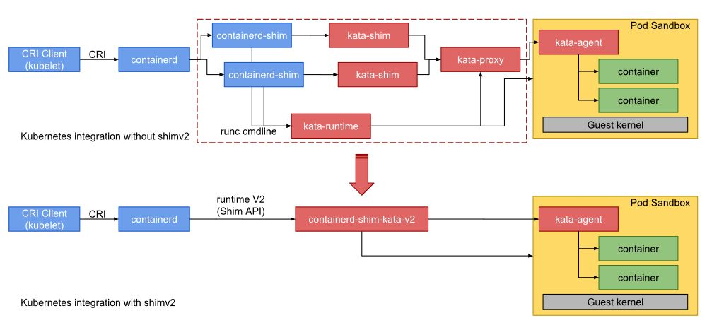
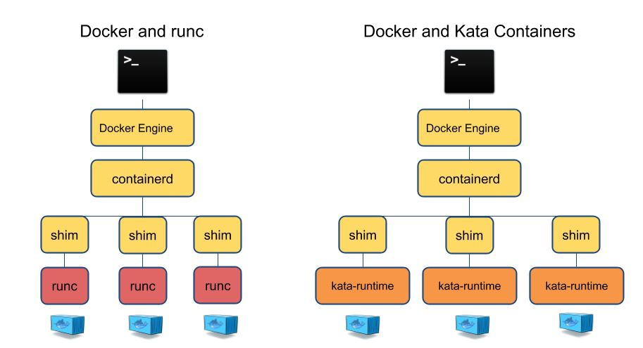
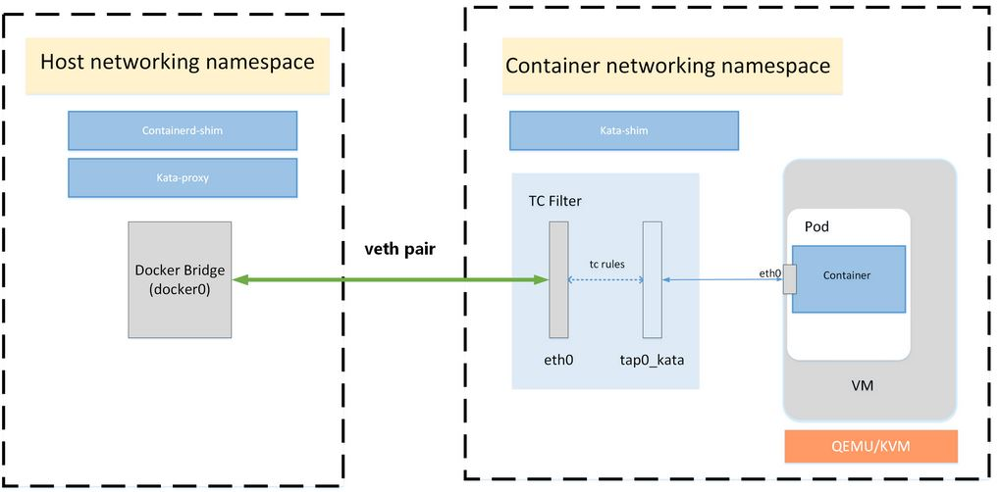
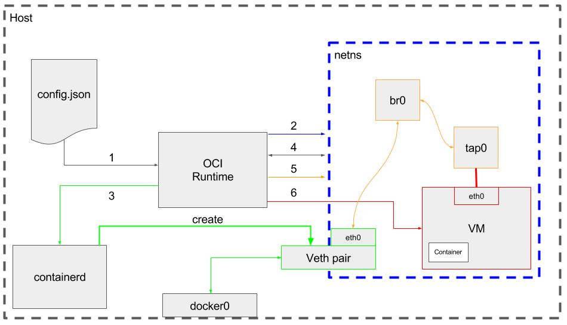

Kata Container -- **<span style="color:red;font-size:1em;">The speed of containers,  the security of VMs<span>**
---

- [What is Kata-container???](#what-is-kata-container)
  - [Guest kernel](#guest-kernel)
  - [Guest image](#guest-image)
    - [Root filesystem image](#root-filesystem-image)
    - [Initrd image](#initrd-image)
  - [Agent](#agent)
  - [Runtime](#runtime)
- [CRI & Conainerd & Kata Containerd Runtime](#cri--conainerd--kata-containerd-runtime)
  - [runc & kata-container](#runc--kata-container)
- [Kata Container Runtime Installation](#kata-container-runtime-installation)
  - [kubeadm init](#kubeadm-init)
- [Containerd as Runtime Configuration](#containerd-as-runtime-configuration)
  - [proxy](#proxy)
  - [Runtime Plugin](#runtime-plugin)
- [Start Kata Container](#start-kata-container)
  - [Kata-container configuration](#kata-container-configuration)
  - [Containers](#containers)
  - [Host Processes (qemu-kvm)](#host-processes-qemu-kvm)
- [Kubernetes Integration with Kata Container](#kubernetes-integration-with-kata-container)
- [Networking](#networking)
- [Debugging](#debugging)
  - [How to enable debugging console](#how-to-enable-debugging-console)
- [Q&A](#qa)
  

# What is Kata-container???
Kata Containers is an open source community working to build **a secure container runtime** with lightweight virtual machines that feel and perform like containers, but provide stronger workload isolation using hardware virtualization technology as a second layer of defense

Features
* **Security**
  
  Runs in a dedicated kernel, providing isolation of network, I/O and memory and can utilize hardware-enforced isolation with virtualization VT extensions.
* **Compatibility**
  
  Supports industry standards including OCI container format, Kubernetes CRI interface, as well as legacy virtualization technologies. 
* **Performance**
  
  Delivers consistent performance as standard Linux containers; increased isolation without the performance tax of standard virtual machines. 
* **Simplicity**
  
  Eliminates the requirement for nesting containers inside full blown virtual machines; standard interfaces make it easy to plug in and get started. 

## Guest kernel

The guest kernel is passed to the hypervisor and used to boot the virtual machine. The default kernel provided in Kata Containers is highly optimized for kernel boot time and minimal memory footprint, providing only those services required by a container workload. This is based on a very current upstream Linux kernel.

## Guest image

Kata Containers supports both an initrd and rootfs based minimal guest image.

### Root filesystem image
The default packaged root filesystem image, sometimes referred to as the "mini O/S", is a highly optimized container bootstrap system based on Clear Linux. It provides an extremely minimal environment and has a highly optimized boot path.

The only services running in the context of the mini O/S are the **init daemon (systemd)** and the **Agent**. The real workload the user wishes to run is created using libcontainer, creating a container in the same manner that is done by runc

### Initrd image

A compressed cpio(1) archive, created from a rootfs which is loaded into memory and used as part of the Linux startup process. During startup, the kernel unpacks it into a special instance of a tmpfs that becomes the initial root filesystem.

The only service running in the context of the initrd is the Agent as the init daemon. The real workload the user wishes to run is created using libcontainer, creating a container in the same manner that is done by runc.

## Agent
a process running in the guest as a supervisor for managing containers and processes running within those containers

## Runtime
 a containerd runtime shimv2 implementation and is responsible for handling the runtime v2 shim APIs, which is similar to the OCI runtime specification but simplifies the architecture by loading the runtime once and making RPC calls to handle the various container lifecycle commands. This refinement is an improvement on the OCI specification which requires the container manager call the runtime binary multiple times, at least once for each lifecycle command

Baidu is running Kata Containers in production to support Function Computing, Cloud Container Instances, and Edge Computing


# CRI & Conainerd & Kata Containerd Runtime


## runc & kata-container


# Kata Container Runtime Installation
```
dnf install -y centos-release-advanced-virtualization
dnf module disable -y virt:rhel
source /etc/os-release
cat <<EOF | sudo -E tee /etc/yum.repos.d/kata-containers.repo
  [kata-containers]
  name=Kata Containers
  baseurl=http://mirror.centos.org/\$contentdir/\$releasever/virt/\$basearch/kata-containers
  enabled=1
  gpgcheck=1
  skip_if_unavailable=1
  EOF
install -y kata-containers
```
## kubeadm init
```
kubeadm init --pod-network-cidr=192.168.0.0/16  --cri-socket=unix:///run/containerd/containerd.sock
```
```
/usr/bin/kubelet --bootstrap-kubeconfig=/etc/kubernetes/bootstrap-kubelet.conf --kubeconfig=/etc/kubernetes/kubelet.conf --config=/var/lib/kubelet/config.yaml --container-runtime=remote --container-runtime-endpoint=unix:///run/containerd/containerd.sock --pod-infra-container-image=k8s.gcr.io/pause:3.4.1
```

```
[root@foss-ssc-6 crio]# cat /var/lib/kubelet/kubeadm-flags.env
KUBELET_KUBEADM_ARGS="--container-runtime=remote --container-runtime-endpoint=unix:///run/containerd/containerd.sock --pod-infra-container-image=k8s.gcr.io/pause:3.4.1"
[root@foss-ssc-6 crio]#
```

# Containerd as Runtime Configuration
## proxy
```
[Service]
Environment=HTTP_PROXY=http://10.158.100.9:8080
Environment=HTTPS_PROXY=http://10.158.100.9:8080
ExecStartPre=-/sbin/modprobe overlay
ExecStart=/usr/bin/containerd
```

## Runtime Plugin
```
#   limitations under the License.

#disabled_plugins = ["cri"]

...


[plugins.cri.containerd]
  no_pivot = false
  [plugins.cri.containerd.runtimes]
    [plugins.cri.containerd.runtimes.runc]
      runtime_type = "io.containerd.runc.v1"
      [plugins.cri.containerd.runtimes.runc.options]
        NoPivotRoot = false
        NoNewKeyring = false
        ShimCgroup = ""
        IoUid = 0
        IoGid = 0
        BinaryName = "runc"
        Root = ""
        CriuPath = ""
        SystemdCgroup = false
    [plugins.cri.containerd.runtimes.kata]
      runtime_type = "io.containerd.kata.v2"
    [plugins.cri.containerd.runtimes.katacli]
      runtime_type = "io.containerd.runc.v1"
      [plugins.cri.containerd.runtimes.katacli.options]
        NoPivotRoot = false
        NoNewKeyring = false
        ShimCgroup = ""
        IoUid = 0
        IoGid = 0
        BinaryName = "/usr/bin/kata-runtime"
        Root = ""
        CriuPath = ""
        SystemdCgroup = false

 # "plugins.cri.containerd.default_runtime" is the runtime to use in containerd.
[plugins.cri.containerd.default_runtime]
  # runtime_type is the runtime type to use in containerd e.g. io.containerd.runtime.v1.linux
  runtime_type = "io.containerd.runtime.v1.linux"

# "plugins.cri.containerd.untrusted_workload_runtime" is a runtime to run untrusted workloads on it.
[plugins.cri.containerd.untrusted_workload_runtime]
  # runtime_type is the runtime type to use in containerd e.g. io.containerd.runtime.v1.linux
  runtime_type = "io.containerd.kata.v2"
  # runtime_engine is the name of the runtime engine used by containerd.
```

# Start Kata Container
```
[root@foss-ssc-6 ~]# ctr run --runtime io.containerd.run.kata.v2 -t --rm docker.io/library/busybox:latest hello sh
/ # ps -ef
PID   USER     TIME  COMMAND
    1 root      0:00 sh
    2 root      0:00 ps -ef
/ #
```

## Kata-container configuration
```
cat /usr/share/kata-containers/defaults/configuration.toml
```
## Containers
```
[root@foss-ssc-6 libexec]# ctr c ls
CONTAINER    IMAGE                               RUNTIME
hello        docker.io/library/busybox:latest    io.containerd.run.kata.v2
[root@foss-ssc-6 libexec]#
```

## Host Processes (qemu-kvm)
```
[root@foss-ssc-6 yum.repos.d]# ps -ef | grep kata
root     1537920 1007772  0 13:32 pts/2    00:00:00 ctr run --runtime io.containerd.run.kata.v2 -t --rm docker.io/library/busybox:latest hello sh

1537941 ?        Sl     0:04 /usr/bin/containerd-shim-kata-v2 -namespace default -address /run/containerd/containerd.sock -publish-binary /usr/bin/containerd -id hello
1537951 ?        Sl     0:00  \_ /usr/libexec/virtiofsd --fd=3 -o source=/run/kata-containers/shared/sandboxes/hello/shared -o cache=auto --syslog -o no_posix_lock -f --thread-pool-size=1
1537961 ?        Sl     0:00      \_ /usr/libexec/virtiofsd --fd=3 -o source=/run/kata-containers/shared/sandboxes/hello/shared -o cache=auto --syslog -o no_posix_lock -f --thread-pool-size=1

root     1537958       1 53 13:32 ?        00:00:10 /usr/libexec/qemu-kvm -name sandbox-hello -uuid 461e04f9-3544-483a-9e0c-57d1d3fb152e -machine q35,accel=kvm,kernel_irqchip -cpu host,pmu=off -qmp unix:/run/vc/vm/hello/qmp.sock,server,nowait -m 2048M,slots=10,maxmem=32938M -device pci-bridge,bus=pcie.0,id=pci-bridge-0,chassis_nr=1,shpc=on,addr=2,romfile= -device virtio-serial-pci,disable-modern=false,id=serial0,romfile= -device virtconsole,chardev=charconsole0,id=console0 -chardev socket,id=charconsole0,path=/run/vc/vm/hello/console.sock,server,nowait -device virtio-scsi-pci,id=scsi0,disable-modern=false,romfile= -object rng-random,id=rng0,filename=/dev/urandom -device virtio-rng-pci,rng=rng0,romfile= -device vhost-vsock-pci,disable-modern=false,vhostfd=3,id=vsock-1616513657,guest-cid=1616513657,romfile= -chardev socket,id=char-10984ae27fc7ed40,path=/run/vc/vm/hello/vhost-fs.sock -device vhost-user-fs-pci,chardev=char-10984ae27fc7ed40,tag=kataShared,romfile= -rtc base=utc,driftfix=slew,clock=host -global kvm-pit.lost_tick_policy=discard -vga none -no-user-config -nodefaults -nographic --no-reboot -daemonize -object memory-backend-file,id=dimm1,size=2048M,mem-path=/dev/shm,share=on -numa node,memdev=dimm1 -kernel /usr/lib/modules/4.18.0-240.22.1.el8_3.x86_64/vmlinuz -initrd /var/cache/kata-containers/osbuilder-images/4.18.0-240.22.1.el8_3.x86_64/"centos"-kata-4.18.0-240.22.1.el8_3.x86_64.initrd -append tsc=reliable no_timer_check rcupdate.rcu_expedited=1 i8042.direct=1 i8042.dumbkbd=1 i8042.nopnp=1 i8042.noaux=1 noreplace-smp reboot=k console=hvc0 console=hvc1 cryptomgr.notests net.ifnames=0 pci=lastbus=0 quiet panic=1 nr_cpus=16 scsi_mod.scan=none -pidfile /run/vc/vm/hello/pid -smp 1,cores=1,threads=1,sockets=16,maxcpus=16
```


# Kubernetes Integration with Kata Container
```
apiVersion: node.k8s.io/v1  # RuntimeClass is defined in the node.k8s.io API group
kind: RuntimeClass
metadata:
  name: mykata # The name the RuntimeClass will be referenced by
  # RuntimeClass is a non-namespaced resource
handler: kata # The name of the corresponding CRI configuration
```
"kata" in "handler: kata" is same with "kata" of "plugins.cri.containerd.runtimes.kata" in /etc/containerd/config.toml

```
apiVersion: apps/v1
kind: Deployment
metadata:
  annotations:
    io.kubernetes.cri.untrusted-workload: "true"
  name: nginx-deployment-kata
spec:
  selector:
    matchLabels:
      app: nginx-kata
  replicas: 1 # tells deployment to run 2 pods matching the template
  template:
    metadata:
      labels:
        app: nginx-kata
    spec:
      runtimeClassName: mykata
      containers:
      - name: nginx-kata
        image: nginx:1.14.2
        ports:
        - containerPort: 8000

```
"runtimeClassName: mykata", here "mykata" is name if RuntimeClass defined above.

```
[root@foss-ssc-6 crio]# kubectl get pod --all-namespaces -o wide
NAMESPACE         NAME                                 READY   STATUS    RESTARTS   AGE   IP                NODE         NOMINATED NODE   READINESS GATES
default           alpine-deployment-6dcc6865f6-7sxgj   1/1     Running   0          19m   172.85.0.19       foss-ssc-6   <none>           <none>
default           alpine-kata-74766d5587-glq47         2/2     Running   0          19m   172.85.0.20       foss-ssc-6   <none>           <none>
kube-system       coredns-558bd4d5db-4vhms             1/1     Running   0          18h   172.85.0.4        foss-ssc-6   <none>           <none>
kube-system       coredns-558bd4d5db-k7p8k             1/1     Running   0          18h   172.85.0.3        foss-ssc-6   <none>           <none>

```

```
[root@foss-ssc-6 crio]# crictl pods
POD ID              CREATED             STATE               NAME                                 NAMESPACE           ATTEMPT             RUNTIME
9b33e739b574e       21 minutes ago      Ready               alpine-kata-74766d5587-glq47         default             0                   kata
f45858f9b12a8       21 minutes ago      Ready               alpine-deployment-6dcc6865f6-7sxgj   default             0                   (default)
87051eced286f       18 hours ago        Ready               coredns-558bd4d5db-4vhms             kube-system         0                   (default)
8c390519bd1a2       18 hours ago        Ready               coredns-558bd4d5db-k7p8k             kube-system         0                   (default)
e9f5e5e0ea004       18 hours ago        Ready               tigera-operator-5b47ff5dcc-mgzrf     tigera-operator     0                   (default)
92e713859d3ef       19 hours ago        Ready               kube-proxy-vqqdw                     kube-system         0                   (default)
0aff1f13d6ef2       19 hours ago        Ready               kube-apiserver-foss-ssc-6            kube-system         0                   (default)
59e303f6e98ba       19 hours ago        Ready               kube-controller-manager-foss-ssc-6   kube-system         0                   (default)
360460b186cd7       19 hours ago        Ready               etcd-foss-ssc-6                      kube-system         0                   (default)
76a61a7dc080c       19 hours ago        Ready               kube-scheduler-foss-ssc-6            kube-system         0                   (default)

```

# Networking

here CNI is "bridge"
```
[root@foss-ssc-6 crio]# brctl show
bridge name     bridge id               STP enabled     interfaces
cni0            8000.9615ea61eda7       no
docker0         8000.02426758e8bd       no
mybridge                8000.2af402f81b2e       no              veth32fa0e96
                                                        veth4ae2f351
                                                        vethfecd0aa6
virbr0          8000.525400d4b5fc       yes             virbr0-nic
[root@foss-ssc-6 crio]# kubectl apply -f kata-deployment.yaml
deployment.apps/nginx-deployment-kata created

mybridge                8000.2af402f81b2e       no              veth32fa0e96
                                                        veth453817b2
                                                        veth49fbaa79
                                                        veth4ae2f351
[root@foss-ssc-6 crio]#
```

Host Layer Device Information
```
1562: veth453817b2@if3: <BROADCAST,MULTICAST,UP,LOWER_UP> mtu 1500 qdisc noqueue master mybridge state UP group default
    link/ether f6:b6:85:cc:5f:ee brd ff:ff:ff:ff:ff:ff link-netns cni-cbd86204-54d7-e0fa-8c32-b47b32af815a
    inet6 fe80::f4b6:85ff:fecc:5fee/64 scope link
       valid_lft forever preferred_lft forever
1563: veth49fbaa79@if3: <BROADCAST,MULTICAST,UP,LOWER_UP> mtu 1500 qdisc noqueue master mybridge state UP group default
    link/ether 62:cd:7c:97:36:f4 brd ff:ff:ff:ff:ff:ff link-netns cni-a491f8b4-4490-1d8c-a7b0-70ae17166323
    inet6 fe80::60cd:7cff:fe97:36f4/64 scope link
       valid_lft forever preferred_lft forever


1546: veth4ae2f351@if3: <BROADCAST,MULTICAST,UP,LOWER_UP> mtu 1500 qdisc noqueue master mybridge state UP group default
    link/ether 9e:b8:cf:4f:66:1b brd ff:ff:ff:ff:ff:ff link-netns cni-76462936-ccf7-ae49-dabe-8b6031fdc460
    inet6 fe80::9cb8:cfff:fe4f:661b/64 scope link
       valid_lft forever preferred_lft forever

1547: veth32fa0e96@if3: <BROADCAST,MULTICAST,UP,LOWER_UP> mtu 1500 qdisc noqueue master mybridge state UP group default
    link/ether 3e:09:d0:18:b3:17 brd ff:ff:ff:ff:ff:ff link-netns cni-f6c8e979-99e8-e6d0-06d4-b6f13578b4a6
    inet6 fe80::3c09:d0ff:fe18:b317/64 scope link
       valid_lft forever preferred_lft forever
```

This container (its network namespace is **cni-cbd86204-54d7-e0fa-8c32-b47b32af815a**) is generic container whose veth(**eth0**) is directly connecting with host node **veth453817b2**
```
[root@foss-ssc-6 crio]# kubectl exec -ti alpine-deployment-6dcc6865f6-7sxgj -- ip addr
1: lo: <LOOPBACK,UP,LOWER_UP> mtu 65536 qdisc noqueue state UNKNOWN qlen 1000
    link/loopback 00:00:00:00:00:00 brd 00:00:00:00:00:00
    inet 127.0.0.1/8 scope host lo
       valid_lft forever preferred_lft forever
    inet6 ::1/128 scope host
       valid_lft forever preferred_lft forever
3: eth0@if1562: <BROADCAST,MULTICAST,UP,LOWER_UP,M-DOWN> mtu 1500 qdisc noqueue state UP
    link/ether 2e:c8:05:ec:63:c0 brd ff:ff:ff:ff:ff:ff
    inet 172.85.0.19/24 brd 172.85.0.255 scope global eth0
       valid_lft forever preferred_lft forever
    inet6 fe80::2cc8:5ff:feec:63c0/64 scope link
       valid_lft forever preferred_lft forever
```

This is Kata network namespaces (**cni-a491f8b4-4490-1d8c-a7b0-70ae17166323**) whose veth (**eth0**) is directly connecting with host node **veth49fbaa79**
```
[root@foss-ssc-6 crio]# ip netns exec cni-a491f8b4-4490-1d8c-a7b0-70ae17166323 ip addr
1: lo: <LOOPBACK,UP,LOWER_UP> mtu 65536 qdisc noqueue state UNKNOWN group default qlen 1000
    link/loopback 00:00:00:00:00:00 brd 00:00:00:00:00:00
    inet 127.0.0.1/8 scope host lo
       valid_lft forever preferred_lft forever
    inet6 ::1/128 scope host
       valid_lft forever preferred_lft forever
3: eth0@if1563: <BROADCAST,MULTICAST,UP,LOWER_UP> mtu 1500 qdisc noqueue state UP group default qlen 1000
    link/ether 4a:a2:0d:6a:0b:30 brd ff:ff:ff:ff:ff:ff link-netnsid 0
    inet 172.85.0.20/24 brd 172.85.0.255 scope global eth0
       valid_lft forever preferred_lft forever
    inet6 fe80::48a2:dff:fe6a:b30/64 scope link
       valid_lft forever preferred_lft forever
4: tap0_kata: <BROADCAST,MULTICAST,UP,LOWER_UP> mtu 1500 qdisc mq state UNKNOWN group default qlen 1000
    link/ether 9e:13:0b:98:e4:28 brd ff:ff:ff:ff:ff:ff
    inet6 fe80::9c13:bff:fe98:e428/64 scope link
       valid_lft forever preferred_lft forever
[root@foss-ssc-6 crio]#
```

**mirroring packet from eth0 to tap0_taka**
```
[root@foss-ssc-6 crio]# ip netns exec cni-a491f8b4-4490-1d8c-a7b0-70ae17166323 tc qdisc show dev eth0
qdisc noqueue 0: root refcnt 2
qdisc ingress ffff: parent ffff:fff1 ----------------

[root@foss-ssc-6 crio]# ip netns exec cni-a491f8b4-4490-1d8c-a7b0-70ae17166323 tc filter show dev eth0 parent ffff:
filter protocol all pref 49152 u32 chain 0
filter protocol all pref 49152 u32 chain 0 fh 800: ht divisor 1
filter protocol all pref 49152 u32 chain 0 fh 800::800 order 2048 key ht 800 bkt 0 terminal flowid ??? not_in_hw
  match 00000000/00000000 at 0
        action order 1: mirred (Egress Redirect to device tap0_kata) stolen
        index 1 ref 1 bind 1
```

**mirroring packet from tap0_taka to eth0**
```
[root@foss-ssc-6 crio]# ip netns exec cni-a491f8b4-4490-1d8c-a7b0-70ae17166323 tc qdisc show dev tap0_kata
qdisc mq 0: root
qdisc fq_codel 0: parent :1 limit 10240p flows 1024 quantum 1514 target 5.0ms interval 100.0ms memory_limit 32Mb ecn
qdisc ingress ffff: parent ffff:fff1 ----------------
[root@foss-ssc-6 crio]#

[root@foss-ssc-6 crio]# ip netns exec cni-a491f8b4-4490-1d8c-a7b0-70ae17166323 tc filter show dev tap0_kata  parent ffff:
filter protocol all pref 49152 u32 chain 0
filter protocol all pref 49152 u32 chain 0 fh 800: ht divisor 1
filter protocol all pref 49152 u32 chain 0 fh 800::800 order 2048 key ht 800 bkt 0 terminal flowid ??? not_in_hw
  match 00000000/00000000 at 0
        action order 1: mirred (Egress Redirect to device eth0) stolen
        index 2 ref 1 bind 1
```

```
[root@foss-ssc-6 crio]# kubectl exec -ti alpine-kata-74766d5587-glq47 -- ip addr
Defaulted container "alpine-kata-top1" out of: alpine-kata-top1, alpine-kata-top2
1: lo: <LOOPBACK,UP,LOWER_UP> mtu 65536 qdisc noqueue state UNKNOWN qlen 1000
    link/loopback 00:00:00:00:00:00 brd 00:00:00:00:00:00
    inet 127.0.0.1/8 scope host lo
       valid_lft forever preferred_lft forever
    inet6 ::1/128 scope host
       valid_lft forever preferred_lft forever
2: eth0: <BROADCAST,MULTICAST,UP,LOWER_UP> mtu 1500 qdisc fq_codel state UP qlen 1000
    link/ether 4a:a2:0d:6a:0b:30 brd ff:ff:ff:ff:ff:ff
    inet 172.85.0.20/24 scope global eth0
       valid_lft forever preferred_lft forever
    inet6 fe80::48a2:dff:fe6a:b30/64 scope link
       valid_lft forever preferred_lft forever
[root@foss-ssc-6 crio]#
```

Kata VM Networking



https://pkg.go.dev/github.com/kata-containers/runtime/virtcontainers#readme-networking

 Kata Containers will create a tap device for the VM, tap0_kata, and setup a TC redirection filter to mirror traffic from eth0's ingress to tap0_kata's egress, and a second to mirror traffic from tap0_kata's ingress to eth0's egress. (above pic is using bridge the latest is using tc redirection role)

```
[root@foss-ssc-6 crio]# ip netns
cni-a491f8b4-4490-1d8c-a7b0-70ae17166323 (id: 8) (default runc pod net namespaces)
cni-cbd86204-54d7-e0fa-8c32-b47b32af815a (id: 3) (kata VM net namespaces)
cni-f6c8e979-99e8-e6d0-06d4-b6f13578b4a6 (id: 7) (default runc coredns pod net namespaces)
cni-76462936-ccf7-ae49-dabe-8b6031fdc460 (id: 6) (default runc coredns pod net namespaces)
```

```
[root@foss-ssc-6 ns]# ip netns pids cni-ffbddab3-69fb-42dc-4534-d72d755f7958
2508754
[root@foss-ssc-6 ns]# ps -ef | grep qemu
root     2508754       1  0 16:18 ?        00:01:23 /usr/libexec/qemu-kvm -name sandbox-51eacfaf94c8195f4f819a5ca7ba7c5ab73c74f8ed9249af46d142791c051bbc -uuid f27b7464-a693-43b9-b0cc-40eb962dea09 -machine q35,accel=kvm,kernel_irqchip -cpu host,pmu=off -qmp unix:/run/vc/vm/51eacfaf94c8195f4f819a5ca7ba7c5ab73c74f8ed9249af46d142791c051bbc/qmp.sock,server,nowait -m 2048M,slots=10,maxmem=32938M -device pci-bridge,bus=pcie.0,id=pci-bridge-0,chassis_nr=1,shpc=on,addr=2,romfile= -device virtio-serial-pci,disable-modern=false,id=serial0,romfile= -device virtconsole,chardev=charconsole0,id=console0 -chardev socket,id=charconsole0,path=/run/vc/vm/51eacfaf94c8195f4f819a5ca7ba7c5ab73c74f8ed9249af46d142791c051bbc/console.sock,server,nowait -device virtio-scsi-pci,id=scsi0,disable-modern=false,romfile= -object rng-random,id=rng0,filename=/dev/urandom -device virtio-rng-pci,rng=rng0,romfile= -device vhost-vsock-pci,disable-modern=false,vhostfd=3,id=vsock-3421461778,guest-cid=3421461778,romfile= -chardev socket,id=char-7b0775a90a1ad47c,path=/run/vc/vm/51eacfaf94c8195f4f819a5ca7ba7c5ab73c74f8ed9249af46d142791c051bbc/vhost-fs.sock -device vhost-user-fs-pci,chardev=char-7b0775a90a1ad47c,tag=kataShared,romfile= -netdev tap,id=network-0,vhost=on,vhostfds=4,fds=5 -device driver=virtio-net-pci,netdev=network-0,mac=0e:84:2b:37:4b:74,disable-modern=false,mq=on,vectors=4,romfile= -rtc base=utc,driftfix=slew,clock=host -global kvm-pit.lost_tick_policy=discard -vga none -no-user-config -nodefaults -nographic --no-reboot -daemonize -object memory-backend-file,id=dimm1,size=2048M,mem-path=/dev/shm,share=on -numa node,memdev=dimm1 -kernel /usr/lib/modules/4.18.0-240.22.1.el8_3.x86_64/vmlinuz -initrd /var/cache/kata-containers/osbuilder-images/4.18.0-240.22.1.el8_3.x86_64/"centos"-kata-4.18.0-240.22.1.el8_3.x86_64.initrd -append tsc=reliable no_timer_check rcupdate.rcu_expedited=1 i8042.direct=1 i8042.dumbkbd=1 i8042.nopnp=1 i8042.noaux=1 noreplace-smp reboot=k console=hvc0 console=hvc1 cryptomgr.notests net.ifnames=0 pci=lastbus=0 quiet panic=1 nr_cpus=16 scsi_mod.scan=none agent.debug_console agent.debug_console_vport=1026 -pidfile /run/vc/vm/51eacfaf94c8195f4f819a5ca7ba7c5ab73c74f8ed9249af46d142791c051bbc/pid -smp 1,cores=1,threads=1,sockets=16,maxcpus=16
root     2691886 2688819  0 21:43 pts/0    00:00:00 grep --color=auto qemu
[root@foss-ssc-6 ns]# ip netns identify 2508754
cni-ffbddab3-69fb-42dc-4534-d72d755f7958

```

Network Interface Pairs
```
        netPair := NetworkInterfacePair{
                TapInterface: TapInterface{
                        ID:   uniqueID,
                        Name: fmt.Sprintf("br%d_kata", idx),
                        TAPIface: NetworkInterface{
                                Name: fmt.Sprintf("tap%d_kata", idx),
                        },
                },
                VirtIface: NetworkInterface{
                        Name:     fmt.Sprintf("eth%d", idx),
                        HardAddr: randomMacAddr,
                },
                NetInterworkingModel: interworkingModel,
        }
```

# Debugging

## How to enable debugging console
1. update runtime config: /usr/share/kata-containers/defaults/configuration.toml
   ```
   [agent.kata]
   debug_console_enabled = true
   ```

2. Start kata monitor
   ```
   sudo kata-monitor &
   [1] 2517091
   [root@foss-ssc-6 crio]# netstat -apn  |grep 8090
   tcp6       0      0 :::8090                 :::*                    LISTEN      2517093/kata-monito
   ```
3. Obtain sandbox id(pod id w/ no-trunc)
   ```
   [root@foss-ssc-6 crio]# crictl pods --no-trunc
    POD ID                                                             CREATED             STATE               NAME                                 NAMESPACE           ATTEMPT             RUNTIME
    51eacfaf94c8195f4f819a5ca7ba7c5ab73c74f8ed9249af46d142791c051bbc   15 minutes ago      Ready               centos-kata-67b77b5898-9fms2         default             0                   kata

   ```
4. Log into debugging console
   ```
   [root@foss-ssc-6 crio]# kata-runtime exec 51eacfaf94c8195f4f819a5ca7ba7c5ab73c74f8ed9249af46d142791c051bbc
    bash-4.4# ps -ef
    UID          PID    PPID  C STIME TTY          TIME CMD
    0              1       0  0 08:18 ?        00:00:00 /init
    0              2       0  0 08:18 ?        00:00:00 [kthreadd]
    0              3       2  0 08:18 ?        00:00:00 [rcu_gp]
    0              4       2  0 08:18 ?        00:00:00 [rcu_par_gp]
    0              5       2  0 08:18 ?        00:00:02 [kworker/0:0-virtio_vsock]
    0              6       2  0 08:18 ?        00:00:00 [kworker/0:0H]
    0              7       2  0 08:18 ?        00:00:00 [kworker/u32:0-events_unboun
    0              8       2  0 08:18 ?        00:00:00 [mm_percpu_wq]
    0              9       2  0 08:18 ?        00:00:00 [ksoftirqd/0]
    0             10       2  0 08:18 ?        00:00:00 [rcu_sched]
    0             11       2  0 08:18 ?        00:00:00 [migration/0]
    0             12       2  0 08:18 ?        00:00:00 [watchdog/0]
    0             13       2  0 08:18 ?        00:00:00 [cpuhp/0]
    0             15       2  0 08:18 ?        00:00:00 [kdevtmpfs]
    0             16       2  0 08:18 ?        00:00:00 [netns]
    0             17       2  0 08:18 ?        00:00:00 [kauditd]
    0             18       2  0 08:18 ?        00:00:00 [khungtaskd]
    0             19       2  0 08:18 ?        00:00:00 [oom_reaper]
    0             20       2  0 08:18 ?        00:00:00 [writeback]
    0             21       2  0 08:18 ?        00:00:00 [kcompactd0]
    0             22       2  0 08:18 ?        00:00:00 [ksmd]
    0             23       2  0 08:18 ?        00:00:00 [khugepaged]
    0             24       2  0 08:18 ?        00:00:00 [crypto]
    0             25       2  0 08:18 ?        00:00:00 [kintegrityd]
    0             26       2  0 08:18 ?        00:00:00 [kblockd]
    0             27       2  0 08:18 ?        00:00:00 [blkcg_punt_bio]
    0             28       2  0 08:18 ?        00:00:00 [tpm_dev_wq]
    0             29       2  0 08:18 ?        00:00:00 [md]
    0             30       2  0 08:18 ?        00:00:00 [edac-poller]
    0             31       2  0 08:18 ?        00:00:00 [watchdogd]
    0             33       2  0 08:18 ?        00:00:00 [pm_wq]
    0             35       2  0 08:18 ?        00:00:00 [kworker/u32:1]
    0             49       2  0 08:18 ?        00:00:00 [kswapd0]
    0            132       2  0 08:18 ?        00:00:00 [kthrotld]
    0            133       2  0 08:18 ?        00:00:00 [acpi_thermal_pm]
    0            134       2  0 08:18 ?        00:00:00 [hwrng]
    0            135       2  0 08:18 ?        00:00:00 [kmpath_rdacd]
    0            136       2  0 08:18 ?        00:00:00 [kaluad]
    0            137       2  0 08:18 ?        00:00:00 [ipv6_addrconf]
    0            138       2  0 08:18 ?        00:00:00 [kstrp]
    0            194       1  0 08:18 ?        00:00:03 /usr/lib/systemd/systemd-jou
    0            199       2  0 08:18 ?        00:00:00 [kworker/0:3-virtio_vsock]
    0            203       1  0 08:18 ?        00:00:03 /usr/lib/systemd/systemd-ude
    0            207       2  0 08:18 ?        00:00:00 [khvcd]
    0            208       2  0 08:18 ?        00:00:00 [scsi_eh_0]
    0            209       2  0 08:18 ?        00:00:00 [scsi_tmf_0]
    0            214       1  0 08:18 ?        00:00:01 /usr/bin/kata-agent
    0            242     214  0 08:18 ?        00:00:00 /pause
    0            248     214  0 08:18 ?        00:00:00 /usr/bin/coreutils --coreuti
    0            255     214  0 08:18 ?        00:00:00 /usr/bin/coreutils --coreuti
    0            258     214  0 08:34 pts/0    00:00:00 [bash]
    0            260     258  0 08:34 pts/0    00:00:00 ps -ef
    bash-4.4#
   ```

   # Q&A
   1. Q: error "Warning  Failed     10m (x2 over 10m)  kubelet            Error: failed to create containerd task: failed to online 3 CPU(s) after 100 retries: unknown" fired.

   A: It takes 18s normally to bring up VM w/ 5 CPUs. but here Kata-Containers "online_cpus" only wait 100 * 50 = 5seconds. so it failed first time and then when retry to bring up again, it successed.

   ```
    // max wait for all CPUs to online will use 50 * 100 = 5 seconds.
    const ONLINE_CPUMEM_WATI_MILLIS: u64 = 50;
    const ONLINE_CPUMEM_MAX_RETRIES: u32 = 100;

    fn online_cpus(logger: &Logger, num: i32) -> Result<i32> {
        let mut onlined_count: i32 = 0;

        for i in 0..ONLINE_CPUMEM_MAX_RETRIES {
            let r = online_resources(
                logger,
                SYSFS_CPU_ONLINE_PATH,
                r"cpu[0-9]+",
                num - onlined_count,
            );
            if r.is_err() {
                return r;
            }

            onlined_count += r.unwrap();
            if onlined_count == num {
                info!(logger, "online {} CPU(s) after {} retries", num, i);
                return Ok(num);
            }
            thread::sleep(time::Duration::from_millis(ONLINE_CPUMEM_WATI_MILLIS));
        }

        Err(anyhow!(
            "failed to online {} CPU(s) after {} retries",
            num,
            ONLINE_CPUMEM_MAX_RETRIES
        ))
    }
   ```

   ```
    [    0.661316] zswap: loaded using pool lzo/zbud
    [    0.661363] page_owner is disabled
    [    0.670378] Key type big_key registered
    [    0.674890] Key type encrypted registered
    [    0.674898] ima: No TPM chip found, activating TPM-bypass!
    [    0.674904] ima: Allocated hash algorithm: sha1
    [    0.674912] ima: No architecture policies found
    [    0.674927] evm: Initialising EVM extended attributes:
    [    0.674927] evm: security.selinux
    [    0.674928] evm: security.ima
    [    0.674928] evm: security.capability
    [    0.674929] evm: HMAC attrs: 0x1
    [    0.675386] rtc_cmos 00:02: setting system clock to 2021-05-19 01:23:34 UTC (1621387414)
    [    0.675428] Warning: unable to open an initial console.
    [    0.677748] Freeing unused decrypted memory: 2040K
    [    0.678727] Freeing unused kernel memory: 2432K
    [    0.679055] Write protecting the kernel read-only data: 18432k
    [    0.680418] Freeing unused kernel memory: 2016K
    [    0.680508] Freeing unused kernel memory: 136K
    [    0.691335] systemd[1]: systemd 239 (239-41.el8_3.2) running in system mode. (+PAM +AUDIT +SELINUX +IMA -APPARMOR +SMACK +SYSVINIT +UTMP +LIBCRYPTSETUP +GCRYPT +GNUTLS +ACL +XZ +LZ4 +SECCOMP +BLKID +ELFUTILS +KMOD +IDN2 -IDN +PCRE2 default-hierarchy=legacy)
    [    0.691400] systemd[1]: Detected virtualization kvm.
    [    0.691405] systemd[1]: Detected architecture x86-64.
    [    0.693434] systemd[1]: No hostname configured.
    [    0.693442] systemd[1]: Set hostname to <localhost>.
    [    0.693496] systemd[1]: Initializing machine ID from KVM UUID.
    [    0.727371] systemd[1]: Reached target Slices.
    [    0.727590] systemd[1]: Listening on Journal Socket.
    [    0.729328] systemd[1]: Starting Create list of required static device nodes for the current kernel...
    [    0.730345] systemd[1]: Starting Load Kernel Modules...
    [    0.861309] fuse: init (API version 7.31)
    [    0.978277] printk: console [hvc0] enabled
    [    1.046341] scsi host0: Virtio SCSI HBA
    [    1.081070] NET: Registered protocol family 40
    [   10.491397] systemd[1]: Started udev Kernel Device Manager.
    [   10.625315] systemd[1]: Started Journal Service.
    [   11.580506] CPU1 has been hot-added
    [   11.631853] x86: Booting SMP configuration:
    [   11.631857] smpboot: Booting Node 0 Processor 1 APIC 0xf
    [   11.632310] kvm-clock: cpu 1, msr 43801041, secondary cpu clock

    [   11.632773] smpboot: CPU 1 Converting physical 15 to logical package 1
    [   11.632776] smpboot: CPU 1 Converting physical 0 to logical die 1
    [   11.634353] KVM setup async PF for cpu 1
    [   11.634368] kvm-stealtime: cpu 1, msr 7c86c080
    [   11.692497] Will online and init hotplugged CPU: 1
    [   11.700624] CPU2 has been hot-added
    [   11.703322] CPU3 has been hot-added
    [   11.712516] smpboot: Booting Node 0 Processor 2 APIC 0xe
    [   11.712894] kvm-clock: cpu 2, msr 43801081, secondary cpu clock
    [   11.713348] smpboot: CPU 2 Converting physical 14 to logical package 2
    [   11.713351] smpboot: CPU 2 Converting physical 0 to logical die 2
    [   11.713562] KVM setup async PF for cpu 2
    [   11.713576] kvm-stealtime: cpu 2, msr 7c8ac080
    [   11.752035] Will online and init hotplugged CPU: 2
    [   11.757494] smpboot: Booting Node 0 Processor 3 APIC 0xd
    [   11.757681] kvm-clock: cpu 3, msr 438010c1, secondary cpu clock
    [   11.757910] smpboot: CPU 3 Converting physical 13 to logical package 3
    [   11.757911] smpboot: CPU 3 Converting physical 0 to logical die 3
    [   11.757998] KVM setup async PF for cpu 3
    [   11.758019] kvm-stealtime: cpu 3, msr 7c8ec080
    [   11.758996] Will online and init hotplugged CPU: 3
    [   17.482983] Unregister pv shared memory for cpu 3
    [   17.485795] smpboot: CPU 3 is now offline
    [   18.700519] CPU3 has been hot-added
    [   18.749960] smpboot: Booting Node 0 Processor 3 APIC 0xd
    [   18.750389] kvm-clock: cpu 3, msr 438010c1, secondary cpu clock
    [   18.751162] KVM setup async PF for cpu 3
    [   18.751177] kvm-stealtime: cpu 3, msr 7c8ec080
    [   18.751744] Will online and init hotplugged CPU: 3
    [   18.810757] CPU4 has been hot-added
    [   18.814182] smpboot: Booting Node 0 Processor 4 APIC 0xc
    [   18.815778] kvm-clock: cpu 4, msr 43801101, secondary cpu clock
    [   18.816609] smpboot: CPU 4 Converting physical 12 to logical package 4
    [   18.816613] smpboot: CPU 4 Converting physical 0 to logical die 4
    [   18.816786] KVM setup async PF for cpu 4
    [   18.816800] kvm-stealtime: cpu 4, msr 7c92c080
    [   18.817559] Will online and init hotplugged CPU: 4
    [   18.819216] CPU5 has been hot-added
    [   18.871617] smpboot: Booting Node 0 Processor 5 APIC 0xb
    [   18.871944] kvm-clock: cpu 5, msr 43801141, secondary cpu clock
    [   18.872398] smpboot: CPU 5 Converting physical 11 to logical package 5
    [   18.872400] smpboot: CPU 5 Converting physical 0 to logical die 5
    [   18.872541] KVM setup async PF for cpu 5
    [   18.872555] kvm-stealtime: cpu 5, msr 7c96c080
    [   18.873149] Will online and init hotplugged CPU: 5
   ```

   if only one CPU attached, "1second" is ok for VM up.
   ```
    [    0.663242] zswap: loaded using pool lzo/zbud
    [    0.663290] page_owner is disabled
    [    0.672417] Key type big_key registered
    [    0.676910] Key type encrypted registered
    [    0.676919] ima: No TPM chip found, activating TPM-bypass!
    [    0.676925] ima: Allocated hash algorithm: sha1
    [    0.676933] ima: No architecture policies found
    [    0.676946] evm: Initialising EVM extended attributes:
    [    0.676947] evm: security.selinux
    [    0.676947] evm: security.ima
    [    0.676948] evm: security.capability
    [    0.676949] evm: HMAC attrs: 0x1
    [    0.677403] rtc_cmos 00:02: setting system clock to 2021-05-19 02:10:04 UTC (1621390204)
    [    0.677445] Warning: unable to open an initial console.
    [    0.680057] Freeing unused decrypted memory: 2040K
    [    0.680809] Freeing unused kernel memory: 2432K
    [    0.681067] Write protecting the kernel read-only data: 18432k
    [    0.682408] Freeing unused kernel memory: 2016K
    [    0.682501] Freeing unused kernel memory: 136K
    [    0.692876] systemd[1]: systemd 239 (239-41.el8_3.2) running in system mode. (+PAM +AUDIT +SELINUX +IMA -APPARMOR +SMACK +SYSVINIT +UTMP +LIBCRYPTSETUP +GCRYPT +GNUTLS +ACL +XZ +LZ4 +SECCOMP +BLKID +ELFUTILS +KMOD +IDN2 -IDN +PCRE2 default-hierarchy=legacy)
    [    0.692944] systemd[1]: Detected virtualization kvm.
    [    0.692950] systemd[1]: Detected architecture x86-64.
    [    0.694966] systemd[1]: No hostname configured.
    [    0.694974] systemd[1]: Set hostname to <localhost>.
    [    0.695060] systemd[1]: Initializing machine ID from KVM UUID.
    [    0.728368] systemd[1]: Listening on udev Kernel Socket.
    [    0.728551] systemd[1]: Listening on udev Control Socket.
    [    0.728585] systemd[1]: Reached target Slices.
    [    0.728597] systemd[1]: Reached target Swap.
    [    0.839141] fuse: init (API version 7.31)
    [    0.964281] printk: console [hvc0] enabled
    [    1.027289] scsi host0: Virtio SCSI HBA
    [    1.061102] NET: Registered protocol family 40
    [   10.558169] systemd[1]: Started Journal Service.

   ```