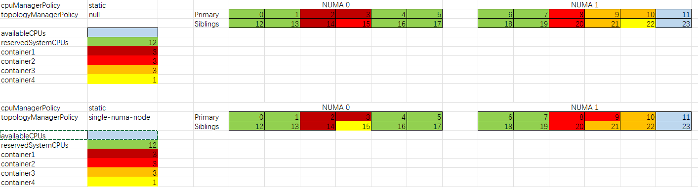

Scheduling Preemption and Eviction
---

- [Resource Manager and Controller](#resource-manager-and-controller)
  - [CPU Manager](#cpu-manager)
    - [none policy](#none-policy)
    - [static policy](#static-policy)
  - [Memory Manager](#memory-manager)
    - [none policy](#none-policy-1)
    - [static policy](#static-policy-1)
  - [topology-manager](#topology-manager)
    - [Toplogy Manager Scopes](#toplogy-manager-scopes)
    - [Topology Manager Policies](#topology-manager-policies)
- [Test Cases](#test-cases)
  - [--topology-manager-scope=pod](#--topology-manager-scopepod)
  - [--topology-manager-scope=conainer (default)](#--topology-manager-scopeconainer-default)
- [How kubelet affinity CPU](#how-kubelet-affinity-cpu)
- [Kubernetes Scheduler](#kubernetes-scheduler)
- [Assigning Pods to Nodes](#assigning-pods-to-nodes)
  - [NodeSelector](#nodeselector)
  - [Node isolation/restriction](#node-isolationrestriction)
  - [Affinity and anti-affinity](#affinity-and-anti-affinity)
    - [Node affinity](#node-affinity)
    - [Node affinity per scheduling profile](#node-affinity-per-scheduling-profile)
    - [Inter-pod affinity and anti-affinity](#inter-pod-affinity-and-anti-affinity)
    - [Namespace selector](#namespace-selector)
    - [nodeName](#nodename)
- [Pod Overhead](#pod-overhead)
- [Taints and Tolerations](#taints-and-tolerations)
- [Scheduling Framework](#scheduling-framework)
- [Scheduler Performance Tuning](#scheduler-performance-tuning)
- [Resource Bin Packing for Extended Resources](#resource-bin-packing-for-extended-resources)
- [Pod Disruption](#pod-disruption)
  - [Pod Priority and Preemption](#pod-priority-and-preemption)
  - [Node-pressure Eviction](#node-pressure-eviction)
  - [API-initiated Eviction](#api-initiated-eviction)
- [Topology Spread Constraints](#topology-spread-constraints)

https://kubernetes.io/docs/concepts/scheduling-eviction/


# Resource Manager and Controller
https://kubernetes.io/docs/reference/config-api/kubelet-config.v1beta1/#kubelet-config-k8s-io-v1beta1-KubeletConfiguration

```yaml
kind: KubeletConfiguration
apiVersion: kubelet.config.k8s.io/v1beta1
featureGates:
  LocalStorageCapacityIsolationFSQuotaMonitoring: true
  CSIMigration: true
  CSIMigrationOpenStack: true
  TopologyManager: false
  MemoryManager: false
rotateCertificates: true
nodeStatusUpdateFrequency: 15s
clusterDNS: ['192.168.155.26']
clusterDomain: "cluster.local"
staticPodPath: "/etc/kubernetes/manifests"
tlsCertFile: "/etc/kubernetes/ssl/kubelet.pem"
tlsPrivateKeyFile: "/etc/kubernetes/ssl/kubelet-key.pem"
tlsMinVersion: "VersionTLS12"
tlsCipherSuites: [TLS_ECDHE_ECDSA_WITH_AES_128_GCM_SHA256,TLS_ECDHE_ECDSA_WITH_AES_256_GCM_SHA384,TLS_ECDHE_RSA_WITH_AES_128_GCM_SHA256,TLS_ECDHE_RSA_WITH_AES_256_GCM_SHA384,TLS_RSA_WITH_AES_128_GCM_SHA256,TLS_RSA_WITH_AES_256_GCM_SHA384]
address: "192.168.155.26"
cgroupDriver: systemd
failSwapOn: false
streamingConnectionIdleTimeout: 60m
protectKernelDefaults: true
makeIPTablesUtilChains: true
eventRecordQPS: 0
authorization:
  mode: Webhook
authentication:
  x509:
    clientCAFile: "/etc/kubernetes/ssl/ca.pem"
  anonymous:
    enabled: false
evictionPressureTransitionPeriod: "60s"
evictionMaxPodGracePeriod: 120
evictionHard:
  memory.available: 958Mi
  nodefs.available: 10%
  nodefs.inodesFree: 5%
  imagefs.available: 10%
evictionSoft:
  memory.available: 1916Mi
evictionMinimumReclaim:
  memory.available: 1916Mi
evictionSoftGracePeriod:
  memory.available: "30s"
kernelMemcgNotification: true
systemReserved:
  memory: 2876Mi
cpuManagerPolicy: static
cpuManagerPolicyOptions:
  full-pcpus-only: "true"
reservedSystemCPUs: "0-1"
containerLogMaxFiles: 3
containerLogMaxSize: 100Mi
imageGCHighThresholdPercent: 75
imageGCLowThresholdPercent: 70
```

## CPU Manager
Kubernetes v1.12 [beta]

https://kubernetes.io/docs/tasks/administer-cluster/cpu-management-policies/

By default, the kubelet uses CFS quota to enforce pod CPU limits.  When the node runs many CPU-bound pods, the workload can move to different CPU cores depending on whether the pod is throttled and which CPU cores are available at scheduling time

in workloads where CPU cache affinity and scheduling latency significantly affect workload performance, the kubelet allows alternative CPU management policies to determine some placement preferences on the node

* cpuManagerPolicy: static|none(default)

### none policy
* explicitly enables the existing default CPU affinity scheme, providing no affinity beyond what the OS scheduler does automatically

### static policy
* allows pods with certain resource characteristics to be granted increased CPU affinity and exclusivity on the node.
* allows containers in Guaranteed pods with integer CPU requests access to exclusive CPUs on the node. This exclusivity is enforced using the cpuset cgroup controller.
* System services such as the container runtime and the kubelet itself can continue to run on these exclusive CPUs.  The exclusivity only extends to other pods.

The following policy options exist for the static CPUManager policy:
* **full-pcpus-only** (beta, visible by default) (1.22 or higher)
  * the static policy will always allocate full physical cores; 
  * By default, without this option, the static policy allocates CPUs using a topology-aware best-fit allocation; On SMT enabled systems, the policy can allocate individual virtual cores, which correspond to hardware threads. This can lead to different containers sharing the same physical cores; this behaviour in turn contributes to the noisy neighbours problem. 
  * With the option enabled, the pod will be admitted by the kubelet only if the CPU request of all its containers can be fulfilled by allocating full physical cores. If the pod does not pass the admission, it will be put in Failed state with the message SMTAlignmentError

* distribute-cpus-across-numa (alpha, hidden by default) (1.23 or higher)
* align-by-socket (alpha, hidden by default) (1.25 or higher)
  * CPUs will be considered aligned at the socket boundary when deciding how to allocate CPUs to a container

Since the CPU manger policy can only be applied when kubelet spawns new pods, simply changing from "none" to "static" won't apply to existing pods

## Memory Manager
Kubernetes v1.22 [beta]

https://kubernetes.io/docs/tasks/administer-cluster/memory-manager/

The Memory Manager is a Hint Provider, and it provides topology hints for the Topology Manager which then aligns the requested resources according to these topology hints. It also enforces cgroups (i.e. cpuset.mems) for pods

The administrator must provide reserved-memory when Static policy is configured in KubeletConfiguration
* MemoryManager: true|false
* memoryManagerPolicy: static|none 
* reservedMemory: 
  * - numaNode: 0
  *   limit:
  *     memory:
  *   request:
  *     memory:

### none policy
* default policy and does not affect the memory allocation in any way
* no preference for NUMA affinity

### static policy
* In the case of the Guaranteed pod, the Static Memory Manger policy returns topology hints relating to the set of NUMA nodes where the memory can be guaranteed, and reserves the memory through updating the internal NodeMap object
* 
* 
## topology-manager
Kubernetes v1.18 [beta]

https://kubernetes.io/docs/tasks/administer-cluster/topology-manager/

In order to extract the best performance, optimizations related to CPU isolation, memory and device locality are required. Topology Manager is a Kubelet component that aims to coordinate the set of components that are responsible for these optimizations

The Topology Manager is a Kubelet component, which acts as a source of truth so that other Kubelet components can make topology aligned resource allocation choices.

The Topology Manager provides an interface for components, called Hint Providers, to send and receive topology information

### Toplogy Manager Scopes
* container (default)
  
  performs a number of sequential resource alignments, i.e., for each container (in a pod) a separate alignment is computed

* pod
  
  grouping all containers in a pod to a common set of NUMA nodes. That is, the Topology Manager treats a pod as a whole and attempts to allocate the entire pod (all containers) to either a single NUMA node or a common set of NUMA nodes

  Using the **pod** scope in tandem with **single-numa-node** Topology Manager policy is specifically valuable for workloads that are latency sensitive or for high-throughput applications that perform IPC

### Topology Manager Policies
topologyManagerPolicy
* none (default)

  not perform any topology alignment

* best-effort

  attempt to align allocations on NUMA nodes as best it can, but will always allow the pod to start even if some of the allocated resources are not aligned on the same NUMA node

* restricted

  this policy is the same as the best-effort policy, except it will fail pod admission if allocated resources cannot be aligned properly

* **single-numa-node**

  the most restrictive and will only allow a pod to be admitted if all requested CPUs and devices can be allocated from exactly one NUMA node

# Test Cases

PreConditions
1. cpuManagerPolicy: static
2. topologyManagerPolicy: "single-numa-node"

```bash
root@tstbed-1:/var/lib/kubelet# numactl -H
available: 2 nodes (0-1)
node 0 cpus: 0 1 2 3 4 5 12 13 14 15 16 17
node 0 size: 64405 MB
node 0 free: 59587 MB
node 1 cpus: 6 7 8 9 10 11 18 19 20 21 22 23
node 1 size: 64467 MB
node 1 free: 60051 MB
node distances:
node   0   1 
  0:  10  20 
  1:  20  10 

reservedSystemCPUs: "0-1,6-7,12-13,18-19"
```
based on above configuration:
```
numa0 avaiable cpus: 2, 3, 4,   5,   14, 15, 16, 17
numa1 availabe cpus: 8, 9, 10, 11,   20, 21, 22, 23
```

## --topology-manager-scope=pod
* case1: pod with c1 5 cpus GQoS and c2 5 cpus GQoS
  
  Result: pod failed with TopologyAffinityError since there is no single numa with 10 cpus

* case2: pod with c1 4 cpus and c2 4 cpus

  Result: successful up since there is 8 cpus in single numa and based on below all containers pinned into single-numa

  ```bash
    root@tstbed-1:/var/lib/kubelet# cat cpu_manager_state 
      {"policyName":"static","defaultCpuSet":"0-1,6-13,18-23","entries":{"28c11c89-3493-4972-bb67-7090b9d75e0d":{"mytestclient":"2-3,14-15","mytestclient2":"4-5,16-17"}},"checksum":1684933537}
  ```

* case3: pod with c1 5001 and c2 with 4 cpus

  Result: successful up although pod cpus count (9001) > 8cpus (single-numa) and only c2 pinned single-numa, c1 is shared cpu

  ```bash
    root@tstbed-1:/var/lib/kubelet# cat cpu_manager_state 
    {"policyName":"static","defaultCpuSet":"0-1,4-13,16-23","entries":{"6d33c60b-5e34-4ab3-ab0c-a616627b0a94":{"mytestclient2":"2-3,14-15"}},"checksum":641473090}
  ```

## --topology-manager-scope=conainer (default)
* case1: pod with c1 5 cpus and c2 8 cpus
  
  Result: successfull up since each container cpus < 8cpus and total pod cpus < 16 cpus

  ```bash
    root@tstbed-1:/var/lib/kubelet# cat cpu_manager_state 
      {"policyName":"static","defaultCpuSet":"0-1,5-7,12-13,16-19","entries":{"edc14415-460d-4885-b77f-906423c72281":{"mytestclient":"2-4,14-15","mytestclient2":"8-11,20-23"}},"checksum":2887245658}
  ```
* case2: pod with c1 5001 and c2 8 cpus

  Result: sucessful up since each container cpus < 8cpus and total pod cpus < 16 cpus but only c2 pinned to single-numa, c1 is shared cpus

  ```bash
    root@tstbed-1:/var/lib/kubelet# cat cpu_manager_state 
    {"policyName":"static","defaultCpuSet":"0-1,6-13,18-23","entries":{"063f2280-ef6d-4937-bf05-fef9df0c8c91":{"mytestclient2":"2-5,14-17"}},"checksum":83294669}
  ```
* case3: pod with c1 5cpus and c2 9cpus
  
  Result: pod failed with TopologyAffinityError since 9 cpus > 8cpus(single-numa)

* case4: pod with c1 10001m and c2 4 cpurs
  
  Result: succesully up since c1 is shared and total < 16cpus

  ```bash
   root@tstbed-1:/var/lib/kubelet# cat cpu_manager_state 
    {"policyName":"static","defaultCpuSet":"0-1,4-13,16-23","entries":{"584e9c4c-9809-4a36-8180-b2dd9e8811b4":{"mytestclient2":"2-3,14-15"}},"checksum":2084937289}
  ```

* case5: pod with c1 10101m/10001m and c2 4 cpus (pod is burstable)
  
  Result: successfully up since < 16cpus 

  although c2 is GQoS, but it is not pinned since from pod level, it is not GQoS instead Burstable.

  ```bash
    {"policyName":"static","defaultCpuSet":"0-23","checksum":1538133146}
  ```

* case6: pod with c1 5 cpus and c2 with 4 cpus
  
  precondiation:
  ```
  reservedSystemCPUs: "0-1,4-7,12-13,16-19"
  node 0 cpus: 0 1 2 3 4 5 12 13 14 15 16 17
  node 1 cpus: 6 7 8 9 10 11 18 19 20 21 22 23

  node0 available cpus: 2, 3, 14, 15, 
  node1 available cpus: 8, 9, 10, 11, 20 21 22 23
  ```

  Result: successfully up but c1 is pinned to numa1

  ```bash
  {"policyName":"static","defaultCpuSet":"0-1,4-7,11-13,16-19,22-23","entries":{"970925e3-c85b-491c-af5a-ab24681d68ef":{"mytestclient":"8-10,20-21","mytestclient2":"2-3,14-15"}},"checksum":1830434018}
  ```
# How kubelet affinity CPU

```
whatever it is single-numa-node or not, cpus allocation order:
1. if there is enough vcpus in single numa, it will allocate vcpus to container within single numa
2. if there is not enough vcpus in single numa, and if single-numa-node configured, then it trigger topologyAffinityError
3. if numCPUs > 1, then first allocated physical call and then logical core from numa0 to numa1
```



```golang
func (p *staticPolicy) Allocate(s state.State, pod *v1.Pod, container *v1.Container) (rerr error) {
    // Get CPU request/limit
    // if not guraranteedCPUs, return 0
    // if cpus not integer return 0
    numCPUs := p.guaranteedCPUs(pod, container)
    //CPUManagerPolicyOptions = full-pcpus-only //1.22 or higher beta visiber by default)
    if p.options.FullPhysicalCPUsOnly {
                //topo.NumCPUs / topo.NumCores
                CPUsPerCore := p.topology.CPUsPerCore()
                // if CPUsPerCore is 2(hyperthreading enabled), then only even numCPUS can be allocated, odd numCPUS will trigger SMTAlighmentError
                if (numCPUs % CPUsPerCore) != 0 {
                        // Since CPU Manager has been enabled requesting strict SMT alignment, it means a guaranteed pod can only be admitted
                        // if the CPU requested is a multiple of the number of virtual cpus per physical cores.
                        // In case CPU request is not a multiple of the number of virtual cpus per physical cores the Pod will be put
                        // in Failed state, with SMTAlignmentError as reason. Since the allocation happens in terms of physical cores
                        // and the scheduler is responsible for ensuring that the workload goes to a node that has enough CPUs,
                        // the pod would be placed on a node where there are enough physical cores available to be allocated.
                        // Just like the behaviour in case of static policy, takeByTopology will try to first allocate CPUs from the same socket
                        // and only in case the request cannot be sattisfied on a single socket, CPU allocation is done for a workload to occupy all
                        // CPUs on a physical core. Allocation of individual threads would never have to occur.
                        return SMTAlignmentError{
                                RequestedCPUs: numCPUs,
                                CpusPerCore:   CPUsPerCore,
                        }
                }
                //numCPU is even integer
                availablePhysicalCPUs := p.GetAvailablePhysicalCPUs(s).Size()

                // It's legal to reserve CPUs which are not core siblings. In this case the CPU allocator can descend to single cores
                // when picking CPUs. This will void the guarantee of FullPhysicalCPUsOnly. To prevent this, we need to additionally consider
                // all the core siblings of the reserved CPUs as unavailable when computing the free CPUs, before to start the actual allocation.
                // This way, by construction all possible CPUs allocation whose number is multiple of the SMT level are now correct again.
                if numCPUs > availablePhysicalCPUs {
                        return SMTAlignmentError{
                                RequestedCPUs:         numCPUs,
                                CpusPerCore:           CPUsPerCore,
                                AvailablePhysicalCPUs: availablePhysicalCPUs,
                        }
                }
        }
        if cpuset, ok := s.GetCPUSet(string(pod.UID), container.Name); ok {
                p.updateCPUsToReuse(pod, container, cpuset)
                klog.InfoS("Static policy: container already present in state, skipping", "pod", klog.KObj(pod), "containerName", container.Name)
                return nil
        }
        // Call Topology Manager to get the aligned socket affinity across all hint providers.
        hint := p.affinity.GetAffinity(string(pod.UID), container.Name)
        klog.InfoS("Topology Affinity", "pod", klog.KObj(pod), "containerName", container.Name, "affinity", hint)

        // Allocate CPUs according to the NUMA affinity contained in the hint.
        cpuset, err := p.allocateCPUs(s, numCPUs, hint.NUMANodeAffinity, p.cpusToReuse[string(pod.UID)])
        if err != nil {
                klog.ErrorS(err, "Unable to allocate CPUs", "pod", klog.KObj(pod), "containerName", container.Name, "numCPUs", numCPUs)
                return err
        }
        //affinity cpu
        s.SetCPUSet(string(pod.UID), container.Name, cpuset)
        p.updateCPUsToReuse(pod, container, cpuset)

        return nil
```

```golang
func (p *staticPolicy) allocateCPUs(s state.State, numCPUs int, numaAffinity bitmask.BitMask, reusableCPUs cpuset.CPUSet) (cpuset.CPUSet, error) {
        klog.InfoS("AllocateCPUs", "numCPUs", numCPUs, "socket", numaAffinity)

        allocatableCPUs := p.GetAvailableCPUs(s).Union(reusableCPUs)
        // If there are aligned CPUs in numaAffinity, attempt to take those first.
        result := cpuset.New()
        //topologyMangerPolicy = single-numa-node
        if numaAffinity != nil {
                alignedCPUs := p.getAlignedCPUs(numaAffinity, allocatableCPUs)

                numAlignedToAlloc := alignedCPUs.Size()
                if numCPUs < numAlignedToAlloc {
                        numAlignedToAlloc = numCPUs
                }

                alignedCPUs, err := p.takeByTopology(alignedCPUs, numAlignedToAlloc)
                if err != nil {
                        return cpuset.New(), err
                }

                result = result.Union(alignedCPUs)
        }

        // Get any remaining CPUs from what's leftover after attempting to grab aligned ones.
        remainingCPUs, err := p.takeByTopology(allocatableCPUs.Difference(result), numCPUs-result.Size())
        if err != nil {
                return cpuset.New(), err
        }
        result = result.Union(remainingCPUs)

        // Remove allocated CPUs from the shared CPUSet.
        s.SetDefaultCPUSet(s.GetDefaultCPUSet().Difference(result))

        klog.InfoS("AllocateCPUs", "result", result)
        return result, nil
}

```

```golang
// getAlignedCPUs return set of aligned CPUs based on numa affinity mask and configured policy options.
func (p *staticPolicy) getAlignedCPUs(numaAffinity bitmask.BitMask, allocatableCPUs cpuset.CPUSet) cpuset.CPUSet {
        alignedCPUs := cpuset.New()
        numaBits := numaAffinity.GetBits()

        // If align-by-socket policy option is enabled, NUMA based hint is expanded to
        // socket aligned hint. It will ensure that first socket aligned available CPUs are
        // allocated before we try to find CPUs across socket to satisfy allocation request.
        if p.options.AlignBySocket {
                socketBits := p.topology.CPUDetails.SocketsInNUMANodes(numaBits...).UnsortedList()
                for _, socketID := range socketBits {
                        alignedCPUs = alignedCPUs.Union(allocatableCPUs.Intersection(p.topology.CPUDetails.CPUsInSockets(socketID)))
                }
                return alignedCPUs
        }

        for _, numaNodeID := range numaBits {
                alignedCPUs = alignedCPUs.Union(allocatableCPUs.Intersection(p.topology.CPUDetails.CPUsInNUMANodes(numaNodeID)))
        }

        return alignedCPUs
}

```
```golang
func (p *staticPolicy) takeByTopology(availableCPUs cpuset.CPUSet, numCPUs int) (cpuset.CPUSet, error) {
        //cpuManagerPolicyOption = distribute-cpus-across-numa
        if p.options.DistributeCPUsAcrossNUMA {
                cpuGroupSize := 1
                if p.options.FullPhysicalCPUsOnly {
                        cpuGroupSize = p.topology.CPUsPerCore()
                }
                return takeByTopologyNUMADistributed(p.topology, availableCPUs, numCPUs, cpuGroupSize)
        }
        return takeByTopologyNUMAPacked(p.topology, availableCPUs, numCPUs)
}

func takeByTopologyNUMAPacked(topo *topology.CPUTopology, availableCPUs cpuset.CPUSet, numCPUs int) (cpuset.CPUSet, error) {
        acc := newCPUAccumulator(topo, availableCPUs, numCPUs)
        if acc.isSatisfied() {
                return acc.result, nil
        }
        if acc.isFailed() {
                return cpuset.New(), fmt.Errorf("not enough cpus available to satisfy request: requested=%d, available=%d", numCPUs, availableCPUs.Size())
        }

        // Algorithm: topology-aware best-fit
        // 1. Acquire whole NUMA nodes and sockets, if available and the container
        //    requires at least a NUMA node or socket's-worth of CPUs. If NUMA
        //    Nodes map to 1 or more sockets, pull from NUMA nodes first.
        //    Otherwise pull from sockets first.
        acc.numaOrSocketsFirst.takeFullFirstLevel()
        if acc.isSatisfied() {
                return acc.result, nil
        }
        acc.numaOrSocketsFirst.takeFullSecondLevel()
        if acc.isSatisfied() {
                return acc.result, nil
        }

        // 2. Acquire whole cores, if available and the container requires at least
        //    a core's-worth of CPUs.
        acc.takeFullCores()
        if acc.isSatisfied() {
                return acc.result, nil
        }

        // 3. Acquire single threads, preferring to fill partially-allocated cores
        //    on the same sockets as the whole cores we have already taken in this
        //    allocation.
        acc.takeRemainingCPUs()
        if acc.isSatisfied() {
                return acc.result, nil
        }

        return cpuset.New(), fmt.Errorf("failed to allocate cpus")
}

```


# Kubernetes Scheduler
# Assigning Pods to Nodes
## NodeSelector
## Node isolation/restriction
## Affinity and anti-affinity
### Node affinity
### Node affinity per scheduling profile
### Inter-pod affinity and anti-affinity
### Namespace selector
### nodeName
# Pod Overhead
# Taints and Tolerations
# Scheduling Framework
# Scheduler Performance Tuning
# Resource Bin Packing for Extended Resources
# Pod Disruption
## Pod Priority and Preemption
## Node-pressure Eviction
## API-initiated Eviction
# Topology Spread Constraints