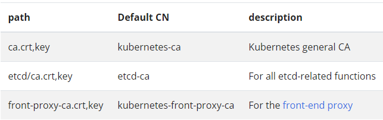
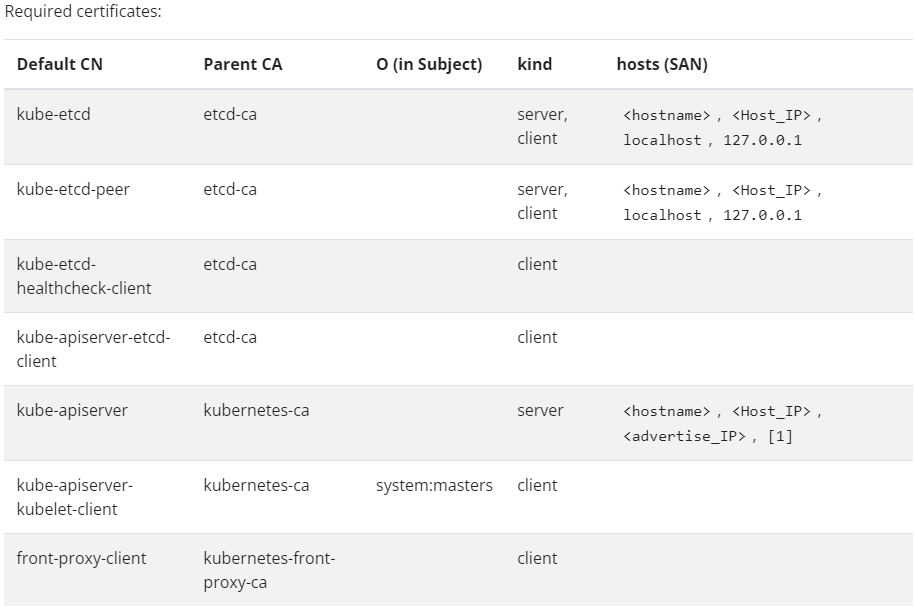

Kubernetes Certficate and Token Management
---

- [PKI Certificates and Requirements](#pki-certificates-and-requirements)
  - [How Certificated are used by cluster](#how-certificated-are-used-by-cluster)
  - [Certificae Location](#certificae-location)
  - [Configure certificate manually](#configure-certificate-manually)
    - [Single root CA](#single-root-ca)
    - [All certificates](#all-certificates)
- [kubernetes certifiate configration](#kubernetes-certifiate-configration)
- [Certificate](#certificate)
- [CNF Projected Mount Volume Update](#cnf-projected-mount-volume-update)
- [Envoy Certificate](#envoy-certificate)
- [How to decode certificate](#how-to-decode-certificate)


# PKI Certificates and Requirements
Kubernetes requires PKI certificates for authentication over TLS.
kubeadmin will automatically geneated the certificates that cluster required

## How Certificated are used by cluster
* kubelet and apiserver
  * **Client certificates** for the kubelet to authenticate to the API server
  * Kubelet **server certificates** for the API server to talk to the kubelets
  * **Client certificates** for the API server to talk to the kubelets
* Server certificate for the API server endpoint
  
* Client certificates for administrators of the cluster to authenticate to the API server
  * ./kube/config = /etc/kubernetes/admin.conf

* etcd and apiserver
  * Client certificate for the API server to talk to etcd

* controller and apiserver
  * Client certificate/kubeconfig for the controller manager to talk to the API server

* scheduler and apiserver
  * Client certificate/kubeconfig for the scheduler to talk to the API server.

* kube-proxy and apiserver
  * Client and server certificates for the front-proxy


## Certificae Location
* /etc/kubernetes/pki
* /etc/kubernetes


## Configure certificate manually
### Single root CA
* Required CAs
  

  * /etc/kubernetes/pki/ca.crt
  * /etc/kubernetes/pki/ca.key
  * /etc/kubernetes/pki/etcd/ca.crt
  * /etc/kubernetes/pki/etcd/ca.key
  * /etc/kubernetes/pki/front-proxy-ca.crt
  * /etc/kubernetes/pki/front-proxy-ca.key

### All certificates
* Required certificate


* server: server auth
* client: client auth

https://kubernetes.io/docs/setup/best-practices/certificates/#certificate-paths


# kubernetes certifiate configration
* apiserver communication with etcd as client (mTLS)
```
apiserver
--etcd-cafile=/etc/kubernetes/pki/etcd/ca.crt - used to valdiate etcd/server.crt/key
--etcd-certfile=/etc/kubernetes/pki/apiserver-etcd-client.crt 
--etcd-keyfile=/etc/kubernetes/pki/apiserver-etcd-client.key 

etcd
--trusted-ca-file=/etc/kubernetes/pki/etcd/ca.crt - used to validate apiserver-etcd-client.crt/key
--cert-file=/etc/kubernetes/pki/etcd/server.crt 
--key-file=/etc/kubernetes/pki/etcd/server.key 

peer etcd
--peer-cert-file=/etc/kubernetes/pki/etcd/peer.crt 
--peer-key-file=/etc/kubernetes/pki/etcd/peer.key 
--peer-trusted-ca-file=/etc/kubernetes/pki/etcd/ca.crt 
```

* apiserver communication with kubelet as server
```
apiserver
--kubelet-client-certificate=/etc/kubernetes/pki/apiserver-kubelet-client.crt 
--kubelet-client-key=/etc/kubernetes/pki/apiserver-kubelet-client.key 

kubelet
--kubeconfig=/etc/kubernetes/kubelet.conf 
certificate-authority-data - used to validate apiserver-kubelet-client.crt/key
```

* communication with kube-proxy as server
--proxy-client-cert-file=/etc/kubernetes/pki/front-proxy-client.crt 
--proxy-client-key-file=/etc/kubernetes/pki/front-proxy-client.key 
--requestheader-client-ca-file=/etc/kubernetes/pki/front-proxy-ca.crt 

* apiserver certificates
--client-ca-file=/etc/kubernetes/pki/ca.crt 
--tls-cert-file=/etc/kubernetes/pki/apiserver.crt 
--tls-private-key-file=/etc/kubernetes/pki/apiserver.key

* apiserver serviceaccount key
--service-account-key-file=/etc/kubernetes/pki/sa.pub 
--service-account-signing-key-file=/etc/kubernetes/pki/sa.key 


Certificates
* apiserver.crt              
* apiserver-etcd-client.key  
* apiserver-kubelet-client.crt  ca.crt  etcd                front-proxy-ca.key      front-proxy-client.key  sa.key
apiserver-etcd-client.crt  apiserver.key              apiserver-kubelet-client.key  ca.key  front-proxy-ca.crt  front-proxy-client.crt  root-ca.cert            sa.pub


# Certificate
* Client Certificates generated by kubeadmin: 
  * expire after 1 year
* Root CA generated Certificate
  * expire after 10 years

```bash
root@tstbed-1:/etc/kubernetes/pki# kubeadm certs check-expiration
[check-expiration] Reading configuration from the cluster...
[check-expiration] FYI: You can look at this config file with 'kubectl -n kube-system get cm kubeadm-config -o yaml'

CERTIFICATE                EXPIRES                  RESIDUAL TIME   CERTIFICATE AUTHORITY   EXTERNALLY MANAGED
admin.conf                 Jun 29, 2024 02:54 UTC   281d            ca                      no      
apiserver                  Jun 29, 2024 02:54 UTC   281d            ca                      no      
apiserver-etcd-client      Jun 29, 2024 02:54 UTC   281d            etcd-ca                 no      
apiserver-kubelet-client   Jun 29, 2024 02:54 UTC   281d            ca                      no      
controller-manager.conf    Jun 29, 2024 02:54 UTC   281d            ca                      no      
etcd-healthcheck-client    Jun 29, 2024 02:54 UTC   281d            etcd-ca                 no      
etcd-peer                  Jun 29, 2024 02:54 UTC   281d            etcd-ca                 no      
etcd-server                Jun 29, 2024 02:54 UTC   281d            etcd-ca                 no      
front-proxy-client         Jun 29, 2024 02:54 UTC   281d            front-proxy-ca          no      
scheduler.conf             Jun 29, 2024 02:54 UTC   281d            ca                      no      

CERTIFICATE AUTHORITY   EXPIRES                  RESIDUAL TIME   EXTERNALLY MANAGED
ca                      Jun 27, 2033 02:54 UTC   9y              no      
etcd-ca                 Jun 27, 2033 02:54 UTC   9y              no      
front-proxy-ca          Jun 27, 2033 02:54 UTC   9y              no      
root@tstbed-1:/etc/kubernetes/pki# 
```


# CNF Projected Mount Volume Update
* token
  * expired 1h (3607 seconds)
  * kubelet restart generated token automatically and mount into pod projected volume immediately
* ca.cert
  * Root CA certificate expired 10 years
  * kube-controler-manager restart when renew Root CA will geneated root-ca-cert cm and automatically mount into pod projected volume around 1m

above two data are used by CNF pod which has connection with kube-apiserver

After renew kubetenetes certificate including root-ca cert and restart kubelet, kube-controller manager, CNF pod does not need to be restarted. but in the phase of renewal, the communication between CNF and apiserver may be broken

CRITICAL NOTE: 

every Application needs to reload ca.crt and token when talking to kube-apiserver --- https://github.com/kubernetes/kubernetes/issues/119483

# Envoy Certificate 
* TLS w/o validating ceraticate
```yaml
      transport_socket:
        name: envoy.transport_sockets.tls
        typed_config:
          "@type": type.googleapis.com/envoy.extensions.transport_sockets.tls.v3.DownstreamTlsContext
          common_tls_context:
            tls_certificates:
            - certificate_chain:
                filename: certs/servercert.pem
              private_key:
                filename: certs/serverkey.pem
```
```yaml
    transport_socket:
      name: envoy.transport_sockets.tls
      typed_config:
        "@type": type.googleapis.com/envoy.extensions.transport_sockets.tls.v3.UpstreamTlsContext
```

* TLS w/ validation certificate to authenticating server
```yaml
    transport_socket:
      name: envoy.transport_sockets.tls
      typed_config:
        "@type": type.googleapis.com/envoy.extensions.transport_sockets.tls.v3.UpstreamTlsContext
        common_tls_context:
          validation_context:
            trusted_ca:
              filename: certs/cacert.pem
            match_typed_subject_alt_names:
            - san_type: DNS
```

* mTLS

```yaml
      transport_socket:
        name: envoy.transport_sockets.tls
        typed_config:
          "@type": type.googleapis.com/envoy.extensions.transport_sockets.tls.v3.DownstreamTlsContext
          require_client_certificate: true
          common_tls_context:
            tls_certificates:
            - certificate_chain:
                filename: certs/servercert.pem
              private_key:
                filename: certs/serverkey.pem
            validation_context:
              trusted_ca:
                filename: certs/cacert.pem
              match_typed_subject_alt_names:
              - san_type: DNS
                matcher:
                  exact: proxy-postgres-frontend.example.com
```

```yaml
    transport_socket:
      name: envoy.transport_sockets.tls
      typed_config:
        "@type": type.googleapis.com/envoy.extensions.transport_sockets.tls.v3.UpstreamTlsContext
        common_tls_context:
          tls_certificates:
          - certificate_chain:
              filename: certs/clientcert.pem       
          validation_context:
            trusted_ca:
              filename: certs/cacert.pem
            match_typed_subject_alt_names:
            - san_type: DNS
```

# How to decode certificate
```bash
root@tstbed-1:/etc/kubernetes/pki# openssl x509 -in ca.crt -text -noout
Certificate:
    Data:
        Version: 3 (0x2)
        Serial Number: 0 (0x0)
        Signature Algorithm: sha256WithRSAEncryption
        Issuer: CN = kubernetes
        Validity
            Not Before: Jun 30 02:54:39 2023 GMT
            Not After : Jun 27 02:54:39 2033 GMT
        Subject: CN = kubernetes
        Subject Public Key Info:
            Public Key Algorithm: rsaEncryption
                Public-Key: (2048 bit)
                Modulus:
                    00:e1:5d:78:6c:d6:d9:9f:59:aa:9c:68:8c:ee:49:
                    d9:95:64:9f:1f:02:e3:66:12:75:93:48:9e:e5:ab:
                    11:27:4d:e8:a4:52:52:18:9a:b5:f1:36:a9:2f:fb:
                    09:03:c5:7e:fc:c0:9c:b8:15:6e:db:f1:58:73:c2:
                    0c:ca:7d:9b:12:16:9f:6f:9d:bd:fb:84:48:b9:b0:
                    4d:51:12:f2:2f:70:2c:a8:1e:4a:34:9e:03:f1:d9:
                    5a:fe:7e:28:74:81:9b:d0:14:d2:29:55:88:47:6d:
                    7e:92:02:63:c4:58:57:e7:43:d7:f8:02:51:85:ae:
                    8c:4f:98:cb:fa:a8:bc:c2:54:ae:80:c1:bb:84:c1:
                    e5:ad:ac:d7:b8:35:56:70:5c:bb:d6:50:99:37:fa:
                    45:c9:7c:f8:e5:e4:51:17:45:48:64:18:34:b5:28:
                    63:8f:00:b0:d0:fe:49:17:41:51:21:2c:c8:f7:6e:
                    cd:6f:98:b3:62:2e:6d:66:99:dd:db:db:d3:91:71:
                    10:da:7b:99:2a:bf:9a:01:6a:18:67:ba:48:ee:8a:
                    67:f5:36:18:a3:0a:eb:5c:fa:cf:39:27:d8:7f:d5:
                    aa:70:1e:e0:1d:3d:eb:26:17:98:b9:bf:9a:9a:c5:
                    7e:76:a0:43:50:15:48:2c:56:cf:a5:24:d3:46:90:
                    e6:9f
                Exponent: 65537 (0x10001)
        X509v3 extensions:
            X509v3 Key Usage: critical
                Digital Signature, Key Encipherment, Certificate Sign
            X509v3 Basic Constraints: critical
                CA:TRUE
            X509v3 Subject Key Identifier: 
                AD:6B:3D:39:7C:49:60:CB:9D:26:99:CB:9C:BC:84:96:AB:D9:1A:D3
            X509v3 Subject Alternative Name: 
                DNS:kubernetes
    Signature Algorithm: sha256WithRSAEncryption
    Signature Value:
        dc:b5:90:a7:ae:b5:1d:3e:af:22:83:93:51:b4:4c:7c:2f:fb:
        06:72:31:94:f8:9d:77:c9:83:4c:f1:79:b6:48:c7:50:3b:2b:
        7d:98:1f:19:33:ce:0c:76:cb:93:73:55:a8:2e:48:62:05:ab:
        66:52:f0:b6:c9:91:68:a7:48:e0:6a:24:ff:96:85:33:c3:c8:
        07:fd:97:14:e1:44:e3:7d:08:c7:be:55:cb:fb:43:bf:1d:35:
        b3:13:95:c7:a9:a3:9b:06:21:13:e2:43:04:14:34:4e:72:2e:
        ce:3e:a5:0e:89:eb:62:b1:3a:ec:20:e7:17:f9:12:1d:3e:99:
        ba:0a:ca:5c:0e:23:b2:93:47:8a:05:a1:c6:17:9a:5d:1f:89:
        54:3d:90:81:3c:88:9f:1c:ed:5c:15:ff:16:9d:c7:bb:73:a4:
        11:fb:25:03:7a:d1:df:64:55:b1:c0:79:72:1e:69:77:9a:0a:
        4f:66:ad:f3:9c:57:5f:bd:37:2b:6a:4e:04:cd:f0:49:38:f5:
        86:a4:a0:a0:3c:b7:dd:54:e4:0b:9c:65:a8:6a:cf:00:55:a0:
        d2:6b:1d:cf:bb:40:3e:aa:6a:e8:8e:c3:3e:6d:21:5c:e7:3d:
        45:a5:8f:3b:46:1f:ea:72:f4:e1:3f:b9:ee:9d:b2:a7:dc:dd:
        1a:22:50:3e
root@tstbed-1:/etc/kubernetes/pki# 

```