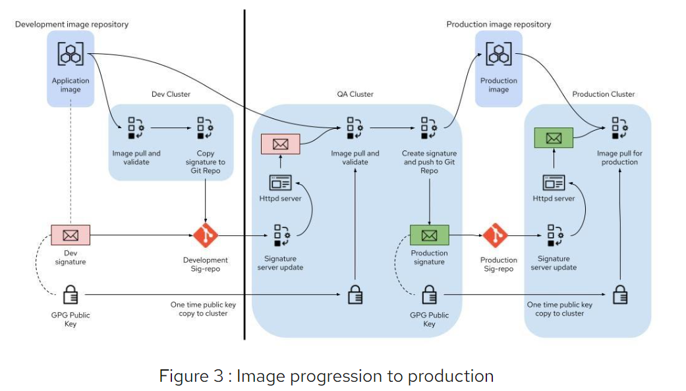
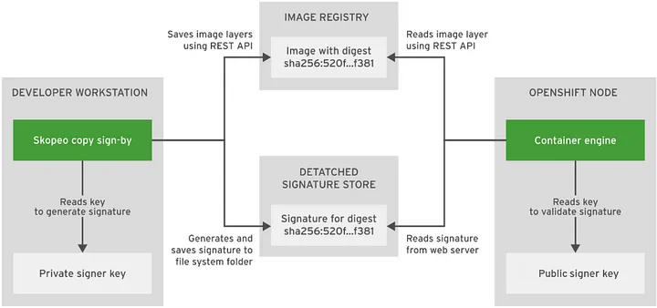
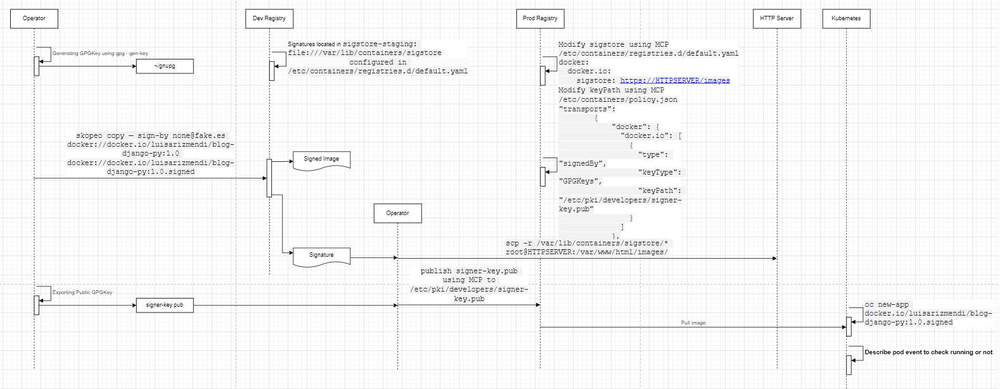

this is used to summarize the image signing process from signing and validation
-------
- [Signing Container Image Ovewview](#signing-container-image-ovewview)
  - [Signature](#signature)
- [Tools used by Image Signature](#tools-used-by-image-signature)
- [Signing Container Image](#signing-container-image)
- [Signature Storage](#signature-storage)
- [Signed Image, Signature and GPG Key LCM](#signed-image-signature-and-gpg-key-lcm)
- [Verify GPG Image Signatures](#verify-gpg-image-signatures)
- [Signaing container images with sigstore signatures using a private key](#signaing-container-images-with-sigstore-signatures-using-a-private-key)
- [Signing Image in Openshift](#signing-image-in-openshift)
- [Kubernetes](#kubernetes)

https://access.redhat.com/documentation/en-us/red_hat_enterprise_linux/8/html-single/building_running_and_managing_containers/index#assembly_signing-container-images_building-running-and-managing-containers

# Signing Container Image Ovewview
Image signing consists of signing an image and storing its signature in a secure location (HTTP server), a policy is then used by container runtimes to determine whether or not unsigned or unsafe images should be used

Signing container images on RHEL systems provides:
* A means of validating where a container image came from, 
* Checking that the image has not been tampered with, 
* And setting policies to determine which validated images you will allow to be pulled to your systems

Image signing is an important step in a secure workflow and should be integrated into the CI/CD pipeline and into any other automated process that deploys Containers Images


## Signature
* With GPG key Signatures  and verify using GPG key
* With sigstore signatures using a private key and verify using public key
* With sigstore signatures using Fulcio and Rekor and verify using Fulcio and Rokor
* With sigstore signatures with a private key and Rekor

# Tools used by Image Signature
* gpg (GNU Privacy Guard)
* podman
* skopeo

# Signing Container Image
1. Generate GPG Key
  ```bash
    root@tstbed-2:~# root@tstbed-2:~# gpg2 --full-generate-key
    gpg (GnuPG) 2.2.27; Copyright (C) 2021 Free Software Foundation, Inc.
    This is free software: you are free to change and redistribute it.
    There is NO WARRANTY, to the extent permitted by law.

    Please select what kind of key you want:
      (1) RSA and RSA (default)
      (2) DSA and Elgamal
      (3) DSA (sign only)
      (4) RSA (sign only)
      (14) Existing key from card
    Your selection? 1
    RSA keys may be between 1024 and 4096 bits long.
    What keysize do you want? (3072) 
    Requested keysize is 3072 bits
    Please specify how long the key should be valid.
            0 = key does not expire
          <n>  = key expires in n days
          <n>w = key expires in n weeks
          <n>m = key expires in n months
          <n>y = key expires in n years
    Key is valid for? (0) 
    Key does not expire at all
    Is this correct? (y/N) y

    GnuPG needs to construct a user ID to identify your key.

    Real name: DEF ABC
    Email address: def.abc@126.com
    Comment: 
    You selected this USER-ID:
        "DEF ABC <def.abc@126.com>"

    Change (N)ame, (C)omment, (E)mail or (O)kay/(Q)uit? o
    We need to generate a lot of random bytes. It is a good idea to perform
    some other action (type on the keyboard, move the mouse, utilize the
    disks) during the prime generation; this gives the random number
    generator a better chance to gain enough entropy.
    We need to generate a lot of random bytes. It is a good idea to perform
    some other action (type on the keyboard, move the mouse, utilize the
    disks) during the prime generation; this gives the random number
    generator a better chance to gain enough entropy.
    gpg: key 5B3CEAD2C32B8314 marked as ultimately trusted
    gpg: revocation certificate stored as '/root/.gnupg/openpgp-revocs.d/C09711DA4A29C25DE732B55C5B3CEAD2C32B8314.rev'
    public and secret key created and signed.

    pub   rsa3072 2024-04-10 [SC]
          C09711DA4A29C25DE732B55C5B3CEAD2C32B8314
    uid                      DEF ABC <def.abc@126.com>
    sub   rsa3072 2024-04-10 [E]

  ```

2. List GPG Key
  ```bash
    root@tstbed-2:~# gpg2 --list-key
    gpg: checking the trustdb
    gpg: marginals needed: 3  completes needed: 1  trust model: pgp
    gpg: depth: 0  valid:   2  signed:   0  trust: 0-, 0q, 0n, 0m, 0f, 2u
    gpg: next trustdb check due at 2026-04-10
    /root/.gnupg/pubring.kbx
    ------------------------
    pub   rsa3072 2024-04-10 [SC] [expires: 2026-04-10]
          D8ABA3565B73DD30A5C07C5CA2FA64F4F8FE9789
    uid           [ultimate] ABC LIU <abc.liu@126.com>
    sub   rsa3072 2024-04-10 [E] [expires: 2026-04-10]

    pub   rsa3072 2024-04-10 [SC]
          C09711DA4A29C25DE732B55C5B3CEAD2C32B8314
    uid           [ultimate] DEF ABC <def.abc@126.com>
    sub   rsa3072 2024-04-10 [E]

  ```

3. Export public key
  ```bash
    root@tstbed-2:~/gpg# gpg --output ./key.gpg --armor --export def.abc@126.com
    root@tstbed-2:~/gpg# ls
    key.gpg
    root@tstbed-2:~/gpg# ls -l
    total 4
    -rw-r--r-- 1 root root 2428 Apr 10 07:55 key.gpg

    root@tstbed-2:~/gpg# cat key.gpg 
    -----BEGIN PGP PUBLIC KEY BLOCK-----

    mQGNBGYWRTABDADRzSIedx1x7uOuwTkwoXUFleN7sMahK1jxv5lniLtxVRU1TlKK
    e6WRS+CyUN+3U1iauq7SvMvXp2ljVkp3KAtoHm0sWgZo6hB6S9naWMVQyysiUp9B
    fP3rvjD5DEyww7EIHc8KztYQPCDtW3iV7v8F9jK3aoIAIFR5jjQyDS7GOq2x+k+5
    9yWql9WJrl00pch/fbmi49sVawerabzmTA53Z/5YXT0yEmqTT5qrM51sNWV0aTUQ
    IHlpha49Wm/qFitHB3Y4pDN/v3sOA+fEyeyjJA+3LDhdrZrOZVFb47pCHmS1OS5q
    8GSpgWuwUEnt2DPXEdlX5UwNAMTBAvELoDA8A6RIXX9fjaGjlBg3IxW79tJ3HBDQ
    tNzIMiF1AOAzB+UL623mEjyBmzWDg6FfxQuk6xtCo7VLnnoepnnBw3TYpqc7/AMB
    tmmL0fTyIGzvt8Acij/jNSbRdBSkf3uL4HCH/h2xcCuaUHd/H0gdTDbl8tub3TFP
    ce2kIXI500ntt0sAEQEAAbQZREVGIEFCQyA8ZGVmLmFiY0AxMjYuY29tPokBzgQT
    AQoAOBYhBMCXEdpKKcJd5zK1XFs86tLDK4MUBQJmFkUwAhsDBQsJCAcCBhUKCQgL
    AgQWAgMBAh4BAheAAAoJEFs86tLDK4MU3KsL/3ajGS0JaRhoMQR4LGV+joqTa38k
    VKYs9fu9Mt6GQMpguIUNI+Vyc9eGOaSwrVZjq69wQPz9EJuIv/BaPZUEspGkGvRI
    h08ES6ZMY3p8AHECnDutT/unDaW6hIj8rUs/QbFtpVcyghloiGLA511BITWAPEr+
    NkpgyJMwMEpUn5tc0Hoton+X+g3n1Ev1Y7OLmH7L7nw0oXqYlAnir50MQ9TskSO3
    OVRaI8nTKzZLQTjMyesmUZapQpZjoNvlXMU9wFHsqpRxP7smf0CDgGPiYHkK57m3
    PJINqu8PvJ9iA0voMVBtEPjMx39fz1MVRIV+rzUBEW7yxDoqpbSZdaXu0DP80Irm
    jt2kMlZY9PNRxfExNiG+0v+xmOYD5kCq+ljicoO1XUynKye7IjER7QFZqDFEMUQh
    qwfraqtzOZpABZrzV34PI6E1krKf9qnqHLe6xUC9yV+1qUlcFdasBMKO4Co9UoRz
    rzxdViY5sqg27NONwRpS0dWA354DUtDLwvRIaLkBjQRmFkUwAQwAytskS3yq7/1X
    Iy131+1nbXdr/S9ja7Je20KmpYA4mNFWBx+As3chtzFDt6wjeE3fxr4w3eysCmB2
    t6Tg9cYGP2nCGYGKkNeIwQAMV0zu9RvZ0wejvq88LrFqYtgYdkNgvi7SbgVGseQV
    vzpSonaRhk3+oPEJv90rxa7n/11RrT+4jf0wmRwZpaKvNrlj1C/EAc9q4ycky/B+
    A0IajVEM+dK7UffaiBXkL+asY6FejbIx6EldU5mWBWHQ7z599VyJXjSI0ASmp0cA
    TA2oHHoCwPtWGC/uyG/TSLBa4xANZyfk3fylVdN1+OwXpA+TxAkTn4dYrTIAyj6t
    lO89BPOOp5GJ9ps8JIxtSFN1fhkKAVQEow9kwWuUcM86MpwpEGrLnT5eInwMCszo
    +l1WmEZWPrWxPdFR4tC0FbQLgdqIDGHbabhdbgFthjTorY4OAy6+v3lDer9WnIr2
    I8ToZhHYayD4kwFcSbAFtvjtAHVJdcn+ljjEMV1FF3YAtgYupEK1ABEBAAGJAbYE
    GAEKACAWIQTAlxHaSinCXecytVxbPOrSwyuDFAUCZhZFMAIbDAAKCRBbPOrSwyuD
    FJJRC/9XV81zHINZ42XgK2lYney4k2IuSJoq+ZsW/tHpKe7Nz8e6fySPzqRMr0oJ
    ABJ5v61TZtTUomCT7JzqE0jf2QmF+MzFQpAvs4h2g6WqI2/+9QJgcCj3HVmgLsC/
    tTJM64RXqsbZiAjXuMNUu8ziZBuU/p+doIJ9Fv8Z5GRIeTTxVquEYhoyPIf2+Tqf
    FMd9dNgHMt5WmwsN3QV21B5cYyh5kDAdFcz75uocdr7SsDSQfT6QC96PCFaUgFMj
    edc/37VMG2mBaaihpuqZU4SDHyYynZ/iUmWqxTw9bgXUqFnr6g/vFieWpIHFHMr9
    yzDcrZgRWm8vFZjYlINTzgByiQNVXHAYWDHPSCFgN2LG7k0GznBXkRuPej2x1zH9
    5EaLmrUYdJ8cJ+/7hdgRCWfTHY1JLO2mQzfjYftzN0OxmkrbKcffngJQVk0LpDP5
    Rmj5TD2tqAXaaMuXkZuEaw74aHuE/rFtoeuPy2TUXwNi2/LvQYATW8OrwA3Mnf/C
    lXp1Rqw=
    =/x6X
    -----END PGP PUBLIC KEY BLOCK-----
  ```

NOTE:
* gen-key generates secret key
* list-key lists all keys
* list-secret-key only lists secret keys
* delete-secret-key will delete secrets but list-key still can list it
* delete-key will delete keys fully and list-key can't list it


4. Build Image
   ```bash
      podman build -t <registry>/<namespace>/<image>
   ```
5. Sign Image and push to registry 

  ```bash
    #for new image
    podman push  --sign-by def.abc@126.com  <registry>/<namespace>/<image>
    #for existing image using skopeo copy
    skopeo copy --sign-by def.abc@126.com docker://quay.io/marrober/layers:latest docker://quay.io/marrober/layers:latest-signed
  ```

if sign old image:
  
  ```bash
    skopeo copy --sign-by abc.liu@126.com  docker://docker.io/library/nginx:1.16.0  docker://docker.io/library/nginx:1.16.0-signed
    Getting image source signatures
    Copying blob 9fc222b64b0a skipped: already exists  
    Copying blob 4b3a8aeaa40e [--------------------------------------] 0.0b / 0.0b
    Copying blob 30e9fc7d9c5b [--------------------------------------] 0.0b / 0.0b
    Copying config ae893c58d8 [--------------------------------------] 0.0b / 6.0KiB
    Writing manifest to image destination
    ...
  ```
  * docker.io/library/nginx:1.16.0: unsigned version
  * docker.io/library/nginx:1.16.0-signed: signed version

6. Display the new image signature
   ```bash
      # (cd /var/lib/containers/sigstore/; find . -type f)
      ./<image>@sha256=<digest>/signature-1
   ```

7. Copy local signature to the lookaside web server
   ```bash
      rsync -a /var/lib/containers/sigstore <user@registry-lookaside.example.com>:/registry-lookaside/webroot/sigstore
   ```

# Signature Storage
  
  ```bash
    root@tstbed-2:/etc/containers/registries.d# cat /etc/containers/registries.d/default.yaml 
    # This is a default registries.d configuration file.  You may
    # add to this file or create additional files in registries.d/.
    #
    # sigstore: indicates a location that is read and write
    # sigstore-staging: indicates a location that is only for write
    #
    # sigstore and sigstore-staging take a value of the following:
    #   sigstore:  {schema}://location
    #
    # For reading signatures, schema may be http, https, or file.
    # For writing signatures, schema may only be file.

    # This is the default signature write location for docker registries.
    default-docker:
    #  sigstore: file:///var/lib/containers/sigstore
    sigstore-staging: file:///var/lib/containers/sigstore

    # The 'docker' indicator here is the start of the configuration
    # for docker registries.
    #
    # docker:
    #
    #   privateregistry.com:
    #    sigstore: http://privateregistry.com/sigstore/
    #    sigstore-staging: /mnt/nfs/privateregistry/sigstore

    # sigstore and sigstore-staging is deprecated 
    # now using lookaside and lookaside-staging
    # cat /etc/containers/registries.d/default.yaml
    docker:
        <registry>:
            lookaside: https://registry-lookaside.example.com
            lookaside-staging: file:///var/lib/containers/sigstore
  ```

# Signed Image, Signature and GPG Key LCM



NOTE:
1. when copied from repository to reposirty, it will get a new sha256 image digest and repository location
2. Any signature created againist the image in the old location will not be valid
3. The only current solution to this problem is to re-sign the image in the production environment

https://www.redhat.com/en/blog/signing-and-verifying-container-images

# Verify GPG Image Signatures

```bash
  $ podman image trust set -f <path>/key.gpg <registry>/<namespace>
  $ cat /etc/containers/policy.json
  {
    ...
    "transports": {
      "docker": {
        "<registry>/<namespace>": [
          {
            "type": "signedBy",
            "keyType": "GPGKeys",
            "keyPath": "<path>/key.gpg"
          }
        ]
      }
    }
  }

  # podman pull <registry>/<namespace>/<image>
  ...
  Storing signatures
  e7d92cdc71feacf90708cb59182d0df1b911f8ae022d29e8e95d75ca6a99776a
```

# Signaing container images with sigstore signatures using a private key

# Signing Image in Openshift


https://docs.openshift.com/container-platform/4.14/security/container_security/security-container-signature.html

Openshfit 
* CRIO Container Engine verifies the images by decrypted using the signer's public key
* skopeo used to add signatures of the image
* skopeo upload the signature to the standard HTTP server that used as signature Store



# Kubernetes
